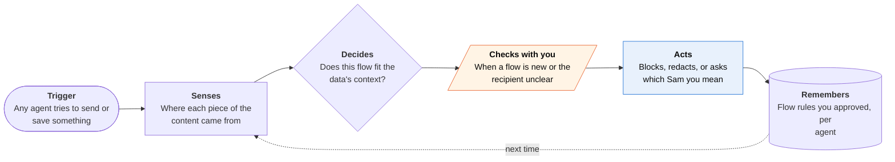

<!-- Generated by scripts/build.py from data/ideas.json. Edit the JSON, then run the script. -->

[← All ideas](../README.md) · **Moonshots** · Social & communication

# M-07 · Context Passport

> Each piece of your data carries where it came from, and no agent can send it somewhere it doesn't belong.

| Difficulty | Novelty | Buildable on iOS today | Impact if it works | Horizon | Autonomy |
|---|---|---|---|---|---|
| `●●●●●` 5/5 | `●●●●●` 5/5 | `●○○○○` 1/5 | `●●●●●` 5/5 | 3–5 years | L3 · Acts in guardrails, reports back |

## The moment

You tell an agent to 'send Sam the notes from today.' You know two Sams: your manager and the nurse at your oncologist's office. Before anything leaves, the phone sees the notes include biopsy results from a clinic email, blocks the send to your manager, and asks which Sam you meant.

## The problem

Agents now read your mail, notes and health records, and they also send things. The failure that matters most is often not a hack but a wrong flow: biopsy results to your manager, a private thread pasted into a group chat, a salary figure in a vendor email. Agent CI Bench found most of 15 frontier computer-use agents leaked context in more than half its scenarios, 67.9% on average. iOS permissions answer 'may this app read Health?' but never 'may this fact go to this person?'

## How the agent works

## iOS building blocks

- **Foundation Models (onToolCall, historyTransform)** — block or confirm outbound tool calls and mark untrusted content, but only for your own app's agent
- **Contacts (CNContactRelation)** — relationship labels to tell your manager Sam from the clinic's Sam
- **App Intents (OwnershipProvidingEntity, IntentAuthenticationPolicy)** — mark entities private or shared so Siri confirms before side effects
- **Core Spotlight (CSSearchableIndex)** — a local index where each item keeps its source label
- **HealthKit** — health data enters already tagged as health, with Apple's sharing rules attached

## What makes it hard

- The wall (platform): iOS gives third-party apps no provenance labels on Mail, Messages, Health or Files data, and no way to inspect Siri's or another app's outbound actions. Only Apple could add system-wide flow labels, something like App Tracking Transparency but for where agent context travels.
- The wall (research): judging whether a flow is appropriate is error-prone. False blocks make agents useless and false passes leak. Google DeepMind's CaMeL and Microsoft's FIDES track information flow inside one agent; nobody has done it across a whole phone.
- Mixed data: a forwarded email, a screenshot or a model's summary blends contexts, and labels are lost once a model rewrites content.
- What would have to change: OS-level provenance labels that survive copy, paste and summaries; a system hook where every agent's outbound action, Siri's included, is checked against the user's flow rules; and research that keeps false blocks rare.

## Risks and failure modes

- Over-blocking: if it stops every third send, people turn it off. Start with a few high-harm flows (health, money, private threads).
- The flow log is itself a very sensitive record of who you talk to about what. It must stay on the device.
- False confidence: data that arrived unlabeled slips through. The app must say plainly what it can't see.

## Unsaid assumptions

_What this idea quietly depends on being true. Check these before you build._

- Data can be labeled cleanly at the source, though much real data (a forwarded email, a screenshot) mixes contexts.
- People will set flow rules once and accept an occasional question.
- Apple would let a third-party checker see agents' outbound actions rather than build the checker itself.

## Unknown unknowns

_Open questions nobody has good answers to yet._

- Can provenance survive an AI summary that blends three sources into one sentence?
- Who sets the default norms: the user, Apple, or each profession (clinicians, employers)?
- What false-block rate will people tolerate before switching it off?

## Prior art and who's building

- [Agent CI Bench](https://huggingface.co/papers/2606.23189) — Measured contextual-integrity leaks in 15 frontier computer-use agents, including sending to the wrong recipient. Measures the problem; doesn't fix it.
- [GhostWriter and AM-Sentry](https://huggingface.co/papers/2607.06595) — Memory poisoning through email and calendar, and a defense that screens memory writes. Works inside one agent.
- [Securing agentic features (WWDC26)](https://developer.apple.com/videos/play/wwdc2026/347/) — Apple's onToolCall confirmations, spotlighting of untrusted content and authentication policies. They protect an app's own agent only.
- [How to limit what Siri AI can access (EFF)](https://www.eff.org/deeplinks/2026/09/how-limit-what-apples-new-siri-ai-can-access-ios-27) — Shows users can't limit Siri AI's on-screen awareness per app. Control is coarse today.
- CaMeL (Google DeepMind) and FIDES (Microsoft) — 2025 research designs that enforce information-flow rules inside an agent. Not a phone-wide layer.

## Smallest useful first version

Partial version buildable today: a gateway that labels data on entry for the agents you route through it: your own app's agent, cloud agents connected through an MCP proxy, and email you forward in. Every outbound send (email, message draft, file share) passes a flow check that blocks, redacts or asks, and unclear recipients are resolved with Contacts relationships. It can't see Siri or other apps, and says so.

Research notes: what we could and couldn't verify

CaMeL and FIDES are listed without URLs because I did not open their papers in this pass.

## Related ideas

- [W-03 · Agent Control Tower](../whitespace/W-03-agent-control-tower.md)
- [W-13 · Canary Garden](../whitespace/W-13-canary-garden.md)
- [M-09 · Decade Memory That Moves](../moonshot/M-09-decade-memory.md)
