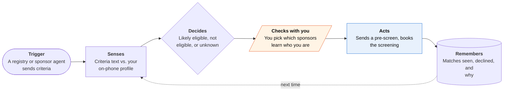

<!-- Generated by scripts/build.py from data/ideas.json. Edit the JSON, then run the script. -->

[← All ideas](../README.md) · **Moonshots** · Health & body

# M-08 · Trial Inbox

> Flips trial matching: sponsors' agents query your private eligibility profile, and your phone answers.

| Difficulty | Novelty | Buildable on iOS today | Impact if it works | Horizon | Autonomy |
|---|---|---|---|---|---|
| `●●●●●` 5/5 | `●●●●●` 5/5 | `●●○○○` 2/5 | `●●●●○` 4/5 | 3–5 years | L2 · Drafts, you approve |

## The moment

Your son has a rare neuromuscular condition and you've read every ClinicalTrials.gov listing twice. This morning your phone shows a new card: a Phase 2 study 90 miles away, eligible on 11 of 12 criteria, travel covered. No one at the sponsor knows who you are until you tap 'Tell them'.

## The problem

Finding a trial means reading free-text eligibility criteria across thousands of listings, which is hard for anyone and brutal for a parent managing a rare disease. Sponsors buy AI recruitment tools that mine clinic records the patient never sees. Both sides want a match, but the only way to check eligibility today is to hand records to someone first.

## How the agent works

## iOS building blocks

- **HealthKit (HKClinicalRecord, HKFHIRResource)** — builds the profile from health records the user already pulled into Health
- **Foundation Models** — checks free-text criteria against the profile on the device
- **PrivateCloudComputeLanguageModel** — handles long or tricky criteria with a larger context, only with consent
- **DeviceCheck (DCAppAttestService)** — proves answers come from a genuine app instance
- **CryptoKit** — signs each yes/no answer so a sponsor's agent can verify it
- **VisionKit (VNDocumentCameraViewController)** — adds genetic reports and letters that aren't in Health Records
- **EventKit** — books the screening call and study visits
- **UserNotifications** — shows each new match as a card

## What makes it hard

- The wall (standards): eligibility criteria are free text with no machine-readable standard, so every answer is a model's reading of prose. Exclusion criteria (past therapies, recent labs) need data the phone may not have.
- The wall (regulation): first contact with patients and any payments need IRB approval, and there's no IRB template for agent-mediated contact. Consumer health apps sit outside HIPAA, and HealthKit data may only be shared with services that provide health care, so answers must be computed on the device.
- The wall (adoption): sponsors have no reason to query patient-held profiles until many patients hold them, and patients won't keep a profile nobody queries. What would have to change: registries requiring structured criteria (FHIR ResearchStudy or similar), IRB templates that accept agent-mediated first contact, and a standard way for sponsors to ask.
- Proof, not data: a signed 'likely eligible' is only as good as the records behind it. The same pattern for money (proving income above 3x rent without sending statements) needs data sources that sign their own data, such as open-banking APIs; zkTLS proofs from a web session are heavy on phones, and banks may treat them as scraping.

## Risks and failure modes

- False hope: 'likely eligible' will often be wrong at screening. Show uncertainty per criterion and never imply a place in the study.
- Health safety line: it never advises joining a trial over current care. That stays a conversation with the treating doctor.
- Re-identification: many yes/no answers can reveal a rare condition. Answer only registered sponsors, rate-limit queries, and log who asked what.

## Unsaid assumptions

_What this idea quietly depends on being true. Check these before you build._

- A patient-held record is complete enough to answer exclusion criteria such as past therapies and recent lab values.
- Sponsors want the answer more than they want the data.
- Families will keep the profile current between queries.

## Unknown unknowns

_Open questions nobody has good answers to yet._

- Would an IRB accept an automated eligibility answer as a valid pre-screen?
- How do you stop a sponsor from asking many narrow questions to rebuild the record?
- Who is responsible when the phone's answer is wrong and a family travels 90 miles for nothing?

## Prior art and who's building

- [Clinical trial recruitment vendors compared](https://intuitionlabs.ai/articles/clinical-trial-patient-recruitment-vendors-compared) — Recruitment AI sold to sponsors and sites (Antidote, Deep 6 AI and others). Patients don't see or control it.
- [Zero-shot LLM trial matching (NEJM AI)](https://ai.nejm.org/doi/full/10.1056/AIcs2400360) — LLMs matched patients to free-text criteria without task-specific training. Evidence the matching step works, run by institutions.
- [Authenticated Delegation and Authorized AI Agents](https://arxiv.org/pdf/2501.09674) — Framework for verifiable credentials between agents; a basis for signed answers.
- [Indicio verifiable credentials for bank AI agents](https://indicio.tech/blog/proven-ai-kyc/) — Proof-based identity checks for banks. Identity only, not health eligibility.
- ClinicalTrials.gov search — The patient does all the reading and all the contacting.

## Smallest useful first version

Partial version buildable today: an on-device profile built from Health Records and scanned documents, plus a nightly check of new ClinicalTrials.gov listings for the condition. The on-device model checks each criterion, shows 'likely eligible on 11 of 12, unknown on 1', and drafts a pre-screen email to the coordinator that you approve. The sponsor-query direction waits for a registry willing to pilot it.

Research notes: what we could and couldn't verify

Merged 'Proof, Not Data' (signed yes/no answers instead of files, the landlord income example, zkTLS limits). The Plaid and TLSNotary mentions from that source were left out of prior_art because I had no URLs for them.

## Related ideas

- [B-09 · Health-record reading assistants](../building-now/B-09-health-record-readers.md)
- [W-20 · Chart Check](../whitespace/W-20-chart-check.md)
- [M-07 · Context Passport](../moonshot/M-07-context-passport.md)
