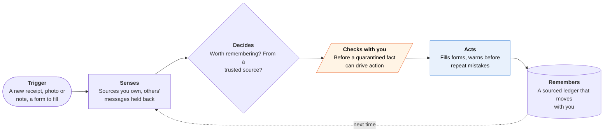

<!-- Generated by scripts/build.py from data/ideas.json. Edit the JSON, then run the script. -->

[← All ideas](../README.md) · **Moonshots** · Learning & memory

# M-09 · Decade Memory That Moves

> Personal memory that learns you for a decade, survives every phone and model upgrade, and resists poisoning.

| Difficulty | Novelty | Buildable on iOS today | Impact if it works | Horizon | Autonomy |
|---|---|---|---|---|---|
| `●●●●●` 5/5 | `●●●●○` 4/5 | `●●●○○` 3/5 | `●●●●○` 4/5 | 3–5 years | L2 · Drafts, you approve |

## The moment

You're filling in your daughter's intake form at a new pediatrician. The agent fills in her vaccine dates, the 2022 rash after amoxicillin and her last doctor's name, each with a source you can tap. A week later, as you're about to rehire a plumber, it reminds you this company overcharged you in 2024 and shows the invoice.

## The problem

Every assistant now keeps a memory of you, and each one is locked in, hard to read, and writable by strangers: GhostWriter showed hidden payloads in email and calendar invites get written into agent memory about 98% of the time. Switching agents means starting over, because no vendor exports tasks, rules or trust history. And anything an on-device model learns in its weights is lost when Apple ships a new base model.

## How the agent works

## iOS building blocks

- **Core Spotlight (CSSearchableIndex, SpotlightSearchTool)** — a local semantic index of memories the model can search (SpotlightSearchTool is new in iOS 27)
- **Foundation Models (onToolCall, historyTransform)** — re-read the ledger with whatever model is current, and stop quarantined facts from triggering actions
- **SwiftData** — the source ledger: each fact with its source, confidence and expiry
- **CloudKit (encryptedValues)** — encrypted sync to your next iPhone
- **App Intents (IndexedEntity, OwnershipProvidingEntity)** — expose memories to Siri, marked private or shared
- **Visual Intelligence (IntentValueQuery)** — recall from what the camera sees, such as the plumber's van
- **BGContinuedProcessingTask** — import a large export from an old agent with visible progress
- **CryptoKit** — sign export bundles and re-sign spending limits on import

## What makes it hard

- The wall (platform): Apple's custom adapters for its on-device model are tied to one base-model version and must be retrained whenever the model changes. Training runs on a Mac with Apple's toolkit, not on the phone, and deploying adapters needs an entitlement. So a model that learns you in its weights resets with each OS release.
- The wall (research): removing a fact from trained weights (unlearning) is unsolved, and provenance is lost once a model summarizes or merges memories. Defenses like AM-Sentry only partly stop poisoning.
- The wall (vendors and regulation): no agent maker exports tasks, skills, limits or trust history, OAuth tokens can't move between clients, and lock-in helps their business. It likely takes regulators reading data-portability rules (GDPR Article 20, the EU Data Act's switching rules) as covering agent state, plus a shared export schema.
- What would have to change: adapter formats that carry across base-model versions or an on-device personalization API, practical and verifiable unlearning, memory write rules and retrieval screens built into the OS, and a standard export format for agent state.

## Risks and failure modes

- A well-organized ten-year record of your life is a prize for thieves and a target for subpoenas. Keep it on-device and end-to-end encrypted, with deletion by category.
- Poisoned memories that drive actions: anything from other people's messages stays quarantined until you confirm it.
- Inheritance gone wrong: an heir sees more than intended. Heir access is per category and needs a trusted contact to confirm death or incapacity.

## Unsaid assumptions

_What this idea quietly depends on being true. Check these before you build._

- People want an agent to remember them for ten years at all, and will spend time correcting it.
- Agent state moves in meaning, not just format: a task written for one agent does the same thing in another.
- Asking an assistant to recite its memory returns what it actually stored, not a paraphrase.

## Unknown unknowns

_Open questions nobody has good answers to yet._

- How much of 'knowing you' can live in a text ledger that a model re-reads, versus needing trained weights?
- Who owns the inferences an agent made about you, and can you export or delete them?
- Can a correction pushed to one vendor's memory be verified from outside?

## Prior art and who's building

- [MobileMem benchmark](https://huggingface.co/papers/2608.13606) — First benchmark of year-scale personal memory on phones. Measures the problem, no product.
- [GhostWriter memory poisoning](https://huggingface.co/papers/2607.06595) — About 98% injection into agent memory through email and calendar; AM-Sentry partly defends.
- [Apple Foundation Models adapter training](https://developer.apple.com/apple-intelligence/foundation-models-adapter) — Custom adapters must be retrained for each base-model version.
- [LoRA-X](https://arxiv.org/pdf/2501.16559) — Research on moving adapters between base models without retraining. Not applied to Apple's models.
- [Mem0 OpenMemory](https://mem0.ai/openmemory) — A local memory layer shared across AI tools. Not built around source chains, poisoning quarantine or moving between phones.
- Siri AI personal context and Amazon Bee — Memory with no user-visible ledger (Siri) or lifelogging from a wearable (Bee). Limitless was discontinued after Meta bought it.

## Smallest useful first version

Partial version buildable today: memory kept as an inspectable, sourced text ledger in SwiftData and the Spotlight index, re-read by whatever model is current, with no weight training. It saves facts only from sources you own, quarantines anything from other people's messages, and fills forms from the share sheet with a source behind each field. A weekly audit checks what your other assistants have memorized about you and flags planted instructions.

Research notes: what we could and couldn't verify

Merged 'Agent Number Portability' (export bundle, re-consenting connectors, regulators and Article 20), 'Memory Chain of Custody' (per-fact sources, quarantine, provenance lost in summaries) and 'Agent Memory Audit' (weekly audit of other assistants' memories, now part of the first version). If the editor keeps 'Agent Memory Audit' as its own whitespace card, drop the last sentence of first_version. The iOS 27 SystemLanguageModel docs I checked no longer list an Adapter type, so the card cites Apple's adapter-toolkit page and names no adapter API in ios_blocks.

## Related ideas

- [B-11 · Meeting and memory capture](../building-now/B-11-meeting-memory-capture.md)
- [M-11 · Agent Will](../moonshot/M-11-agent-will.md)
- [W-13 · Canary Garden](../whitespace/W-13-canary-garden.md)
