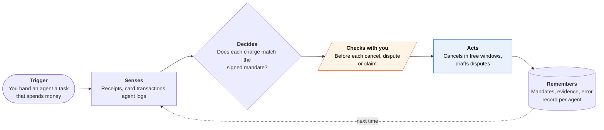

<!-- Generated by scripts/build.py from data/ideas.json. Edit the JSON, then run the script. -->

[← All ideas](../README.md) · **Moonshots** · Money & commerce

# M-10 · Agent Mistake Warranty

> Signs what your agents may do, checks what they actually did, and chases the refund when they overstep.

| Difficulty | Novelty | Buildable on iOS today | Impact if it works | Horizon | Autonomy |
|---|---|---|---|---|---|
| `●●●●○` 4/5 | `●●●●●` 5/5 | `●●●○○` 3/5 | `●●●●○` 4/5 | 3–5 years | L2 · Drafts, you approve |

## The moment

Your travel agent booked the right hotel for the wrong week: nonrefundable, $640. Your bank says the charge is authorized because you gave the agent your card. But your phone holds the instruction you signed with Face ID ('Oct 12-14, under $250 a night'), the receipt it matched against that instruction, and a cancellation request you approved while the free-cancel window was still open.

## The problem

People now let agents spend money: price-triggered auto-buy, booking agents, shopping agents with one-time cards. When an agent buys the wrong thing, the loss usually lands on the user, because bank and card rules were written for people and agent vendors' terms push losses to users. Banking apps show the charge after the fact. None of them compares it with what you actually allowed.

## How the agent works

## iOS building blocks

- **CryptoKit (SecureEnclave.P256.Signing)** — signs each mandate with a key that never leaves the phone
- **LocalAuthentication** — Face ID before signing a mandate or approving a cancellation
- **FinanceKit** — reads Apple Card and other supported account transactions to match against mandates
- **DeviceCheck (DCAppAttestService)** — shows a mandate came from a genuine copy of the app
- **UserNotifications (time-sensitive interruption level)** — warns you before a free-cancel window closes
- **PassKit (Wallet pass)** — shows each active mandate and its limits as a pass
- **BackgroundTasks** — re-checks new transactions against open mandates

## What makes it hard

- The wall (law + market): US rules for electronic transfers (Regulation E) generally treat a payment made by someone you gave your card or login to as authorized, and card networks have no dispute reason for 'my agent went beyond its instructions'. No insurer sells consumer cover for agent errors because there is no loss data. A mandate signed on your phone binds no merchant or agent vendor, and Apple Pay has no agent or mandate API.
- Getting the evidence without reading your inbox: receipts arrive through a forwarding address or Gmail/Outlook OAuth on a server, and card data comes from FinanceKit (only for accounts it supports) or a bank link. Matching a receipt to a mandate across taxes, currencies, split charges and fees is messy.
- Racing undo windows: the US 24-hour cancel rule for flights booked a week or more ahead, hotel free-cancel deadlines and store return windows all run on different clocks with different fine print. The app has to read each one right and warn you in time.
- What would have to change: regulators or card networks defining who is liable for agent-initiated payments tied to a signed mandate (AP2 mandates and card agent tokens are a start); merchants and agent vendors accepting those mandates as binding; and enough error data for an insurer to price per-task cover.

## Risks and failure modes

- False confidence: people may hand agents more because they think they're covered, when today the app can only help them undo or dispute. It must say plainly what it can and can't get back.
- Wrong disputes: disputing a charge you did authorize can be treated as friendly fraud and hurt your standing with the bank or merchant. Every dispute is drafted for you to review, never filed on its own.
- A rich target: transaction feeds, receipts and signed mandates in one place attract attackers. Match on the device where possible and keep only what a dispute needs.

## Unsaid assumptions

_What this idea quietly depends on being true. Check these before you build._

- People will sign a short mandate before each agent run instead of granting blanket access once.
- Agents and merchants leave enough of a trail (receipts, order emails, agent logs) to prove what happened.
- Most agent mistakes are caught inside some undo window, so the free fix works more often than a dispute.

## Unknown unknowns

_Open questions nobody has good answers to yet._

- Will card networks accept 'exceeded a signed mandate' as a dispute reason, and who pays: the merchant, the agent vendor or the user?
- What are real agent error rates per kind of task? Nobody publishes them, so per-task cover can't be priced yet.
- Does a Secure Enclave signature made in a consumer app carry any legal weight in a dispute?

## Prior art and who's building

- [AP2 (Agent Payments Protocol)](https://cloud.google.com/blog/products/ai-machine-learning/announcing-agents-to-payments-ap2-protocol) — Signed Intent and Cart mandates as an audit trail. It defines the evidence, not who pays when an agent breaks the mandate, and it has no Apple Pay integration.
- [Mastercard Agent Pay](https://www.mastercard.com/us/en/news-and-trends/press/2025/april/mastercard-unveils-agent-pay-pioneering-agentic-payments-technology-to-power-commerce-in-the-age-of-ai.html) — Agent tokens tie a card to one agent and scope. They limit exposure but give consumers no claim process.
- [AI agent liability insurance and underwriting (Zylos Research)](https://zylos.ai/research/2026-07-10-ai-agent-liability-insurance-underwriting/) — Overview of specialist agent insurance. The cover is sold to businesses only.
- [Underwriting the Agent Economy (paper)](https://arxiv.org/pdf/2607.11999) — Research on pricing agent risk. No consumer product.
- [Chargeflow on AI agent chargeback liability](https://www.chargeflow.io/blog/ai-agent-chargeback-liability) — The merchant-side view of the same dispute gap.
- Meta Muse one-time Stripe Link cards — Limit how much an agent can spend per task, but offer no recourse when it spends wrong.

## Smallest useful first version

Ship the evidence-and-undo half with no warranty. You sign a mandate with Face ID before an agent run. The app matches forwarded receipts and FinanceKit transactions against it, warns you before free-cancel windows close, drafts the cancellation for you to send, and builds a ready-to-file dispute packet (mandate, receipt, timeline) when undo fails.

Research notes: what we could and couldn't verify

Merged 'Agent Error Cover' (per-task cover priced from each agent's track record; the per-agent error record and the warranty goal come from it). The Regulation E point is a plain summary, not legal advice; how it applies to agent-initiated transfers is untested. FinanceKit account coverage outside Apple Card, Apple Cash and Savings varies by region and was not re-checked.

## Related ideas

- [W-03 · Agent Control Tower](../whitespace/W-03-agent-control-tower.md)
- [M-02 · Household Spending Constitution](../moonshot/M-02-household-spending-constitution.md)
- [B-08 · Bill-fighting and cancel agents](../building-now/B-08-bill-fighting-agents.md)
