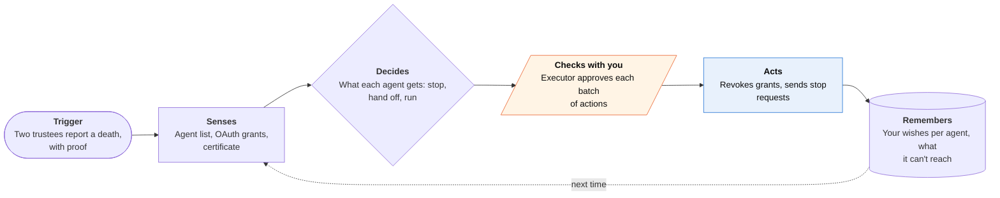

<!-- Generated by scripts/build.py from data/ideas.json. Edit the JSON, then run the script. -->

[← All ideas](../README.md) · **Moonshots** · Life admin

# M-11 · Agent Will

> Tells every agent acting in your name what to do after you die: stop buying, hand off, say goodbye.

| Difficulty | Novelty | Buildable on iOS today | Impact if it works | Horizon | Autonomy |
|---|---|---|---|---|---|
| `●●●●●` 5/5 | `●●●●●` 5/5 | `●●○○○` 2/5 | `●●●○○` 3/5 | 3–5 years | L2 · Drafts, you approve |

## The moment

Three weeks after your father's funeral, a package arrives in his name. His price watch is still auto-buying, a research task still runs every Monday, and a bill-negotiation agent keeps calling his cable company. With the agent will he set up a year ago, the app would have revoked every grant it could reach once you and your sister confirmed his death, and handed you a short list of the three agents it couldn't reach.

## The problem

Personal agents now act unattended for weeks: auto-buy rules, scheduled tasks, money autopilots, calling agents with calls in progress. When the owner dies, nothing tells them to stop, and families often don't know they exist. Estate apps help executors close accounts, but none of them knows about agents, and no agent platform has a signal for 'the person I work for has died'.

## How the agent works

## iOS building blocks

- **CryptoKit (Secure Enclave keys)** — signs your per-agent instructions so they can be shown to be yours
- **AuthenticationServices (passkeys)** — trustees and the executor sign in to the trustee service without passwords
- **VisionKit (VNDocumentCameraViewController)** — scans the death certificate
- **CloudKit (CKShare)** — shares the will and inventory with named trustees
- **FinanceKit** — finds recurring charges that point to agents and standing orders
- **UserNotifications** — yearly prompts to review the inventory, and loud notices to your own devices if a death is reported

## What makes it hard

- The wall (platform + law): no agent platform has an API for 'the principal has died'. A power of attorney ends at death, and until a court appoints an executor nobody has authority to act for the estate. Fiduciary-access laws (RUFADAA, adopted in most US states) give executors rights to digital assets, but not to autonomous agents, and logging in as the dead person can breach terms of service. Apple's Digital Legacy gives a Legacy Contact data, but not Keychain passwords or app tokens.
- Finding the agents: people won't keep an inventory current, so the app has to discover most agents from OAuth grants, receipt emails and recurring charges. It will still miss some.
- Confirming a death without false triggers: two trustees plus a certificate scan plus a waiting period is slow, and a false trigger that cuts off a living person's accounts does real harm. A scanned certificate proves little without a check against vital records.
- What would have to change: agent protocols (A2A, MCP) adding a 'principal status' signal that platforms honor; platforms accepting signed instructions written before death, the way Google's Inactive Account Manager does for Google accounts; and Apple extending Digital Legacy to agent grants and app-held tokens.

## Risks and failure modes

- False or malicious triggers: a relative or an abuser could report a death to shut down someone's accounts. Require two independent trustees, a waiting period with loud notices to the owner's devices, and a one-tap cancel.
- Handing an agent's memory to a named person can expose private conversations the person never meant to share. Default to delete, and show exactly what would be handed over when the will is written.
- Grief and paperwork: the executor gets a queue of actions at a hard time. Batch them, explain each in plain words, and never act on legal matters without the executor's signature.

## Unsaid assumptions

_What this idea quietly depends on being true. Check these before you build._

- People will do the uncomfortable setup while healthy, and review it once a year.
- Platforms will honor a stop request from a trustee service even without a formal API.
- Executors will trust software to act in their parent's name.

## Unknown unknowns

_Open questions nobody has good answers to yet._

- Can instructions signed before death carry weight with platforms that never agreed to honor them?
- What is agent memory after death: an estate asset, personal data, or something new?
- Who pays to run a trustee service that may sit idle for 30 years?

## Prior art and who's building

- Google Inactive Account Manager — Per-account instructions for Google data after inactivity. Nothing for agents or other platforms.
- Apple Digital Legacy (Legacy Contact) — Lets a named contact request iCloud data after death. Leaves out Keychain and doesn't touch agent grants.
- [Sunset](https://learn.hellosunset.com/sunset-vs-empathy-vs-goodtrust-closing-accounts) — Finds and closes accounts on the executor's authority after death. It works from what the family knows, not from instructions the person left for their agents.
- [EstateExec](https://www.estateexec.com/) — Task app for executors. No agent inventory or automatic revocation.
- [TechPolicy.Press: platforms as executors of the dead](https://www.techpolicy.press/big-tech-is-becoming-the-executor-of-the-dead/) — Analysis of how platforms, not families, end up deciding what happens to a dead user's data.
- [Dark Reading on AI agent lifecycles](https://www.darkreading.com/identity-access-management-security/the-lifecycle-crisis-managing-the-birth-life-and-death-of-ai-agents) — Frames agent retirement as an unsolved identity problem, from the enterprise side.

## Smallest useful first version

An inventory-and-instructions app plus a small trustee service. It finds agents and standing orders from OAuth grants, forwarded receipts and recurring charges, and lets you write wishes per agent. On a confirmed death it gives the executor a pre-filled queue: revocation links, stop requests, each company's bereavement process, and the final notes you left.

Research notes: what we could and couldn't verify

Merged 'Posthumous Admin Agent' (account map built from email and bank feeds, executor approval queue, dated final notes). The candidate listed Afterlife AI Executor Lock as prior art; left out because I could not check what it does. Apple Digital Legacy's Keychain exclusion and RUFADAA adoption are stated from general knowledge, not re-checked.

## Related ideas

- [W-12 · Agent Janitor](../whitespace/W-12-agent-janitor.md)
- [W-03 · Agent Control Tower](../whitespace/W-03-agent-control-tower.md)
- [M-09 · Decade Memory That Moves](../moonshot/M-09-decade-memory.md)
