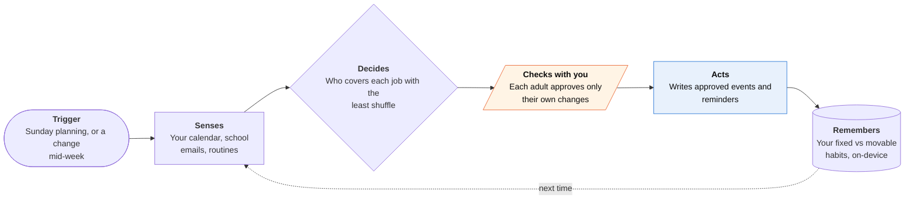

<!-- Generated by scripts/build.py from data/ideas.json. Edit the JSON, then run the script. -->

[← All ideas](../README.md) · **Moonshots** · Family & care

# M-12 · Household Agent Treaty

> Each family member's own agent negotiates the week with the others, without pooling private calendars.

| Difficulty | Novelty | Buildable on iOS today | Impact if it works | Horizon | Autonomy |
|---|---|---|---|---|---|
| `●●●●○` 4/5 | `●●●●○` 4/5 | `●●●○○` 3/5 | `●●●●○` 4/5 | 3–5 years | L2 · Drafts, you approve |

## The moment

It's Sunday night. Your spouse's agent knows about a doctor's appointment they haven't mentioned, your teen's knows about a shift swap, and yours knows your mother's physical therapy moved to Thursday. By morning each of you has a proposed week with only your own changes to approve, and no agent saw why the others said 'busy, can't move'.

## The problem

Family scheduling needs everyone's constraints, but pooling everyone's calendar and email into one agent means each person gives up privacy from the others. One shared family assistant also breaks when it misreads a single email, which is why Milo shut down. Nobody offers per-person agents that negotiate with each other and reveal only 'busy' or 'movable'.

## How the agent works

## iOS building blocks

- **Foundation Models (SystemLanguageModel)** — turns each person's calendar and forwarded emails into busy/movable constraints on their own phone
- **EventKit** — reads your calendar and writes approved events and reminders
- **CloudKit (CKShare)** — a shared family zone that holds only constraints and offers, never reasons
- **UserNotifications (UNNotificationAction)** — approve or decline a proposed change from the notification
- **BackgroundTasks** — joins a negotiation round when the system grants time
- **CryptoKit (Secure Enclave keys)** — signs offers from each person's agent and checks signed updates from other households

## What makes it hard

- The wall (platform + research): iPhones can't reliably wake an app to take part in a negotiation round. Apple suggests no more than two or three silent pushes an hour, background time is short, and Foundation Models has a background budget, so a five-person round can take hours. Apple has no way for agents on different people's devices to message each other, only CloudKit sharing and push.
- Minimal disclosure is open research: even 'can't move Tuesday' leaks something, and repeated rounds can reveal a pattern. Asking the fewest people the smallest question ('can you move gym to 7?') is an unsolved scheduling problem.
- Extraction errors: a small model misreading one school email ('early release Friday') puts a wrong constraint into every plan. Structured feeds would help, but schools, clubs and other families mostly send prose.
- What would have to change: an Apple channel for agent messages among Family Sharing members with its own background budget, or agent-to-agent (A2A) support in App Intents; better minimal-disclosure negotiation methods; and schools or their messaging vendors publishing signed, structured event feeds.

## Risks and failure modes

- Silence as a signal: letting a teen's agent decline without a reason is the point, but a controlling parent may read repeated 'no's as a red flag. No adult's agent may ever read another person's raw data, including a teen's.
- Cross-household injection: once carpool families' and schools' agents can send offers, one poisoned message could write false events into many calendars. Act only on typed, signed fields, never on instructions inside message text.
- Unequal load: the planner may keep giving pickups to whoever has the most 'movable' time, often the same parent. Show who is carrying what each week.

## Unsaid assumptions

_What this idea quietly depends on being true. Check these before you build._

- Family members want privacy from each other inside a shared plan.
- Everyone in the household has a recent iPhone that runs the on-device model.
- People approve their own changes fast enough for the plan to settle by Monday morning.

## Unknown unknowns

_Open questions nobody has good answers to yet._

- How much time does this save compared with one shared calendar and a group chat?
- Can minimal-disclosure negotiation settle in a few rounds with five people and messy, real constraints?
- Will schools publish signed structured feeds once enough parents' agents ask for them?

## Prior art and who's building

- [Google CC for families](https://www.compsmag.com/news/google-turns-cc-into-an-ai-agent-for-family-scheduling-and-household-tasks/) — One shared agent for up to six family members. It pools everyone's data into one place.
- Ohai 'O' household manager — Lists, SMS and grocery orders for the household. One assistant, not an agent per person.
- Milo — SMS family assistant that shut down in January 2026, saying the technology was too early.
- [PEMAND multi-agent household negotiation (paper)](https://arxiv.org/pdf/2604.10475) — Research on agents negotiating household tasks. Not a product.
- [A2A protocol v1.0](https://github.com/a2aproject/A2A) — Standard format for agent-to-agent tasks. No iOS or Family Sharing support.
- School messaging apps (ParentSquare, ClassDojo) — Send prose announcements. No signed, structured event feeds for agents.

## Smallest useful first version

A coordinator server that sees only busy/movable tags, never reasons. Each phone extracts its own constraints on the device and posts tags whenever the app runs; the server proposes a week. Each adult approves only their own changes from a notification, and households outside the app get a normal drafted message instead.

Research notes: what we could and couldn't verify

Merged 'Village Protocol' (signed structured messages between households, school event feeds, carpool swaps, treating other households' messages as untrusted, drafted fallback messages for non-users). PEMAND is described from the candidate's summary; I did not open the paper.

## Related ideas

- [B-12 · Family logistics agents](../building-now/B-12-family-logistics-agents.md)
- [B-04 · Scheduling negotiator agents](../building-now/B-04-scheduling-negotiators.md)
- [W-15 · Two-House Handoff](../whitespace/W-15-two-house-handoff.md)
