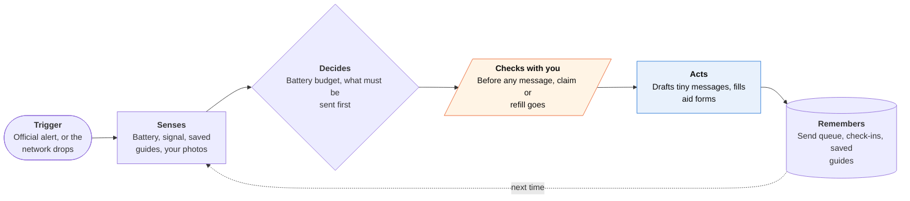

<!-- Generated by scripts/build.py from data/ideas.json. Edit the JSON, then run the script. -->

[← All ideas](../README.md) · **Moonshots** · Safety & civic

# M-13 · Blackout Mode Agent

> When a disaster cuts service, it plans on the phone, drafts tiny satellite messages, and queues the rest.

| Difficulty | Novelty | Buildable on iOS today | Impact if it works | Horizon | Autonomy |
|---|---|---|---|---|---|
| `●●●●○` 4/5 | `●●●●○` 4/5 | `●●●○○` 3/5 | `●●●●○` 4/5 | 3–5 years | L2 · Drafts, you approve |

## The moment

It's day two after the hurricane. You have no cell service, 38% battery, and your sister hasn't checked in. The agent has already set a battery plan that lasts to Thursday, drafted a check-in short enough for you to send over satellite, and filled in most of your disaster-aid registration from the room-by-room video you took before the storm. It sends nothing until a signal returns and you say yes.

## The problem

Disaster apps assume a network. When towers go down, people are left with a phone, a shrinking battery and paperwork that has to wait. Offline chatbots answer questions but don't plan, and satellite messaging on iPhone is built for short texts you type yourself. Nothing prepares the paperwork before the storm and queues it for the moment service comes back.

## How the agent works

## iOS building blocks

- **WeatherKit (WeatherAlert)** — starts the prep plan when an official severe-weather alert covers your area
- **Network (NWPathMonitor, NWPath.isUltraConstrained)** — notices when service drops or only a satellite link is left
- **Carrier-constrained network entitlement (com.apple.developer.networking.carrier-constrained.app-optimized)** — marks the app as built for a carrier satellite network, so approved apps can send small payloads over it
- **Foundation Models (SystemLanguageModel)** — plans, drafts and fills forms with no connection
- **Vision (OCRTool) and VisionKit document camera** — reads IDs, prescriptions and policy pages into the offline file
- **ProcessInfo (isLowPowerModeEnabled, thermalState)** — keeps the agent's own power use inside the budget
- **Multipeer Connectivity** — passes block roll-call status between nearby phones while the app is open

## What makes it hard

- The wall (platform + carrier + research): third-party satellite data needs Apple's approval and a carrier plan (T-Mobile's T-Satellite was first), bandwidth is tiny, and apps can't send through Apple's own Messages via satellite. iOS allows no background phone-to-phone mesh, so relaying between neighbors works only with the app open. Disaster-aid agencies offer no public API for survivors' applications, so a queued claim still ends in a form a person submits.
- Battery versus thinking: every minute of on-device inference spends charge an SOS may need. The agent needs a hard energy budget and must do most of its work before the storm, while the phone is charging.
- Offline knowledge: a small on-device model has no reliable disaster or medical knowledge. Answers must come only from a vetted guide saved in advance, and the app has to say 'I don't know' otherwise.
- What would have to change: an Apple store-and-forward API for small, structured app messages over satellite; wider carrier support; an emergency mode that lets public-safety apps relay in the background; and agency APIs for disaster-aid registration.

## Risks and failure modes

- Wrong advice when lives are at stake: the agent never improvises medical or evacuation advice. It quotes the saved guide, points to 911 or Emergency SOS via satellite, and says when it has nothing.
- The app itself could drain the battery someone needs for an SOS. Cap its energy use and show the budget on screen.
- Neighbors' needs cards (oxygen, insulin, mobility, who has a spare key) are sensitive. Encrypt them and open them to the block only when an emergency is declared.

## Unsaid assumptions

_What this idea quietly depends on being true. Check these before you build._

- People set it up before the disaster, while service works; most of the value is prepared in advance.
- Enough neighbors opt in that a block roll call covers more than a few houses.
- Official alerts arrive before service fails, so the prep plan has time to run.

## Unknown unknowns

_Open questions nobody has good answers to yet._

- Will Apple approve disaster-prep apps for carrier satellite data, and will carriers besides T-Mobile follow?
- How much battery does an on-device plan really cost on a hot, throttled phone?
- Would aid agencies accept a pre-filled registration from an app, or only through their own site?

## Prior art and who's building

- [HAVEN Survival](https://havensurvival.com/blog/best-survival-apps-offline-2026/) — Offline AI chat and mesh messaging. Answers questions but doesn't plan or queue paperwork.
- [OfflineGPT](https://apps.apple.com/us/app/-/id6755918504) — An on-device chatbot. No disaster workflow.
- [iPhone apps that work over T-Satellite on iOS 26 (9to5Mac)](https://9to5mac.com/2025/09/17/on-ios-26-with-a-t-satellite-plan-these-six-iphone-apps-work-via-satellite/) — The first apps using carrier satellite data. None is a disaster agent.
- [Apple carrier-constrained entitlement](https://developer.apple.com/documentation/bundleresources/entitlements/com.apple.developer.networking.carrier-constrained.app-optimized) — The door for third-party satellite data, gated by Apple and the carrier.
- Facebook Crisis Response (Safety Check) — Marks people safe after a disaster. Needs a network and does no planning.
- Bridgefy — Bluetooth mesh messaging. No agent and no paperwork.
- Map Your Neighborhood (Washington State) — Paper program for neighbors to check on each other. Shows the roll-call idea works; nothing is automated.

## Smallest useful first version

The pre-storm prep agent plus an offline planner. When an official alert arrives, it saves shelter lists and a vetted guide, walks you through a video inventory, and stores copies of IDs and prescriptions. After service drops, it sets a battery budget, drafts short check-ins for you to send yourself through Messages via satellite (iPhone 14 or later, where offered), and fills aid forms to submit when a connection returns.

Research notes: what we could and couldn't verify

Merged 'Blackout Block Roll-Call' (neighbor needs cards, roll call, nearest-neighbor checks, phone-to-phone relay, syncing with city CERT teams). The claim that disaster-aid systems have no public submission API comes from the candidate; not verified. A roll call that breaks through Focus would need Apple's Critical Alerts entitlement, which Apple grants rarely.

## Related ideas

- [B-26 · Offline on-device LLM apps](../building-now/B-26-offline-on-device-llm.md)
- [M-15 · Zero-Cloud Exit Planner](../moonshot/M-15-zero-cloud-exit-planner.md)
