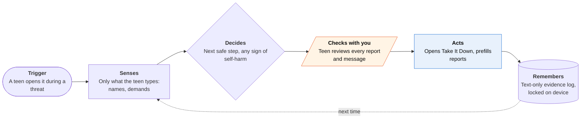

<!-- Generated by scripts/build.py from data/ideas.json. Edit the JSON, then run the script. -->

[← All ideas](../README.md) · **Moonshots** · Safety & civic

# M-14 · Sextortion First Responder

> A private guide for a teen facing sextortion at 1 a.m.: don't pay, keep proof, report, find an adult.

| Difficulty | Novelty | Buildable on iOS today | Impact if it works | Horizon | Autonomy |
|---|---|---|---|---|---|
| `●●●●○` 4/5 | `●●●●○` 4/5 | `●●●○○` 3/5 | `●●●●○` 4/5 | 3–5 years | L2 · Drafts, you approve |

## The moment

It's 1:14 a.m. Someone who seemed to be a student at a nearby school now demands $300 in gift cards within 30 minutes, or the photos go to all your followers. You open the app instead of paying, and it tells you this is a crime against you, not your fault, and that paying usually brings more demands. Then it walks you through the next ten minutes, one step at a time, and never asks to see the images.

## The problem

Financial sextortion is scripted, fast and aimed at teens: NCMEC received more than 100 sextortion reports a day in 2025. The first hour decides whether a teen pays, deletes the evidence or tells no one. The help exists (NCMEC's Take It Down, the CyberTipline, platform reporting, crisis lines), but a panicking teen has to find it and chain it together alone, at night, on the same phone the threats arrive on.

## How the agent works

## iOS building blocks

- **SafariServices (SFSafariViewController)** — opens Take It Down and the CyberTipline; Apple's docs say the app can't see what happens in that view
- **Foundation Models (SystemLanguageModel, on-device, text only)** — turns what the teen types into the fields each report asks for; it is never given images
- **Foundation (FileProtectionType.complete)** — keeps the text-only evidence log unreadable while the phone is locked
- **MessageUI (MFMessageComposeViewController)** — drafts the first message to a trusted adult; the teen taps Send
- **App Intents** — a neutral Siri phrase or Shortcut that opens the app straight to step one

## What makes it hard

- The wall (law + trust + platform): any copy of the images is child sexual abuse material, so the agent must never see, store, send or analyze them, not even with an on-device model. US federal law (18 U.S.C. 2258A) requires online service providers that learn of such material to report it to the CyberTipline, one more reason the app must never hold it. Platforms have no victim-side reporting API and NCMEC has no report-intake API, so today the agent can only prepare text and hand off to each website and app.
- Evidence without images: screenshots of the chat often include the image itself. The app has to guide the teen to record usernames, profile links, payment handles and the demand as typed or pasted text, and to keep the conversation rather than delete it.
- Being there in the first minute: a teen won't install an app mid-crisis if it needs a parent's approval (Ask to Buy) or an age check they fear, and Apple's Declared Age Range API lets a parent decide whether a child's age is shared. Distribution through schools, counselors and platform help pages, with a neutral name and icon, matters as much as the software.
- What would have to change: NCMEC offering an on-device hashing SDK and a report-intake API; platforms accepting structured victim reports; and a clear safe harbor for crisis tools that follow a protocol written with NCMEC and child-safety experts.

## Risks and failure modes

- False reassurance: Take It Down only helps on participating platforms' public or unencrypted services and can't stop uploads elsewhere. The app never says 'you're safe now' or 'it's deleted'. It says what each step does and doesn't do, and it never advises paying, replying or negotiating.
- Mandatory reporting: many adults a teen might pick (teachers, school counselors, coaches, doctors) are mandated reporters under state law and may have to report what they're told. The app says so before the teen chooses. Lawyers must also decide whether text a teen types creates any reporting duty for the company.
- Danger at home and self-harm: the extorter may be someone the teen knows, even in the home, so the trusted-adult step never defaults to a parent. Any mention of self-harm puts the 988 Suicide & Crisis Lifeline one tap away at once; financial sextortion has been linked to teen suicides.

## Unsaid assumptions

_What this idea quietly depends on being true. Check these before you build._

- A teen in crisis will open an app instead of paying, so it has to be installed already or findable in seconds.
- A calm, step-by-step script helps more than a page of links, even though every step ends on someone else's website.
- Schools and platforms are willing to point teens to a third-party tool.

## Unknown unknowns

_Open questions nobody has good answers to yet._

- Does guided help in the first hour lower payment and self-harm rates, and how would anyone measure that without collecting sensitive data?
- Who should publish it: a startup, NCMEC, or a platform? Trust may matter more than features.
- Should self-harm detection be a plain keyword rule plus an always-visible button, rather than a model judgment?

## Prior art and who's building

- [NCMEC Take It Down](https://takeitdown.ncmec.org/) — Hashes explicit images of under-18s on the user's own device so participating platforms can find copies. Doesn't work on encrypted services or stop uploads elsewhere, and a teen has to find it alone.
- [NCMEC sextortion resources and CyberTipline](https://ncmec.org/sextortion) — Guidance and a reporting form. Static pages, no guided flow.
- [NCMEC 2025 sextortion data](https://www.missingkids.org/blog/2026/ncmec-releases-new-sextortion-data-2025) — Over 100 sextortion reports a day in 2025.
- [Meta teen sextortion protections](https://about.fb.com/news/2024/02/helping-teens-avoid-sextortion-scams/) — Protections inside Meta's own apps. They don't help once a threat arrives elsewhere.
- Thorn's NoFiltr — Youth resources on sextortion. Information, not a step-by-step guide.

## Smallest useful first version

A guided, mostly rule-based crisis flow with no image handling at all: don't pay, don't reply, keep the chat, record usernames and demands as text. It opens Take It Down and the CyberTipline, gives per-platform reporting steps, drafts a message to a trusted adult for the teen to send, and keeps 988 one tap away throughout. It is written and tested with child-safety experts before launch.

Research notes: what we could and couldn't verify

Checked by web search: NCMEC's 2026 post is titled 'Over 100 Reports Received Daily in 2025' (more than 50,000 financial sextortion reports, about 137 a day), and Take It Down's hashing happens on the user's device, excludes encrypted services, and only reaches participating platforms. Raised the candidate's feasibility from 2 to 3: the handoff version needs no blocked API; the wall is law, trust and liability. Mandated-reporter duties vary by state and were not checked state by state. The 18 U.S.C. 2258A description is a summary and needs a lawyer's reading. Declared Age Range was dropped from ios_blocks on purpose: the flow asks 'were you under 18 when the images were taken?' instead.

## Related ideas

- [M-15 · Zero-Cloud Exit Planner](../moonshot/M-15-zero-cloud-exit-planner.md)
- [B-18 · Scam-call guardian agents](../building-now/B-18-scam-call-guardians.md)
