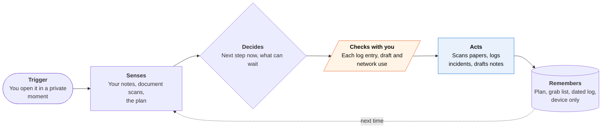

<!-- Generated by scripts/build.py from data/ideas.json. Edit the JSON, then run the script. -->

[← All ideas](../README.md) · **Moonshots** · Safety & civic

# M-15 · Zero-Cloud Exit Planner

> A plan for safely leaving an abusive home that lives only on your phone and works alongside an advocate.

| Difficulty | Novelty | Buildable on iOS today | Impact if it works | Horizon | Autonomy |
|---|---|---|---|---|---|
| `●●●●○` 4/5 | `●●●●●` 5/5 | `●●●○○` 3/5 | `●●●●○` 4/5 | 3–5 years | L2 · Drafts, you approve |

## The moment

Your partner knows your email and iCloud passwords, but after a call with a hotline advocate you changed your phone's passcode and reset Face ID so only your face opens it. You open what looks like a calculator, and it picks up where you stopped last night: two documents still to photograph, one bank account still to open, and a draft note to your employer about your pay deposit. Nothing it holds is in any cloud.

## The problem

Leaving an abusive partner takes weeks of quiet preparation: documents, money, evidence, a place to go, and a day when everything happens in the right order. Planning tools store plans in accounts a controlling partner may be able to read, and they don't help carry out the steps. Trained advocates do this work well, but they aren't in the room at 11 p.m. when there are ten safe minutes to scan a birth certificate.

## How the agent works

## iOS building blocks

- **Foundation Models (SystemLanguageModel, on-device only)** — drafts messages and turns notes into log entries with no server
- **Vision (OCRTool) with Foundation Models Attachment** — reads passports, leases and insurance cards on the device
- **VisionKit (VNDocumentCameraViewController)** — scans documents straight into the app, not the Photos library
- **Speech (SpeechAnalyzer)** — transcribes voice notes on the device
- **SwiftData with FileProtectionType.complete** — keeps the plan and log encrypted whenever the phone is locked
- **Foundation (URLResourceValues.isExcludedFromBackup)** — keeps its files out of iCloud and computer backups
- **UIKit (setAlternateIconName)** — a disguised icon
- **LocalAuthentication** — its own lock, separate from the phone's

## What makes it hard

- The wall (research + platform): a roughly 3B on-device model with a context of a few thousand tokens has to support a plan that spans weeks, hundreds of facts and local legal steps it can't look up, and it must not drop a step on the day that matters. iOS background work is short and visible (a Live Activity would show on the Lock Screen), long inference heats the phone, and data on the device is only as safe as the passcode and Face ID enrollment.
- Leaks through the system: the app must stay out of Spotlight, Siri suggestions, widgets, notifications and the Photos library, blank its App Switcher snapshot, and never donate intents. App Store purchase history, Screen Time and the battery-usage list can still show it was installed or used, and iOS's hidden-apps folder is itself visible.
- Keeping local knowledge right: protective-order steps, shelter rules and benefits differ by state and county. That content has to come from advocates as dated offline packs, not from the model.
- What would have to change: much longer on-device context or reliable local memory for small models; offline, jurisdiction-specific legal packs kept current by advocacy groups; and an OS-level duress or decoy mode (for example, a second passcode that opens a clean profile), which no app can build alone.

## Risks and failure modes

- Discovery can raise the danger: if a partner finds a disguised safety app, abuse can escalate. At setup the app says this plainly, suggests a safer device if this phone may be monitored, and urges talking with an advocate about whether to use it at all. Every screen has a quick exit to a working calculator.
- Stalkerware and shared access: if the partner knows the passcode, has their face enrolled, has installed monitoring software or a configuration profile, or signs in to the same Apple Account, the app can't protect anything. Removing monitoring tools can alert the abuser, so the app points to Apple's Safety Check and an advocate before any changes.
- Not a replacement for people: the app never presents itself as an advocate or lawyer. It routes to the National Domestic Violence Hotline (1-800-799-7233, text START to 88788, or chat) and local programs, and to 911 in immediate danger. An incident log can also be demanded in a custody case, so an advocate or lawyer should advise what to record.

## Unsaid assumptions

_What this idea quietly depends on being true. Check these before you build._

- The survivor can keep the phone itself private. If the partner can get into it, no on-device design is safe.
- Survivors will use it in short private windows, one step at a time.
- Advocates will help write and maintain the plan templates and local packs.

## Unknown unknowns

_Open questions nobody has good answers to yet._

- Do disguised apps protect more people than they endanger when found?
- Will courts give weight to a log kept in an app, and does keeping it on the phone help or hurt in a custody case?
- Can a small model draft messages without slipping plan details into text meant for an employer or landlord?

## Prior art and who's building

- [Apple Safety Check](https://support.apple.com/guide/personal-safety/safety-check-iphone-ios-16-ips2aad835e1/web) — Reviews and resets what you share with people and apps, with Quick Exit and Emergency Reset. Doesn't plan or keep records.
- [NNEDV Safety Net resources for survivors](https://www.techsafety.org/resources-survivors) — Tech-safety guides written by advocates. Information, not a tool that holds a plan.
- [FTC: Stalkerware, what to know](https://consumer.ftc.gov/articles/stalkerware-what-know) — Explains monitoring apps and the need to plan before removing them.
- myPlan (Johns Hopkins) — Safety-planning decision aid. Helps decide; takes no actions.
- Bright Sky (UK) — Disguised support app with resources. No agent.
- [apple/foundation-models-utilities](https://github.com/apple/foundation-models-utilities) — Apple's rolling-window and history-summary helpers for working inside a small context.

## Smallest useful first version

A fixed checklist engine does the planning; the on-device model only reads documents, transcribes notes and drafts messages. It works in airplane mode by default, keeps files out of backups, uses a disguised icon and sits in iOS's Face ID-locked hidden apps. Every screen has a quick exit and a one-tap link to the National Domestic Violence Hotline, and the plan templates are written with advocates.

Research notes: what we could and couldn't verify

Hotline contact details (1-800-799-SAFE (7233), text START to 88788, chat) and Safety Check's Quick Exit and Emergency Reset were checked by web search. Context size is given loosely because Apple's docs cite 4,096 tokens while WWDC26 coverage cites 8,192 for the iOS 27 model. Anyone building this should work with DV tech-safety advocates (for example NNEDV's Safety Net team) from day one.

## Related ideas

- [M-14 · Sextortion First Responder](../moonshot/M-14-sextortion-first-responder.md)
- [B-26 · Offline on-device LLM apps](../building-now/B-26-offline-on-device-llm.md)
- [M-13 · Blackout Mode Agent](../moonshot/M-13-blackout-mode-agent.md)
