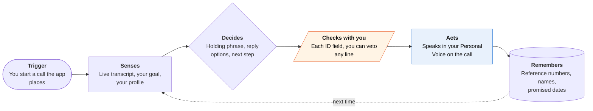

<!-- Generated by scripts/build.py from data/ideas.json. Edit the JSON, then run the script. -->

[← All ideas](../README.md) · **Moonshots** · Accessibility

# M-16 · Mid-Call Voice Stand-In

> Speaks for people who can't talk fast, in their own banked voice, inside a live call, then hands back.

| Difficulty | Novelty | Buildable on iOS today | Impact if it works | Horizon | Autonomy |
|---|---|---|---|---|---|
| `●●●●●` 5/5 | `●●●●○` 4/5 | `●●○○○` 2/5 | `●●●●○` 4/5 | 3–5 years | L2 · Drafts, you approve |

## The moment

You have ALS and type with your eyes. The insurance rep says 'hello? are you there?' for the third time and is about to hang up. You glance at 'Hold the line', and your own banked voice says 'I'm here. I type slowly, please stay on.' Later you glance at 'Take over', and the agent keeps pressing for the wheelchair repair while you watch the transcript and veto any sentence before it's spoken.

## The problem

Phone calls punish anyone who can't speak quickly: people with ALS, aphasia, a severe stutter or after a stroke. Type-to-speak is too slow for reps who hang up after a few seconds of silence. AI calling agents call instead of you, not with you, and the human service that exists (speech-to-speech relay) has no AI version. Nothing helps you stay in charge of your own call at conversation speed.

## How the agent works

## iOS building blocks

- **CallKit** — runs the app's own VoIP calls with the system call interface
- **AVFoundation (AVSpeechSynthesizer, requestPersonalVoiceAuthorization)** — speaks in your Personal Voice once you allow it
- **Speech (SpeechAnalyzer)** — live on-device transcript of the other side
- **Foundation Models (PrivateCloudComputeLanguageModel)** — suggests replies and plans the next step with a larger context
- **ActivityKit (Live Activities)** — shows the call goal and status on the Lock Screen
- **EventKit** — saves reference numbers and promised dates as reminders

## What makes it hard

- The wall (platform + research + law): third-party apps can't touch cellular call audio, so this works only on calls the app places over VoIP, never on calls to your real number. Duplex speech on a phone is a proof of concept, and keeping sub-second turn-taking through a 40-minute call runs into heat limits, while cloud duplex adds delay. Legally, a synthetic copy of your voice saying words an AI chose is new ground: some institutions use voiceprints, some states require every party's consent to record, and FCC relay rules cover human speech-to-speech relay, not AI.
- Speed of choice: someone typing with eye gaze may manage a few words a minute. Suggested replies must be right often enough that picking beats composing, and every control has to work with iOS Eye Tracking, Switch Control and AAC hardware.
- Safe takeover: in 'take over' mode, the agent must stay inside the goal, never agree to new charges or share unapproved data, and hand back instantly. A text model steering a voice front end needs hard rules on what it may say.
- What would have to change: an Apple in-call assist extension for AAC apps, like its own Live Speech; on-device duplex speech that holds up under heat; and a rule that treats a user-supervised AI voice as the user's own relay.

## Risks and failure modes

- Voice misuse: a banked voice an agent can drive is a fraud tool if the phone is stolen or the app compromised. Require the user's presence for every call, keep the voice on the device, and keep a full log.
- Honesty with the other side: the app says at the start of each call that an assistant is helping, even though some reps may hang up.
- Wrong commitments: anything that changes money, appointments or identity needs the user's tap first, even in takeover mode.

## Unsaid assumptions

_What this idea quietly depends on being true. Check these before you build._

- People on the other end will stay on the line and treat a disclosed assistant voice as the customer.
- Most calls that matter can be placed from the app over VoIP rather than received on the user's own number.

## Unknown unknowns

_Open questions nobody has good answers to yet._

- Will banks and insurers accept identity answers spoken by a synthetic voice while the customer is present?
- How much delay will reps tolerate before hanging up, and can on-device duplex models meet it?
- Does Apple allow Personal Voice audio in an app's outgoing call stream?

## Prior art and who's building

- Apple Live Speech with Personal Voice — Type-to-speak in calls. No suggested replies, no agent.
- [Pine AI](https://apps.apple.com/us/app/pine-assistant/id6746403769) — Calls businesses instead of you. You aren't on the call.
- [Kyutai moshi-swift](https://github.com/kyutai-labs/moshi-swift) — Full-duplex speech on MLX Swift with an iOS proof of concept. No device performance numbers published.
- [Duplex speech front end with delegated tool calls (paper)](https://huggingface.co/papers/2609.19334) — September 2026 research reporting 92-97% tool-call recall. Not a product.
- Apple Hold Assist — Waits on hold for you. Never talks.

## Smallest useful first version

An outbound-only VoIP caller for people who use AAC. It speaks typed or chosen text in Personal Voice, fills silences with honest holding phrases, suggests two or three replies from the live transcript, speaks profile fields only after approval, and logs reference numbers and promises. No autonomous takeover yet.

Research notes: what we could and couldn't verify

Category changed from Social & communication to Accessibility. I could not verify whether Apple permits Personal Voice output in an app's outgoing VoIP audio; AVSpeechSynthesizer can render to buffers, but the policy is unclear. Duplex paper figures and moshi-swift details come from the research digest.

## Related ideas

- [W-07 · Deaf-First Call Agent](../whitespace/W-07-deaf-first-call-agent.md)
- [B-02 · Phone-call errand agents](../building-now/B-02-phone-call-errand-agents.md)
- [M-05 · Assistive Agent Pass](../moonshot/M-05-assistive-agent-pass.md)
