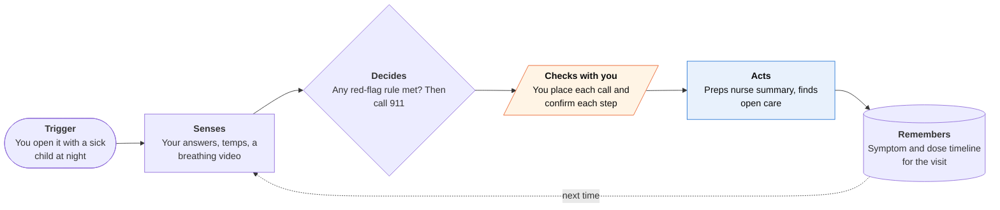

<!-- Generated by scripts/build.py from data/ideas.json. Edit the JSON, then run the script. -->

[← All ideas](../README.md) · **Moonshots** · Health & body

# M-17 · 2 a.m. Fever Triage

> With a sick child at 2 a.m., it gathers the facts, gets a licensed nurse on the line, and follows through.

| Difficulty | Novelty | Buildable on iOS today | Impact if it works | Horizon | Autonomy |
|---|---|---|---|---|---|
| `●●●●●` 5/5 | `●●●○○` 3/5 | `●●●○○` 3/5 | `●●●●●` 5/5 | 3–5 years | L2 · Drafts, you approve |

## The moment

It's 2 a.m. and your 10-month-old is hot and breathing fast, and you're scrolling forums with one hand. Instead, the app checks a short list of emergency signs, asks five questions, reads the last readings from your thermometer and has you record 30 seconds of her breathing for the nurse. When the nurse line answers you read from one screen, and afterwards it sets the recheck timers exactly as the nurse said.

## The problem

At night, parents choose between waiting, calling a nurse line and driving to the ER, usually while scared and searching forums or asking a chatbot. Nurse lines give good advice, but parents arrive unprepared and forget half of it by morning. Chatbots answer but can't take responsibility or act. Nothing collects the facts, gets a licensed person on the line, and then does what that person said.

## How the agent works

## iOS building blocks

- **Foundation Models (@Generable)** — turns spoken or typed answers into a fixed intake form
- **Core Bluetooth** — reads thermometers that use the standard Bluetooth Health Thermometer service
- **AVFoundation** — records a short breathing video for the nurse; the app doesn't analyze it
- **MapKit (MKLocalSearch)** — finds open pediatric urgent care nearby
- **AlarmKit** — sets recheck and dose alarms exactly as the nurse said
- **ActivityKit (Live Activities)** — shows the next recheck on the Lock Screen

## What makes it hard

- The wall (regulation + liability + sensing): software that tells a parent 'ER now' or 'wait until morning' about their own child is likely a medical device under FDA's clinical decision support guidance and needs clearance. Under-triaging meningitis or sepsis is catastrophic for the family and the company. Camera-based infant vital signs aren't validated for this use, and the best pediatric triage protocols (Schmitt-Thompson) are licensed content.
- The red-flag check must be plain rules from published pediatric guidance (for example, any fever in a baby under 3 months needs prompt medical care), versioned and reviewed by clinicians, with no model anywhere in that path.
- Getting data about a child: HealthKit holds the phone owner's data, so a baby's readings don't belong in a parent's Health. Readings come from manual entry or a Bluetooth thermometer, and weight from the last checkup.
- What would have to change: an FDA-cleared triage engine with a plan for model updates; a health system or insurer partner that carries clinical liability and staffs the nurse line; and validated home sensors.

## Risks and failure modes

- Under-triage: a calm summary screen can make a sick child look fine. The app never says 'it's OK to wait'; only the nurse or a doctor decides, and red flags always send the parent to 911.
- Delay: a slow nurse line could hold up care. After a set wait, the app tells parents plainly they can go to urgent care or the ER without waiting.
- Dosing errors: it logs doses given and the times the nurse set, but never calculates a dose.

## Unsaid assumptions

_What this idea quietly depends on being true. Check these before you build._

- A nurse line answers fast enough at 2 a.m. to beat simply driving to the ER.
- Scared parents will follow a short structured intake.
- Insurers or pediatric practices will let an app hand a summary to their nurses.

## Unknown unknowns

_Open questions nobody has good answers to yet._

- Will nurses use a parent-prepared summary, or re-ask everything anyway?
- Does prep plus follow-through cut needless ER visits without missing serious illness?
- Could a health system run the decision step under its own clearance and licenses?

## Prior art and who's building

- [Mount Sinai 'Check Symptoms and Get Care'](https://pubmed.ncbi.nlm.nih.gov/42454888/) — AI triage run by a health system on nurse protocols. Institution-side, not a parent's agent.
- [AAP Pediatric Symptom Checker (Schmitt-Thompson)](https://www.stcc-triage.com/the-authors) — The standard pediatric protocols. A static guide.
- [ChatGPT Health](https://www.macrumors.com/2026/01/07/openai-chatgpt-health-apple-health-integration/) — Chat with Apple Health data. No handoff to a nurse and no follow-through.
- [Coverage of AI symptom checkers (Association of Health Care Journalists)](https://healthjournalism.org/blog/2026/08/ai-powered-symptom-checkers/) — Reporting on where AI symptom checkers help and fail.
- Insurer 24/7 nurse lines — Licensed humans. No prep before the call and no follow-through after.

## Smallest useful first version

Everything except the decision. The app runs rule-based red-flag checks (911 if any), prepares a one-screen summary, and starts the call to your insurer's or pediatrician's after-hours nurse line when you tap. Then it acts on what the nurse decided: finds open urgent care and gives directions, or sets recheck and dose timers.

Research notes: what we could and couldn't verify

Dropped HealthKit from ios_blocks: a child's readings don't belong in the parent's Health data (flagged in hard_parts). The FDA point reflects the 2022 clinical decision support guidance; I did not check whether 2026 revisions changed it. The under-3-months fever rule is standard AAP guidance, stated from general knowledge.

## Related ideas

- [B-09 · Health-record reading assistants](../building-now/B-09-health-record-readers.md)
- [W-21 · Discharge Scramble](../whitespace/W-21-discharge-scramble.md)
- [M-19 · Fourth Trimester Sentinel](../moonshot/M-19-fourth-trimester-sentinel.md)
