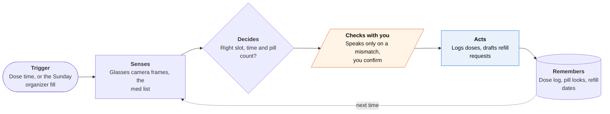

<!-- Generated by scripts/build.py from data/ideas.json. Edit the JSON, then run the script. -->

[← All ideas](../README.md) · **Moonshots** · Family & care

# M-18 · Med-Pass Witness

> Camera glasses watch a family caregiver give each dose, check it against the list, and prep refills.

| Difficulty | Novelty | Buildable on iOS today | Impact if it works | Horizon | Autonomy |
|---|---|---|---|---|---|
| `●●●●●` 5/5 | `●●●●●` 5/5 | `●●○○○` 2/5 | `●●●●○` 4/5 | 3–5 years | L2 · Drafts, you approve |

## The moment

You're giving your father his evening pills with one hand and holding his cup with the other. The glasses see you tip a small white tablet out of the Tuesday evening slot, and a quiet voice in your ear says 'that looks like the morning blood-pressure pill'. You check, swap it, and the dose is logged without you touching the phone.

## The problem

Most doses at home are given by unpaid family caregivers who are tired, rushed and have no second check. Hospitals scan barcodes and are testing smart glasses to catch errors; kitchens have pill organizers and reminder apps that only ask 'did you take it?'. Nothing checks that the right pill went out at the right time, then keeps the log and the refills in order.

## How the agent works

## iOS building blocks

- **Meta Wearables Device Access Toolkit (third-party iOS SDK)** — streams frames from Ray-Ban Meta glasses and can show text on Ray-Ban Display
- **Foundation Models (Attachment image input)** — compares what the camera sees with the list, on the device
- **Vision (OCRTool)** — reads pharmacy labels to build the med list
- **HealthKit (HKUserAnnotatedMedicationQueryDescriptor)** — reads the med list from the Health app on the parent's own iPhone, with permission
- **AVFoundation (AVSpeechSynthesizer)** — the quiet warning, played through the glasses' speakers
- **App Intents on Apple Watch** — logs a dose with one tap when the glasses are off
- **UserNotifications** — refill reminders and approval requests

## What makes it hard

- The wall (hardware + research + regulation + consent): glasses video at arm's length rarely resolves pill imprint codes, many generics look alike, and continuous streaming drains the glasses and heats the phone. Meta's SDK is still a developer preview. A tool that claims to prevent medication errors may be regulated as a medical device, a missed error still falls on the caregiver, and filming a parent with dementia raises consent questions the parent may not be able to answer.
- Knowing when to look: spotting the moment pills leave the organizer in continuous first-person video, without streaming all day, is open research. The early version needs an explicit 'dose now' tap or voice cue.
- Whose data: HealthKit's Medications API reads the list the phone's owner added to Health. A parent's list lives on the parent's phone, so the app needs that phone, label scans or manual entry.
- What would have to change: higher-resolution on-demand capture on glasses; pharmacy-issued pill images or coded adherence packs tied to each prescription; general availability of the SDK; and a clear regulatory line for caregiver-facing checks.

## Risks and failure modes

- False confidence: if the caregiver reads silence as 'correct', a missed error is worse than no tool. The app says plainly that it checks slot and time well and pill identity only sometimes.
- Consent and dignity: filming someone being cared for at home needs their agreement, or an authorized proxy's, recorded in the app. Frames are processed on the device and not kept, and updates to siblings go out only if the parent agreed.
- Medical changes: it drafts refill requests for the caregiver to approve and never changes a dose or schedule.

## Unsaid assumptions

_What this idea quietly depends on being true. Check these before you build._

- Caregivers will wear camera glasses at home, and the person receiving care accepts being filmed.
- The med list is right to begin with; the app checks against the list, not against the prescriber.

## Unknown unknowns

_Open questions nobody has good answers to yet._

- What share of home medication errors are wrong-slot or wrong-time mistakes a camera can see, versus wrong pills filled into the organizer?
- Will the FDA treat a caregiver-facing dose check as a device?
- How long can glasses stream each day before battery and heat make it impractical?

## Prior art and who's building

- [UW smart-glasses study on medication errors](https://www.pymnts.com/artificial-intelligence-2/2025/can-ai-powered-smart-glasses-help-spot-medication-errors) — AI glasses caught drug-vial swaps in the operating room. Hospital setting, not a kitchen table.
- [Meta Wearables Device Access Toolkit for iOS](https://github.com/facebook/meta-wearables-dat-ios) — The glasses-to-iPhone SDK. Developer preview.
- [Smart Pill ID](https://www.smartpillid.com/) — Identifies one pill from a phone photo. No dose workflow.
- Medisafe — Reminders and missed-dose alerts. Takes the user's word for it.
- Hero Health — A pill dispenser that controls doses. Needs dedicated hardware and doesn't watch the hand-off.

## Smallest useful first version

A Sunday organizer check from still photos taken through the glasses, compared with a med list built from pharmacy-label scans. At dose time, a tap on Apple Watch logs the dose, and refill requests are drafted for the caregiver to approve. No continuous video yet.

Research notes: what we could and couldn't verify

Meta SDK capabilities come from the research digest's reading of its changelog; not re-checked. The UW study and Smart Pill ID are described from the candidate's sources. Changed the moment's example pill from metformin (often taken twice a day) to a morning blood-pressure pill.

## Related ideas

- [W-18 · Refill Runway](../whitespace/W-18-refill-runway.md)
- [B-19 · Blind-assist scene agents](../building-now/B-19-blind-assist-scene-agents.md)
