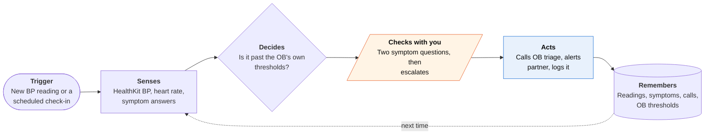

<!-- Generated by scripts/build.py from data/ideas.json. Edit the JSON, then run the script. -->

[← All ideas](../README.md) · **Moonshots** · Health & body

# M-19 · Fourth Trimester Sentinel

> Watches blood pressure and warning signs for six weeks after birth and gets the OB team on the line fast.

| Difficulty | Novelty | Buildable on iOS today | Impact if it works | Horizon | Autonomy |
|---|---|---|---|---|---|
| `●●●●○` 4/5 | `●●●○○` 3/5 | `●●○○○` 2/5 | `●●●●●` 5/5 | 1–2 years | L3 · Acts in guardrails, reports back |

## The moment

You're nine days postpartum, up at 3 a.m. with the baby, and you've decided your headache is just lack of sleep. Your cuff reading lands in Health: 164/102, over the line your OB set at discharge. The agent asks two quick questions about your vision and breathing, wakes your partner, and puts you through to the OB triage line with your last three readings already in the care team's inbox.

## The problem

Postpartum preeclampsia can start days or weeks after you leave the hospital, when you're exhausted and nobody is checking. Its warning signs, a headache or swollen feet, look like ordinary new-parent misery. Hospital programs that have parents text in home blood pressure readings work, but most practices don't run one, and consumer blood pressure apps log numbers with nobody on the other end.

## How the agent works

## iOS building blocks

- **HealthKit (HKCorrelationType blood pressure, HKObserverQuery with background delivery)** — picks up cuff readings soon after they sync to Health
- **HealthKit clinical records (HKClinicalRecord)** — delivery date, diagnoses and discharge meds where the hospital supports Health Records
- **UserNotifications (critical alerts, managed entitlement)** — breaks through silent mode and Focus for a threshold hit
- **WatchKit (WKInterfaceDevice haptics)** — wrist taps for twice-daily readings and night symptom check-ins
- **ActivityKit (Live Activities)** — shows an escalation in progress: triage called, partner alerted
- **App Intents** — 'log my pressure' or 'I have a headache' from Siri or the Action button

## What makes it hard

- Wall (trust and regulation): an app that reads blood pressure and tells someone to go to the ER is very likely a medical device, and escalation only works if an OB team is on the other end. Health systems don't accept alerts from consumer apps. What would have to change: OB practices 'prescribing' the app with their own thresholds and an inbox that receives its alerts, paid for as remote patient monitoring.
- Someone has to answer at 3 a.m. That is a staffing contract and a clinical protocol, not an API. The call itself runs from a cloud phone number on the server, because an iPhone app can't place a cellular call on its own.
- Readings are only as good as the cuff and the technique. Cuff size, a validated device and a recheck rule after a single high reading all have to be written by clinicians, not guessed by a model.
- HealthKit background delivery is not instant or guaranteed, and postpartum preeclampsia can appear up to six weeks after birth. The agent has to keep an exhausted parent taking readings twice a day for weeks without nagging them into ignoring it.

## Risks and failure modes

- Medical safety line: it never invents thresholds, never tells anyone a reading is fine, and never talks anyone out of care. A red-flag symptom (severe headache, vision changes, chest pain, trouble breathing, a seizure) always means 'call 911 or go to the ER now', with the OB call running alongside.
- Regulatory status: under FDA's software policy, logging readings and sharing them with a clinician is low risk, but alarms meant to prompt urgent clinical action look like a regulated device function. That needs FDA clearance or has to run inside a clinician-run monitoring program. Apple's own FDA-cleared hypertension notifications are not intended for pregnant people or people already diagnosed with hypertension.
- False reassurance: if the app stays quiet, people may skip the postpartum blood pressure check their OB scheduled. It must say plainly that it doesn't replace that visit.

## Unsaid assumptions

_What this idea quietly depends on being true. Check these before you build._

- New parents will take readings twice a day, even at 3 a.m., if logging takes one tap and a Watch nudge.
- An OB practice will write thresholds into the app, answer its escalations, and find someone to pay for that time.
- The home cuff is validated and syncs to Health reliably.

## Unknown unknowns

_Open questions nobody has good answers to yet._

- Does an app that only applies a clinician's own thresholds count as a regulated device, or as part of that clinician's practice? There's no clear FDA answer for this exact setup.
- Will a triage nurse act on a call started by software, or insist on hearing from the patient first?
- Do outcomes from academic programs (fewer readmissions, better follow-up) hold for practices without research staff?

## Prior art and who's building

- [Penn Medicine Heart Safe Motherhood](https://chti.upenn.edu/heart-safe-motherhood) — Health-system program where new parents text in home blood pressure readings and clinicians act on high ones. Proves the model, but it lives inside one system and isn't an app anyone can get.
- [Remote postpartum BP program at a safety-net hospital (JAHA)](https://www.ahajournals.org/doi/10.1161/JAHA.123.034031) — Published remote blood pressure monitoring program for postpartum patients. Again a hospital program with its own staff, not a tool a small OB practice can switch on.
- [Apple Watch hypertension notifications](https://support.apple.com/en-us/117296) — FDA-cleared alerts for possible undiagnosed hypertension. Not intended for pregnant people or people already diagnosed, and not built for acute escalation.
- [Cooley on FDA's January 2026 general wellness guidance](https://www.cooley.com/news/insight/2026/2026-01-20-fda-opens-aperture-for-wearables-in-latest-general-wellness-guidance) — Law-firm summary of FDA widening what non-invasive wearables can do as wellness products. A disease-specific alarm for postpartum preeclampsia still sits outside general wellness.

## Smallest useful first version

Ship it through one OB practice as the practice's tool, not as a consumer app. At discharge the practice enters each patient's thresholds and triage number; the app reads cuff readings from HealthKit, runs a two-question symptom check, and on a threshold hit shows a full-screen 'call triage now' button with the readings, plus a 911 button for red-flag symptoms. Every reading also flows into a weekly summary the practice reviews.

Research notes: what we could and couldn't verify

Changed the moment's reading from 158/104 to 164/102 so it clearly crosses a severe-range line (160 systolic) rather than relying on the headache alone; thresholds in the product still come from the OB. The FDA points (tracking and sharing BP is low risk; alarms for urgent clinical action look like active patient monitoring, a device function) are my reading of FDA's software guidance, not legal advice, and were not re-checked this session. Apple's hypertension-notification restrictions were confirmed from Apple Support search results. I did not open the JAHA article or the Cooley summary; their descriptions follow the candidate research. Critical alerts need Apple's managed entitlement, which Apple grants case by case.

## Related ideas

- [M-17 · 2 a.m. Fever Triage](../moonshot/M-17-2am-fever-triage.md)
- [B-09 · Health-record reading assistants](../building-now/B-09-health-record-readers.md)
- [W-21 · Discharge Scramble](../whitespace/W-21-discharge-scramble.md)
