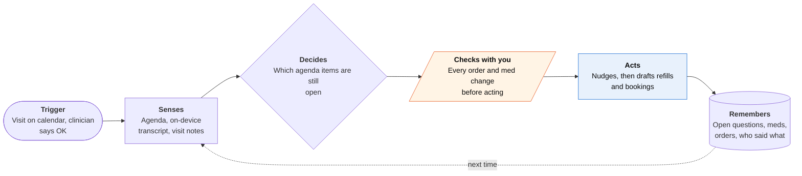

<!-- Generated by scripts/build.py from data/ideas.json. Edit the JSON, then run the script. -->

[← All ideas](../README.md) · **Moonshots** · Family & care

# M-20 · Exam Room Advocate

> Sits in on your parent's appointment, keeps the agenda, and turns what the doctor said into next steps.

| Difficulty | Novelty | Buildable on iOS today | Impact if it works | Horizon | Autonomy |
|---|---|---|---|---|---|
| `●●●●○` 4/5 | `●●●●○` 4/5 | `●●○○○` 2/5 | `●●●●○` 4/5 | 3–5 years | L2 · Drafts, you approve |

## The moment

Your mom has a cardiology visit at 10:40 and you're 600 miles away. With the doctor's OK, her phone sits on the table and you listen in, and her Watch taps her when the visit is wrapping up and the dizziness question still hasn't come up. By noon you've approved three follow-ups the agent drafted: a refill request, a call to book the echocardiogram, and a note to her pharmacist about the new dose.

## The problem

Adult children managing a parent's care from far away hear about visits secondhand, if at all. Questions get forgotten in a 15-minute slot, and the after-visit summary shows up later in a portal the parent can't find. Clinicians now have AI scribes writing their notes; the patient's side still has a paper list and a tired memory.

## How the agent works

## iOS building blocks

- **Speech (SpeechAnalyzer, SpeechTranscriber)** — on-device transcription so visit audio never leaves the phone
- **Foundation Models (on-device)** — matches the transcript to agenda items and pulls out orders and med changes
- **WatchKit (WKInterfaceDevice haptics)** — a quiet wrist tap while an agenda item is still open
- **HealthKit (clinical records, symptoms)** — builds the agenda from logged symptoms, current meds and recent labs
- **App Intents (AudioRecordingIntent)** — starts visit mode with the system recording indicator and a Live Activity
- **CallKit** — lets the remote caregiver listen in over a VoIP call the app controls
- **EventKit** — puts the visit and each follow-up on the family calendar

## What makes it hard

- Wall (consent, liability and integration): about a dozen US states require everyone's consent to record, many clinics ban patient recordings, and nobody knows who is responsible if a live nudge steers a visit wrong. What would have to change: health systems sharing the scribe's structured summary (orders, med changes) with the patient right after the visit, and a norm that accepts patient-side AI the way clinics accept medical interpreters.
- Orders and med changes come back hours later as portal text or a PDF, not structured data. Health Records in HealthKit update on the hospital's schedule, so the agent can't confirm a new prescription until the portal or pharmacy shows it.
- Exam rooms are noisy, voices overlap, and drug names are easy to mishear. A transcript that says 'stop metoprolol' when the doctor said 'start' is dangerous, so every extracted change is checked against the official summary before anything happens.
- Follow-ups have no API. Most portals don't let an app book imaging or request refills, so the agent drafts portal messages for the caregiver (with proxy access) to send, or calls the scheduling line from a cloud number after approval.

## Risks and failure modes

- Medical safety line: it never gives clinical advice, never speaks to the clinician, and never acts on a medication change heard only in audio. Nudges point only at items the family put on the agenda, and any mismatch goes back to the clinic as a question.
- Regulatory status: a note-taker and agenda keeper is generally not a medical device, but it drifts toward FDA-regulated decision support if it starts suggesting diagnoses or questions from symptom analysis. The app isn't covered by HIPAA, so the FTC's Health Breach Notification Rule applies, and a leak of visit audio would be serious.
- The parent is the patient. They decide who listens, what gets shared with the adult child, and when it's off; the app must not become a way to monitor them.

## Unsaid assumptions

_What this idea quietly depends on being true. Check these before you build._

- Clinicians will accept a second AI in the room once their own scribe is already listening.
- The parent wants a family member on the visit and has given portal proxy access.
- On-device transcription is good enough in a small room with two or three voices.

## Unknown unknowns

_Open questions nobody has good answers to yet._

- Do live nudges help, or do they break the patient's attention on the doctor?
- Will health systems ever send the scribe's structured output to the patient's own agent?
- Who is liable if the agent's summary and the clinician's note disagree and the family follows the wrong one?

## Prior art and who's building

- [Abridge](https://www.abridge.com/) — Clinician-side ambient scribe that also produces plain-language visit summaries. It works for the clinic, on the clinic's schedule, and doesn't carry the family's agenda or act on follow-ups.
- [Granola for iPhone and Apple Watch](https://apps.apple.com/us/app/granola-ai-meeting-notes/id6739429409) — Meeting notes on phone and Watch. Shows the capture pattern works, but knows nothing about care, meds or follow-ups.
- [Plaud NotePin](https://www.plaud.ai/blogs/news/plaud-unveils-notepins-and-desktop) — Wearable recorder with transcripts and summaries. No consent ritual for clinics, no agenda, no follow-up actions.
- [ChatGPT Health](https://www.macrumors.com/2026/01/07/openai-chatgpt-health-apple-health-integration/) — Reads Apple Health data to help prepare for visits. Doesn't sit in the room or act on what was decided.

## Smallest useful first version

Skip the live room. Before the visit, build a one-page agenda with the parent and caregiver from HealthKit and open questions; after it, the parent shares or photographs the after-visit summary, and the agent turns it into a checklist of orders and med changes the caregiver confirms, then drafts the portal messages and reminders. Add consented, on-device recording only for clinics that opt in.

Research notes: what we could and couldn't verify

'About a dozen' all-party-consent states is the commonly cited figure; the exact list differs by source and by in-person versus phone recording. Abridge's patient-summary feature is described from its site as shown in search results. The FTC Health Breach Notification Rule's coverage of non-HIPAA health apps is from FTC's 2024 amendment, stated from general knowledge and not re-checked this session. Candidate listed Microsoft Dragon Copilot as prior art; left out because I had no verified URL.

## Related ideas

- [W-20 · Chart Check](../whitespace/W-20-chart-check.md)
- [B-11 · Meeting and memory capture](../building-now/B-11-meeting-memory-capture.md)
- [M-06 · Proxy Passport](../moonshot/M-06-proxy-passport.md)
