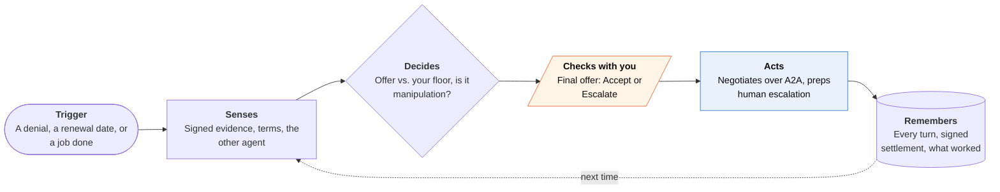

<!-- Generated by scripts/build.py from data/ideas.json. Edit the JSON, then run the script. -->

[← All ideas](../README.md) · **Moonshots** · Money & commerce

# M-21 · Bot-to-Bot Dispute Desk

> Your agent argues a refund or claim directly with the company's AI, using signed evidence.

| Difficulty | Novelty | Buildable on iOS today | Impact if it works | Horizon | Autonomy |
|---|---|---|---|---|---|
| `●●●●●` 5/5 | `●●●●●` 5/5 | `●●○○○` 2/5 | `●●●●○` 4/5 | 3–5 years | L2 · Drafts, you approve |

## The moment

The airline's claims AI has denied your delayed-bag claim for 'missing receipts'. Your agent opens a session with the airline's agent, presents receipts your phone signed the moment you photographed them, cites the delay rule the denial skipped, and comes back with an offer. You tap Accept or Escalate.

## The problem

Companies already put AI in the support and claims seat, and it answers in seconds. You still type into a chat box, dig for receipts, and give up when the bot says no. Consumer agents that fight bills today, such as Pine, work through human channels (calls, emails, web forms) one company at a time, with evidence the company can simply doubt.

## How the agent works

## iOS building blocks

- **Foundation Models (tool calling with onToolCall checks)** — deterministic gates on every tool call, with the other agent's text treated as untrusted
- **CryptoKit (SecureEnclave P256 signing keys)** — signs evidence at capture and signs the settlement record
- **DeviceCheck (DCAppAttestService)** — shows the evidence came from a genuine app on a real device
- **LocalAuthentication** — Face ID before accepting a settlement or signing a spending mandate
- **FinanceKit** — finds the disputed charge and upcoming renewals on Apple Card and Apple Cash (managed entitlement)
- **ActivityKit (Live Activities)** — shows a negotiation in progress and its deadline
- **App Intents** — 'dispute this charge' from Siri or the share sheet

## What makes it hard

- Wall (incentives, trust and research): companies gain nothing by opening negotiable dispute endpoints to consumer agents, and no one has shown that two adversarial agents reach fair outcomes rather than the stronger model wearing down the weaker one. What would have to change: regulators requiring machine-readable complaint channels (as some already require human ones), a shared standard for signed evidence, and tested safeguards for agent-versus-agent negotiation.
- Prompt injection between hostile agents: everything the company's agent sends is untrusted, and it can bury terms like 'accepting waives all future claims' in friendly text. Acceptance has to pass deterministic checks, not model judgment.
- A receipt signed by your phone proves when you captured it, not that it's genuine. Companies will accept signed records only if a card network or regulator vouches for the format, the way chargeback rules do for card data.
- The merged modes hit their own walls. Renewal auctions, where providers' agents bid for your broadband or insurance, run into US insurance rate filing and anti-rebating laws and need identity-linked underwriting data. Curbside job settlement needs pre-authorized payment, but Apple Pay has no mandate or agent-payment API in iOS 27, and holding funds in escrow is a licensed business.

## Risks and failure modes

- Accepting a settlement can waive your rights. The agent never accepts or signs on its own, flags waiver and arbitration language in plain words, and keeps the human routes (chargeback, regulator complaint, small claims) open until you decide.
- Arms race: companies tune their agents to outlast consumer agents, and the side with the bigger model wins. A full log of every turn is the defense.
- Over-sharing: an evidence bundle can hold far more than the dispute needs. Send the minimum; never hand the company's agent your inbox or photo library.

## Unsaid assumptions

_What this idea quietly depends on being true. Check these before you build._

- The company's agent is authorized to make binding offers, not just to say no.
- Adversarial agent negotiation converges on fair outcomes more often than it grinds consumers down.
- Companies will expose agent endpoints (A2A Agent Cards, MCP servers, UCP order capabilities) for disputes, not only for sales.

## Unknown unknowns

_Open questions nobody has good answers to yet._

- What makes a settlement between two agents binding? UETA recognizes contracts formed by electronic agents, but agent-negotiated waivers haven't been tested in court.
- Would regulators treat a company's refusal to deal with consumer agents as an unfair practice?
- Can a small on-device model catch manipulation from a frontier model on the other side, or must screening run on a bigger model?

## Prior art and who's building

- [A2A protocol](https://github.com/a2aproject/A2A) — Agent-to-agent standard (v1.0, March 2026) with Agent Cards and Tasks. Provides the transport, not dispute rules or evidence formats.
- [Universal Commerce Protocol](https://github.com/Universal-Commerce-Protocol/ucp) — Merchant capabilities for checkout, identity linking and orders over REST, MCP or A2A. Built for buying; nothing for refunds or claims.
- [Pine AI](https://apps.apple.com/us/app/pine-assistant/id6746403769) — Negotiates bills, refunds and cancellations by phone and email. Works through human channels, one company at a time.
- [Google AP2 (Agent Payments Protocol)](https://cloud.google.com/blog/products/ai-machine-learning/announcing-agents-to-payments-ap2-protocol) — Signed intent and cart mandates for agent payments. The mandate idea fits settlements and job escrow, but there is no Apple Pay path.
- [Apple WWDC26 'Secure your app' session](https://developer.apple.com/videos/play/wwdc2026/347/) — Apple's guidance on onToolCall confirmations and marking untrusted content. Supplies guardrails, not a negotiation design.

## Smallest useful first version

Build the one-sided half now: an evidence locker that signs receipts, photos and chat screenshots at capture with a Secure Enclave key, then assembles a dispute packet (timeline, evidence, the rule that applies) and sends it through the company's human channels by email or web form, with you approving each send. Where a company offers an MCP or UCP order endpoint, read order status from it, but keep every settlement decision with you.

Research notes: what we could and couldn't verify

Merged: 'Renewal Reverse Auction' (anonymized renewal requests that providers' agents bid on; the UK's 2022 ban on insurance price walking shows the loyalty-penalty problem; US rate filing and anti-rebating laws block free bidding) and 'Job-Done Escrow' (a tradesperson's agent and a homeowner's agent settling at the curb against photos and a Face ID-signed mandate; AP2, Mastercard Agent Pay and Visa Intelligent Commerce exist, but Apple Pay has no mandate API). The trigger line covers all three modes. I left out the candidate's claim about the share of inquiries Airbnb's support agent resolves because I couldn't verify a figure. UETA's electronic-agent provision and the UK FCA pricing rules (effective January 2022) are stated from general knowledge, not re-checked this session.

## Related ideas

- [B-08 · Bill-fighting and cancel agents](../building-now/B-08-bill-fighting-agents.md)
- [M-22 · Consumer Agent Union](../moonshot/M-22-consumer-agent-union.md)
- [M-10 · Agent Mistake Warranty](../moonshot/M-10-agent-mistake-warranty.md)
