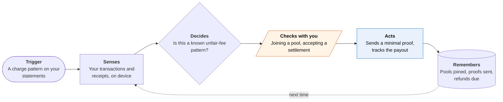

<!-- Generated by scripts/build.py from data/ideas.json. Edit the JSON, then run the script. -->

[← All ideas](../README.md) · **Moonshots** · Money & commerce

# M-22 · Consumer Agent Union

> Thousands of personal agents pool private proof of the same unfair fee and bargain with the company as one.

| Difficulty | Novelty | Buildable on iOS today | Impact if it works | Horizon | Autonomy |
|---|---|---|---|---|---|
| `●●●●●` 5/5 | `●●●●●` 5/5 | `●●○○○` 2/5 | `●●●●○` 4/5 | 5+ years | L2 · Drafts, you approve |

## The moment

Your agent notices a small 'service fee' that started appearing on your delivery orders without showing in the listed price. Thousands of other members' agents found the same fee. The consumer law firm running the pool presents the company with a refund demand backed by private proofs, not raw bank data, and weeks later you tap Accept on the settlement and your share lands as a credit.

## The problem

A few dollars of junk fee isn't worth an afternoon of your time, which is why companies can keep charging it. Mass arbitration works, but law firms recruit claimants with ads and forms, and proving each person was charged means handing over statements. Your own transaction history already holds the proof; nothing turns it into a claim without exposing everything else.

## How the agent works

## iOS building blocks

- **FinanceKit** — reads Apple Card and Apple Cash transactions on device (managed entitlement)
- **AuthenticationServices (ASWebAuthenticationSession)** — OAuth to Gmail or Outlook for e-receipts, since FinanceKit covers only Apple's own cards
- **Foundation Models (on-device)** — classifies fees and renewal price rises without uploading statements
- **CryptoKit** — hashes and signs the minimal proof (merchant, amount, date) a pool receives
- **DeviceCheck (DCAppAttestService)** — shows each claim came from a genuine app instance
- **BackgroundTasks** — periodic rescans as new transactions arrive
- **UserNotifications** — tells you when a pool forms or a settlement needs your vote

## What makes it hard

- Wall (legal and research): lawyer ethics rules restrict paying for referrals and soliciting clients, so pooling has to run through licensed attorneys, and unauthorized-practice rules limit what the app itself can say. Companies answer with batch-arbitration clauses and pressure on arbitration providers' fee rules. What would have to change: banks signing transaction attestations, and bar rules (such as Arizona's alternative business structures) that let a consumer-controlled tool coordinate claims.
- Private proof of a charge isn't mainstream. Most people's transactions sit outside FinanceKit, so the app needs bank aggregation or email receipts, and proving a charge without revealing the account needs signed bank data or TLS-proof techniques such as TLSNotary that banks don't support.
- Fraud: a pool worth money attracts fake claimants. App Attest proves a genuine app, not a genuine customer, so the pool needs to tie each proof to a real account without collecting identities.
- Deciding a fee was 'undisclosed' is a legal judgment, and it depends on what the checkout page showed, which the phone may never have seen.

## Risks and failure modes

- Legal safety line: the app is not a law firm. It doesn't give legal advice, promise payouts, or pay or take money for referrals.
- Joining a group settlement can give up an individual claim that was worth more. The app must show what you give up before you vote.
- Membership is sensitive data: it shows you're a customer and were charged. Keep lists minimal and encrypted, and never sell them.

## Unsaid assumptions

_What this idea quietly depends on being true. Check these before you build._

- Companies will settle faster with a verified pool than they would fight one.
- Enough members opt in to reach the size where arbitration fees start to hurt the company.
- A law firm or nonprofit will accept private proofs in place of statements.

## Unknown unknowns

_Open questions nobody has good answers to yet._

- Would an arbitrator or court accept a cryptographic proof of a charge instead of a bank statement?
- Does coordinating claims through an app count as soliciting clients, and in which states?
- Do companies respond with refunds, or with new contract terms that break pooling?

## Prior art and who's building

- [ClassAction.org junk-fee sign-ups](https://www.classaction.org/illegal-hidden-junk-fees) — Law-firm-run sign-ups for mass claims over hidden fees. Claimants fill in forms by hand; no automatic detection and no private proof.
- [Class Action U current mass-arbitration claims](https://classactionu.org/mass-arbitrations/current-claims/) — Lists open mass-arbitration claims people can join by hand.
- [Goodwin on AI-scaled mass arbitration](https://www.goodwinlaw.com/en/insights/publications/2025/12/insights-technology-cldr-mass-arbitration-the-risk-lurking-in-consumer-agreements) — Defense-side analysis of how AI lets firms file mass arbitrations at scale. Shows the pressure exists, seen from the company's side.

## Smallest useful first version

An on-device fee detector: FinanceKit plus e-receipts from Gmail flag charges that match known junk-fee and renewal patterns and explain each one. When a matching public class action or mass-arbitration campaign exists, it pre-fills the sign-up with only what the form asks for and you send it yourself. No pooling, no negotiation, no referral payments.

Research notes: what we could and couldn't verify

'Union' is a metaphor: this is a consumer collective run with a law firm or nonprofit, not a labor union. Lawyer ethics points (ABA Model Rules on referral payments, solicitation and fee sharing) and Arizona's alternative business structure program are stated from general knowledge, not re-checked this session. TLSNotary is named without a URL (not verified this session). The moment avoids claiming the delivery fee is illegal, since fee-disclosure rules vary by state and the FTC's 2024 fee rule covers only live-event tickets and short-term lodging.

## Related ideas

- [M-21 · Bot-to-Bot Dispute Desk](../moonshot/M-21-bot-to-bot-dispute-desk.md)
- [B-08 · Bill-fighting and cancel agents](../building-now/B-08-bill-fighting-agents.md)
- [W-30 · Shelf Price Witness](../whitespace/W-30-shelf-price-witness.md)
