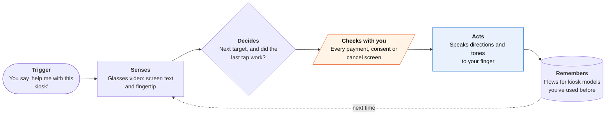

<!-- Generated by scripts/build.py from data/ideas.json. Edit the JSON, then run the script. -->

[← All ideas](../README.md) · **Moonshots** · Accessibility

# M-23 · Kiosk Hands

> Glasses watch a touchscreen and guide a blind user's finger, step by step, through any kiosk.

| Difficulty | Novelty | Buildable on iOS today | Impact if it works | Horizon | Autonomy |
|---|---|---|---|---|---|
| `●●●●●` 5/5 | `●●●●○` 4/5 | `●●○○○` 2/5 | `●●●●○` 4/5 | 3–5 years | L1 · Suggests, you act |

## The moment

You're at a hospital check-in kiosk with a flat touchscreen and no audio. Through your glasses the agent reads the screen, says 'left, down, stop, tap,' and confirms each step until the wristband prints. At the screen asking you to agree to a payment plan, it stops and reads you every option.

## The problem

Touchscreen kiosks for check-in, tickets, food orders and parking are everywhere, and many have no speech output or tactile keypad. Blind users either ask a stranger, handing over their birth date or card, or give up. Be My Eyes and similar apps describe the scene or connect a human, but nothing guides your finger to the right spot and checks that the tap worked.

## How the agent works

## iOS building blocks

- **Meta Wearables Device Access Toolkit (third-party SDK)** — streams glasses camera frames to the iPhone app, including in the background
- **Vision (RecognizeTextRequest, DetectHumanHandPoseRequest)** — reads the screen and finds the fingertip in each frame
- **Core AI** — runs a local vision model fast enough for step-by-step guidance
- **Foundation Models (image Attachment)** — understands an unfamiliar screen and plans the path through it
- **AVFAudio (AVAudioEngine)** — directional tones that steer the finger
- **Accessibility (VoiceOver announcements)** — speaks through the user's own VoiceOver voice and rate
- **App Intents** — starts from Siri or the Action button without looking at the phone

## What makes it hard

- Wall (research and hardware): finger guidance needs fingertip tracking and screen reading with well under a second of delay, from glasses video sent over a wireless link to the phone. Today's on-device models and a developer-preview glasses SDK can't do that reliably, and glare, odd angles and the hand covering the screen make it worse. What would have to change: faster local vision models, a stable glasses SDK with low-latency frames (or Apple glasses with an open camera API), and an agreed confirmation design for money and consent screens.
- Closing the loop: after every tap the agent has to confirm the screen changed as expected, and recover when the finger hits the wrong button or the kiosk times out.
- Every kiosk model has its own flows, pop-ups and languages. Remembered flows help most if they're shared across users, which means making sure nobody's personal data from the screen goes with them.
- When confidence drops it has to hand off to a human helper quickly, while the kiosk's timeout keeps running.

## Risks and failure modes

- A wrong tap can pay, consent or cancel. On money and consent screens the agent reads every option and waits; it never chooses for the user.
- Cameras at kiosks capture other people and screens full of personal data. Frames stay on device and are dropped after each step, and venues may object to cameras near payment terminals.
- Over-trust: if guidance is usually right, users stop checking. The agent must say out loud when it isn't sure.

## Unsaid assumptions

_What this idea quietly depends on being true. Check these before you build._

- Clinics, banks and stores will tolerate a camera on a customer's face at their kiosks.
- Meta keeps the toolkit open to third-party iPhone apps and takes it past developer preview.
- Blind users are willing to wear camera glasses in public for this.

## Unknown unknowns

_Open questions nobody has good answers to yet._

- What end-to-end delay can users live with for finger guidance?
- Will accessibility law (the European Accessibility Act covers new self-service terminals from June 2025) make kiosks accessible faster than this can ship?
- Can remembered kiosk flows be shared across users without leaking what was on anyone's screen?

## Prior art and who's building

- [VizLens (CMU)](https://www.cs.cmu.edu/~jbigham/pubs/pdfs/2016/vizlens.pdf) — Phone camera plus crowd-labeled interfaces to guide a finger on appliance panels. A lab prototype, not a product.
- [StateLens](https://pith.science/paper/1908.07144) — Extended the idea to dynamic touchscreens by learning a kiosk's screen states. Research only.
- [Toucha11y (CHI 2023)](https://arxiv.org/pdf/2305.04097) — A small mechanical bot a blind user attaches to the kiosk; it reads the screen, shows it in a phone app, and does the tapping. Works, but you carry and mount a robot.
- [Apple Magnifier Point and Speak](https://www.apple.com/newsroom/2023/05/apple-previews-live-speech-personal-voice-and-more-new-accessibility-features/) — Reads the label under your finger on appliance keypads using the camera and LiDAR. Built in and good, but you hold the phone up and it doesn't plan multi-screen flows.
- [Meta Wearables Device Access Toolkit for iOS](https://github.com/facebook/meta-wearables-dat-ios) — Developer-preview SDK that gives iPhone apps glasses camera frames. The building block, not a guidance app.
- [Be My Eyes](https://www.bemyeyes.com/business/bme-service-ai/) — AI and volunteer help for blind users. Describes what's there; doesn't guide a finger or verify taps.

## Smallest useful first version

Use the iPhone camera, not glasses: a chest or lanyard mount pointed at the kiosk, with Vision reading the screen and tracking the fingertip, Point-and-Speak style. The agent reads each screen's options, tells you which label to find, and reads what's under your finger before you tap, with one-tap handoff to a human helper. No guidance on payment screens in v1, only reading them out.

Research notes: what we could and couldn't verify

Toucha11y's design (attachable mechanical bot plus phone app) was confirmed from the paper's abstract. Point and Speak details confirmed from Apple Support and newsroom search results. The European Accessibility Act date is stated from general knowledge; existing terminals may stay in use for years, which is why the problem persists. Latency figures for the Meta toolkit over the glasses link are not published in anything I saw, so the card doesn't give numbers.

## Related ideas

- [B-19 · Blind-assist scene agents](../building-now/B-19-blind-assist-scene-agents.md)
- [M-04 · Agent That Reads VoiceOver's Map](../moonshot/M-04-voiceover-map-agent.md)
- [M-18 · Med-Pass Witness](../moonshot/M-18-med-pass-witness.md)
