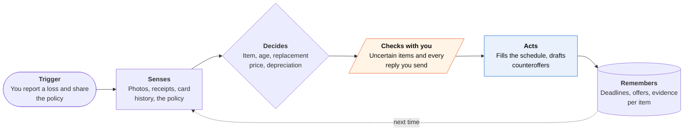

<!-- Generated by scripts/build.py from data/ideas.json. Edit the JSON, then run the script. -->

[← All ideas](../README.md) · **Moonshots** · Money & commerce

# M-24 · Pocket Public Adjuster

> After a fire or flood, it rebuilds what you owned and argues the contents claim with your insurer.

| Difficulty | Novelty | Buildable on iOS today | Impact if it works | Horizon | Autonomy |
|---|---|---|---|---|---|
| `●●●●○` 4/5 | `●●●○○` 3/5 | `●●○○○` 2/5 | `●●●●●` 5/5 | 1–2 years | L2 · Drafts, you approve |

## The moment

Your house burned three weeks ago, and the insurer wants an itemized list of everything you owned, with ages and prices. The agent has found 1,800 items across eleven years of your photos and purchase emails, and it flags that the insurer depreciated your two-year-old sofa as if it were ten.

## The problem

After a total loss, the contents claim asks people in shock to list thousands of things from memory, room by room, with ages and prices. Insurers depreciate and price line by line, and most families don't know what to push back on. Public adjusters help but take a percentage of the payout, and inventory apps only help if you made the inventory before the disaster.

## How the agent works

## iOS building blocks

- **PhotoKit (PHPhotoLibrary, full-library access with consent)** — finds years of photos taken at home
- **Vision (ClassifyImageRequest)** — spots furniture, electronics and appliances in old photos
- **Foundation Models (image Attachment)** — names and describes items on device
- **PrivateCloudComputeLanguageModel** — reads long policies and the insurer's spreadsheet with a 32K context
- **BackgroundTasks (BGContinuedProcessingTask)** — scans thousands of photos as a user-started job with visible progress
- **AuthenticationServices (ASWebAuthenticationSession)** — OAuth to Gmail or Outlook for purchase emails
- **PDFKit** — reads the policy and the insurer's letters

## What makes it hard

- Wall (regulation and liability): negotiating a claim on someone's behalf is public-adjuster work, which needs a license in most US states, so an app that argues the claim risks unlicensed practice. Wrong valuations create liability, and insurers can refuse to deal with a bot. What would have to change: a licensed public adjuster in the loop using the app as their tool, or a regulatory sandbox, and insurers accepting machine-built schedules with photo evidence.
- Photos show rooms, not receipts. Matching a blurry 2019 photo to a model, a purchase date and today's replacement price is error-prone, and every uncertain line needs the owner's confirmation.
- Rules differ by state and insurer. California, for example, requires insurers to accept grouped categories (clothing, books) after a declared-disaster total loss and to advance 30% of the dwelling limit, up to $250,000, for contents without an itemized list. The agent has to know which rules apply.
- No insurer API: each company has its own spreadsheet, depreciation tables and portal, so the output is a file the owner uploads or emails.

## Risks and failure modes

- Legal safety line: the app helps you document and respond, and you send everything. Negotiating in your name, or taking a cut of the payout, is licensed public-adjuster work.
- Inflated inventories are insurance fraud. The agent never adds items without evidence or the owner's confirmation, and marks which lines rest on memory alone.
- Full photo-library access in a crisis is a lot of trust. Scanning runs on device, and only confirmed items leave the phone.

## Unsaid assumptions

_What this idea quietly depends on being true. Check these before you build._

- The phone and its cloud photo library survive the disaster, and old photos show enough of the home.
- Insurers will accept a machine-built schedule if every line links to evidence.
- Survivors will spend the hours needed to confirm uncertain items.

## Unknown unknowns

_Open questions nobody has good answers to yet._

- Where exactly is the line between helping a policyholder respond and adjusting a claim, state by state?
- Will insurers move toward paying contents limits without inventories after big disasters, as California's insurance commissioner urged in 2025, making the inventory matter less?
- How accurate are replacement prices from photos compared with a human adjuster's?

## Prior art and who's building

- [Bevel (free AI inventory for LA fire survivors)](https://abc7.com/post/artificial-intelligence-driven-inventory-tool-bevelmade-serves-solution-california-wildfire-victims-document-belongings/17882452/) — Builds a contents list after the fires. Doesn't read the policy or answer the insurer.
- [Preloss](https://preloss.app/) — Home inventory made before a loss. After the loss it's too late to start one.
- [MovingBox AI Home Inventory](https://apps.apple.com/us/app/movingbox-ai-home-inventory/id6742755218) — AI inventory from photos on iPhone. Built for moving and pre-loss records, not for fighting a claim.
- [HomeZada](https://www.homezada.com/homeowners/home-inventory) — Home inventory and upkeep app. Needs the inventory done in advance.

## Smallest useful first version

A post-loss inventory builder the policyholder drives: scan the photo library and purchase emails on device, propose items room by room with evidence thumbnails, let the owner confirm, and export the insurer's spreadsheet. Add a policy reader that lists deadlines and compares the insurer's depreciation line by line, with plain questions the owner can send. Point to licensed public adjusters rather than negotiating.

Research notes: what we could and couldn't verify

California SB 872 (grouped-category inventories; 30% of the dwelling limit, up to $250,000, advanced for contents) confirmed from California Department of Insurance and law-blog search results. The commissioner's 2025 alert urging full contents payment without detailed inventories: https://www.insurance.ca.gov/0400-news/0102-alerts/2025/Commissioner-Lara-urges-insurance-compan.cfm. Re-tier thought: the inventory-plus-policy-reader first version is buildable today (arguably whitespace); the moonshot part is arguing the claim.

## Related ideas

- [M-21 · Bot-to-Bot Dispute Desk](../moonshot/M-21-bot-to-bot-dispute-desk.md)
- [W-24 · Coverage Clock](../whitespace/W-24-coverage-clock.md)
- [B-08 · Bill-fighting and cancel agents](../building-now/B-08-bill-fighting-agents.md)
