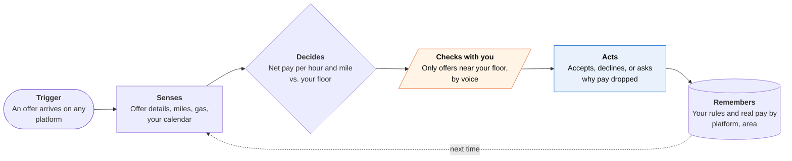

<!-- Generated by scripts/build.py from data/ideas.json. Edit the JSON, then run the script. -->

[← All ideas](../README.md) · **Moonshots** · Work & business

# M-25 · Worker-Side Dispatch Agent

> Works for the driver or per-diem nurse, not the platform: screens every offer and bargains back.

| Difficulty | Novelty | Buildable on iOS today | Impact if it works | Horizon | Autonomy |
|---|---|---|---|---|---|
| `●●●●●` 5/5 | `●●●●○` 4/5 | `●○○○○` 1/5 | `●●●●●` 5/5 | 3–5 years | L3 · Acts in guardrails, reports back |

## The moment

You're logged into three delivery apps and a nurse-shift app, and offers flash for a few seconds each. Your agent sees them all, knows your floor of $1.50 a mile after gas, your hours cap and your kid's 3 p.m. pickup, accepts two, and declines the rest. When your pay per mile drops three days in a row, it asks the platform to explain the change.

## The problem

Gig platforms use algorithms to price, dispatch and deactivate workers in real time; workers answer with a thumb and a few seconds. Juggling several apps means doing math on every offer while driving. Android workers have offer-automation tools, but on iPhone the sandbox limits them to snapshot analysis, and nothing bargains back or asks why pay changed.

## How the agent works

## iOS building blocks

- **Visual Intelligence** — stopgap: you select an offer in a screenshot and the app receives it
- **CarPlay (CPVoiceControlTemplate)** — hands-free 'take it?' prompts while driving; iOS 27 opens the template to all CarPlay app categories
- **ActivityKit (Live Activities)** — shift earnings and the pending offer on the Lock Screen, Watch and CarPlay
- **Core Location** — tracks miles and time for true net pay
- **Foundation Models (on-device)** — scores an offer without a network round trip
- **App Intents** — set rules and answer prompts through Siri

## What makes it hard

- Wall (platform and regulation): iOS doesn't let a third-party app read or tap other apps, which is why tools like Maxymo keep automation on Android. Platforms expose no offer API to worker agents and ban automation in their terms. What would have to change: a legal duty to give workers (or their agents) a machine-readable interface to algorithmic management, or iOS letting a user-authorized agent call other apps' App Intents, which today only Siri can do.
- The EU Platform Work Directive, due to be written into national law by 2 December 2026, requires transparency about automated monitoring and decisions and human review of significant ones. It doesn't require a real-time interface an agent could use, and US law has nothing comparable.
- Stopgaps are too slow: a screenshot through Visual Intelligence or a screen-broadcast extension can read an offer but can't accept it, and offers expire in seconds.
- Platforms can redesign offers to beat agents (hiding destinations, shortening windows), turning dispatch into an agent-versus-agent game.

## Risks and failure modes

- Deactivation: platforms ban offer bots, so an agent that taps for you can cost you your account. Where terms forbid automation, it advises and you tap.
- Driving safety: nothing should pull a driver's eyes to the phone. Voice only on CarPlay, no long text while moving.
- Pooled pay data can identify individual workers to platforms. Share only aggregated, delayed figures, and only with opt-in.

## Unsaid assumptions

_What this idea quietly depends on being true. Check these before you build._

- Platforms would keep working if every worker had an agent enforcing a pay floor, instead of redesigning offers to beat the agents.
- Workers will trust software to decline offers for them.
- Regulators will extend transparency rights toward real-time, machine-readable access.

## Unknown unknowns

_Open questions nobody has good answers to yet._

- Will any EU member state's transposition require a machine-readable interface rather than written explanations?
- Do pay floors enforced by many agents raise pay, or shift work to workers without agents?
- How will platforms respond to agent-filed data-access and explanation requests at scale?

## Prior art and who's building

- [Maxymo](https://maxymoapp.com/) — Offer analysis on iPhone through snapshots; full automation only on Android.
- [Mystro driver app](https://apps.apple.com/us/app/mystro-driver-drive-deliver/id1524407919) — Markets rule-based multi-apping for drivers on iPhone. Covers ride and delivery apps only, doesn't bargain or request explanations, and how it reaches platforms on iOS isn't public.
- [EU Platform Work Directive transposition tracker](https://remoteworkeurope.eu/news/2026/platform-work-directive-enforcement-divergence-2026/) — Tracks how member states are implementing the directive. Transparency and human-review rights, but no agent interface.

## Smallest useful first version

An iPhone shift co-pilot that never touches other apps: you set your floor and rules, it tracks miles and time with Core Location, and when you screenshot or share an offer it scores it aloud on CarPlay. After each shift it shows real hourly pay by platform, and it drafts data-access and explanation requests to platforms (under GDPR or the new EU rules) for you to send.

Research notes: what we could and couldn't verify

How Mystro reaches ride and delivery platforms on iPhone is not documented in anything I saw; described neutrally. The Platform Work Directive's transposition date (2 December 2026) and its transparency and human-review provisions are stated from general knowledge plus the candidate research. The CarPlay Voice Control template opening to all categories in iOS 27 comes from the research digest; the Apple doc page still describes it as a navigation-app template. Feasibility 1 reflects that the core loop (reading and tapping other apps' offers) is blocked on iOS.

## Related ideas

- [W-31 · Deactivation Defense File](../whitespace/W-31-deactivation-defense-file.md)
- [W-32 · Between-Clients Wage Check](../whitespace/W-32-between-clients-wage-check.md)
- [B-16 · CarPlay voice agents](../building-now/B-16-carplay-voice-agents.md)
