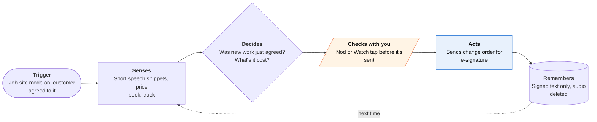

<!-- Generated by scripts/build.py from data/ideas.json. Edit the JSON, then run the script. -->

[← All ideas](../README.md) · **Moonshots** · Work & business

# M-26 · Scope Creep Catcher

> Hears 'while you're here, could you also...' on the job and gets a change order signed before you start it.

| Difficulty | Novelty | Buildable on iOS today | Impact if it works | Horizon | Autonomy |
|---|---|---|---|---|---|
| `●●●●○` 4/5 | `●●●●●` 5/5 | `●●●○○` 3/5 | `●●●●○` 4/5 | 1–2 years | L2 · Drafts, you approve |

## The moment

You're under the sink with wet hands when the homeowner asks if you can also swap the garbage disposal. You say sure. Before you reach for it, your AirPods say: 'Change order: disposal swap, $285 plus the part. Send to Dana to sign?' You nod twice, Dana signs on her phone, and the invoice is right when you leave.

## The problem

Small extras agreed in passing are where tradespeople lose money and where disputes start: the customer remembers 'free', the tech remembers '$285'. Some states, California among them, require signed written change orders before extra home-improvement work begins, but nobody stops mid-job with wet hands to type one. Field-service apps handle quotes and signatures, but only if you remember to open them.

## How the agent works

## iOS building blocks

- **App Intents (AudioRecordingIntent)** — starts job-site mode with the system recording indicator and a required Live Activity
- **AVFAudio (AVAudioSession)** — keeps capture going in the background after starting in the foreground
- **Speech (SpeechAnalyzer, SpeechTranscriber)** — on-device transcription of short snippets
- **Foundation Models (on-device, Generable)** — pulls a structured change order out of a snippet
- **Core Motion (CMHeadphoneMotionManager)** — reads a head nod from AirPods as the tech's confirmation
- **WatchKit** — tap to confirm or cancel on the wrist
- **PDFKit** — renders the signed change order to attach to the job

## What makes it hard

- Wall (regulation, trust and research): about a dozen US states, California among them, require every party's consent to record a conversation, so ambient listening in someone's home needs a clear consent ritual. California law also requires change orders in writing and signed before the extra work starts, so a bad extraction produces a wrong legal document. What would have to change: a body-cam-style consent norm for job sites, reliable on-device speaker separation in noise, and low-power listening hardware (AirPods or glasses) open to approved apps.
- Job sites are loud: running water, power tools, two speakers and trade jargon. On-device speech still mishears prices and part names, and a missed 'no' flips the meaning.
- Battery and background limits: iOS keeps a microphone session alive in the background only if it started in the foreground, with a visible indicator, and hours of capture drain the battery. Listening in short windows saves power but misses the casual ask.
- A nod is a weak confirmation. It only approves sending; the customer's e-signature is what binds, and it has to land before the work starts.

## Risks and failure modes

- Recording customers in their homes without clear consent is illegal in all-party-consent states and destroys trust. The customer hears the consent script at the door and can say no, and then the app stays off.
- Wrong prices or scope in a signed change order can hurt either side. The tech reviews every line before it goes out.
- Audio from inside private homes is sensitive. It stays on device and is deleted once the change is extracted; only the signed text is kept.

## Unsaid assumptions

_What this idea quietly depends on being true. Check these before you build._

- Homeowners will agree to be recorded in their own home if the tradesperson explains it protects both sides.
- Customers will sign on their phone within a minute of being asked.
- Techs will leave the mode on rather than turning it off after one false alarm.

## Unknown unknowns

_Open questions nobody has good answers to yet._

- Can on-device speaker separation tell tech from customer in a noisy kitchen well enough?
- Does a software-drafted change order signed by e-signature meet each state's home-improvement rules?
- Will field-service platforms open APIs so the change order lands in the job record automatically?

## Prior art and who's building

- [Housecall Pro estimate approvals and signatures](https://help.housecallpro.com/en/articles/918072-estimate-or-job-approval-signature-on-mobile) — Techs capture customer signatures on estimates in the field. Someone has to create the change by hand, so small extras slip through.
- [Jobber](https://www.getjobber.com/comparison/jobber-vs-housecall-pro/) — Field-service app with mobile quotes, one-tap client approval and signatures. Same manual step: nothing notices that scope changed.
- [Plaud NotePin](https://www.plaud.ai/blogs/news/plaud-unveils-notepins-and-desktop) — Ambient recording hardware with summaries. No consent ritual for customers and no structured change orders.

## Smallest useful first version

Skip ambient listening. Give techs push-to-talk on the Watch or AirPods: they say 'change order, swap disposal', the on-device model drafts it from the price book, the tech confirms, and the customer gets a text link to sign before work starts. The audio is dropped as soon as the tech confirms the text.

Research notes: what we could and couldn't verify

California Business and Professions Code 7159 (change orders in writing and signed before the covered work starts) confirmed from search results: https://california.public.law/codes/business_and_professions_code_section_7159. 'About a dozen' all-party-consent states is the usual figure; the exact list varies by source. The Jobber link is Jobber's own comparison page, the only Jobber page I saw. Re-tier thought: the push-to-talk first version is buildable today and could be whitespace; the moonshot part is ambient capture with consent.

## Related ideas

- [M-21 · Bot-to-Bot Dispute Desk](../moonshot/M-21-bot-to-bot-dispute-desk.md)
- [W-33 · Stuck Invoice Detective](../whitespace/W-33-stuck-invoice-detective.md)
- [B-11 · Meeting and memory capture](../building-now/B-11-meeting-memory-capture.md)
