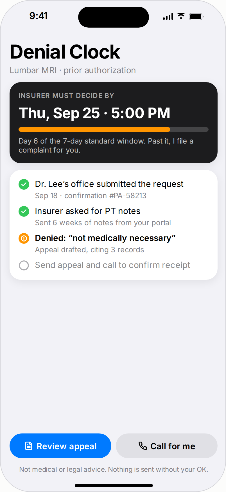
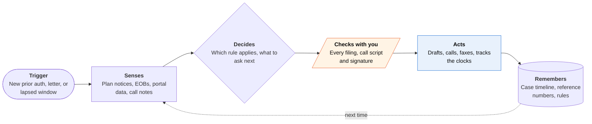
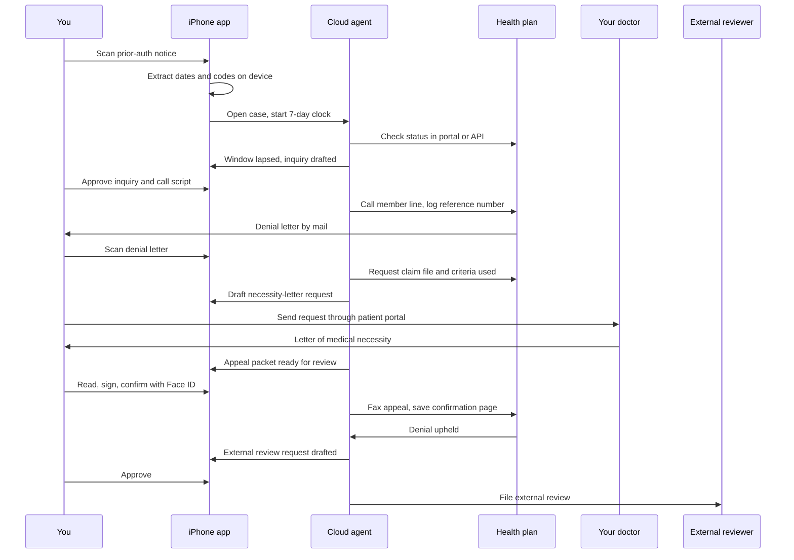

<!-- Generated by scripts/build.py from data/ideas.json. Edit the JSON, then run the script. -->

[← All ideas](../README.md) · **Whitespace** · Health & body

# W-01 · Denial Clock

> Times your prior auths against the insurer's legal deadlines, then runs the appeal when the answer is no.

| Difficulty | Novelty | Buildable on iOS today | Impact if it works | Horizon | Autonomy |
|---|---|---|---|---|---|
| `●●●○○` 3/5 | `●●●●○` 4/5 | `●●●●○` 4/5 | `●●●●●` 5/5 | Buildable now | L2 · Drafts, you approve |

## The moment

Your MRI has sat at 'pending review' for nine days, and the scheduler keeps moving your slot. You forward the plan's notice, and when a letter finally says 'not medically necessary' you photograph it. Before you've finished reading, your phone tells you the plan missed its 7-day decision window, that you can ask for the criteria it used, and that a first appeal is drafted and waiting for your review.

## The problem

Prior authorization is a clock game, and most patients don't know the clock exists. Since January 2026, Medicare Advantage, Medicaid and CHIP plans must decide within 72 hours (urgent) or 7 days (standard) and give a specific reason for a denial, but nothing on the patient's side tracks those deadlines. Appeal-letter tools write the letter and stop. The status calls, claim-file requests, filing and external review are still left to a sick person.

## How the agent works

## Deep dive

Denial Clock is a case file with a stopwatch attached. The phone is where evidence comes in and where you say yes. The waiting, calling and faxing run on a server, because a case can take months and iOS won't keep an app running that long.

### What the first 90 days look like

Start narrow: Medicare Advantage and Medicaid managed care members in two or three states, where the 2026 decision windows and specific-denial-reason rules apply. Weeks 1 to 4 build the rules table (decision windows, appeal windows and the next level of review for each plan type) and test letter extraction on a few hundred donated, redacted denial letters. Weeks 5 to 8 run a concierge beta with about 30 patients recruited through a patient-advocacy group. A human case worker reviews every draft before the patient sees it. Weeks 9 to 12 add cloud fax, the status-call agent and Live Activity countdowns. The numbers that matter are days from request to decision, the share of lapsed windows caught, appeals filed on time, and the overturn rate.

### The hardest engineering problem

Getting the clock right. The countdown starts when the plan received the request, which the patient rarely knows. Whether a request is urgent depends on what the doctor asked for. Whether the 72-hour and 7-day rules apply at all depends on plan type: they cover Medicare Advantage, Medicaid and CHIP, not marketplace plans, employer plans or drugs. So every date the app shows carries its working ("7 calendar days from receipt on May 3, per the plan's notice"), and the first status call asks the plan for the receipt date and a reference number. When the app can't be sure, it says so and uses the more cautious date. A confident wrong deadline does more harm than no deadline, because it can make someone wait too long to appeal.

The second-hardest problem is the handoff to the doctor. A necessity letter often decides the appeal, and the app can't write it. It can make asking easy: a one-page summary of the denial reason, the plan's criteria and what the letter needs to answer, sent through the patient portal, with a polite follow-up if nothing comes back.

### How it makes money

People meet this problem in a crisis, not as a monthly habit, so a consumer subscription fits poorly. Better options are a flat fee per case, refunded if the appeal isn't filed on time; licenses to employers, unions and disease foundations that already pay for patient advocates; and a free tier for Medicaid members funded by grants. Two tempting models should be avoided: contingency fees on the value of care, which invite conflicts and state regulation, and drug-maker sponsorship, which biases which denials get help.

## iOS building blocks

- **VisionKit (VNDocumentCameraViewController)** — scans denial letters, notices and EOBs
- **Foundation Models (@Generable)** — pulls dates, codes and reference numbers from letters on-device
- **PrivateCloudComputeLanguageModel** — drafts long appeal letters with a 32K context
- **ActivityKit (Live Activities)** — shows decision and appeal countdowns on the Lock Screen
- **AuthenticationServices (ASWebAuthenticationSession)** — OAuth sign-in to a plan's FHIR Patient Access API where one exists
- **HealthKit (HKClinicalRecord)** — pulls diagnoses and history from Health Records for the appeal, with permission
- **App Intents** — answers 'where is my MRI appeal?' from Siri or Shortcuts
- **UserNotifications** — deadline alerts and approval requests pushed by the server agent

## What makes it hard

- Most prior-auth status isn't machine-readable for patients until prior-auth data reaches Patient Access APIs in 2027, so the first version works from forwarded notices, scans and phone calls.
- Appeal rules differ by plan type. Medicare Advantage, Medicaid managed care, marketplace and employer plans each have their own appeal windows and next step (an independent review entity, a state fair hearing, or external review). The rules table has to be exact and kept current.
- The new 72-hour and 7-day windows cover Medicare Advantage, Medicaid and CHIP. They exclude marketplace (FFE) plans, prescription drugs and employer plans. Telling someone a deadline was missed when it didn't apply would hurt both trust and the appeal.
- The doctor's letter of medical necessity often wins the appeal, and the app can't make the office write it. It can only make the request easy and follow up politely.

## Risks and failure modes

- Safety line: this is not medical or legal advice. It never suggests skipping or delaying care while an appeal runs, a person reviews and signs every filing, and urgent cases are routed to the plan's expedited process and the doctor, not a queue.
- Health data flows to a server and maybe a cloud model. That needs 5.1.2(i) consent naming the provider, HIPAA-grade handling, and a promise never to use the data for anything else.
- A wrong deadline, a missed filing window or a misread denial reason can lose the appeal. Every computed date needs a visible source and a safety buffer.

## Unsaid assumptions

_What this idea quietly depends on being true. Check these before you build._

- Plans treat an appeal and a claim-file request sent by the patient as seriously as one from the doctor's office.
- Doctors will write a necessity letter when the patient asks with a ready-made request.
- Patients will share insurer letters and health details with an app in exchange for someone watching the clock.

## Unknown unknowns

_Open questions nobody has good answers to yet._

- Will member-services lines talk to an AI caller acting for the member, or insist on the member being on the line or a signed representative form (such as Medicare's CMS-1696)?
- Does copying the state insurance regulator actually speed decisions, and how would the app measure that?
- Who pays: patients once per crisis, employers, unions, or patient-advocacy groups?

## Prior art and who's building

- [Counterforce Health](https://www.counterforcehealth.org/) — Free AI-written appeal letters for patients. It stops at the letter: no deadline tracking, claim-file requests, calls or external-review filing.
- [Claimable](https://www.pymnts.com/news/artificial-intelligence/2026/insurance-denials-meet-their-match-in-ai-powered-appeals/) — Paid AI appeal letters. Same gap: the patient still runs the follow-up and watches the clocks.
- [Insight Health](https://www.insighthealth.ai/blog/prior-authorization-appeal-ai) — Prior-auth and appeal automation sold to practices. It works for the clinic's revenue cycle, not for a patient whose doctor's office has moved on.
- [Payer-calling voice agents (VocalLabs roundup)](https://www.vocallabs.ai/blogs/top-ai-voice-agents-prior-authorization-healthcare-2026) — Voice agents that call insurers about prior auths and denials, sold to providers. No patient-side equivalent.
- [KFF tracker of rules on insurer AI](https://www.kff.org/patient-consumer-protections/regulation-of-ai-in-prior-authorization-and-claims-review-a-look-at-federal-and-state-consumer-protections/) — Tracks federal and state rules on insurers' use of AI in prior auth and claims review. A source for the rules table, not a tool.

## Smallest useful first version

Medicare Advantage and Medicaid members only. Scan or forward any prior-auth notice or denial, and the app builds a timeline, starts the right countdown and drafts three things for your approval: a status inquiry when a window lapses, a claim-file and criteria request after a denial, and a first-level appeal. Filing is by cloud fax, and the confirmation page is saved to the case.

Research notes: what we could and couldn't verify

Corrected the candidate's scope: per search results quoting the CMS fact sheet, the 72-hour/7-day decision windows exclude QHP issuers on the federally facilitated exchanges (their existing 15-day/72-hour rules still apply) and exclude drugs, and employer (ERISA) plans are outside CMS-0057-F entirely. cms.gov itself was blocked for fetching. Patient Access API prior-auth data due 2027 confirmed via search snippets. The 11.5% appealed / about 80% overturned figures come from Insight Health via the research digest and look like KFF's Medicare Advantage prior-auth numbers; I did not verify them at source, so the card doesn't use them. Claimable's drug-maker deals (in the candidate) were not re-checked and are left out. CMS-1696 as Medicare's Appointment of Representative form is from general knowledge.

## Related ideas

- [B-24 · Medical-bill dispute tools](../building-now/B-24-medical-bill-dispute.md)
- [W-19 · Ghost Network Buster](../whitespace/W-19-ghost-network-buster.md)
- [W-21 · Discharge Scramble](../whitespace/W-21-discharge-scramble.md)
