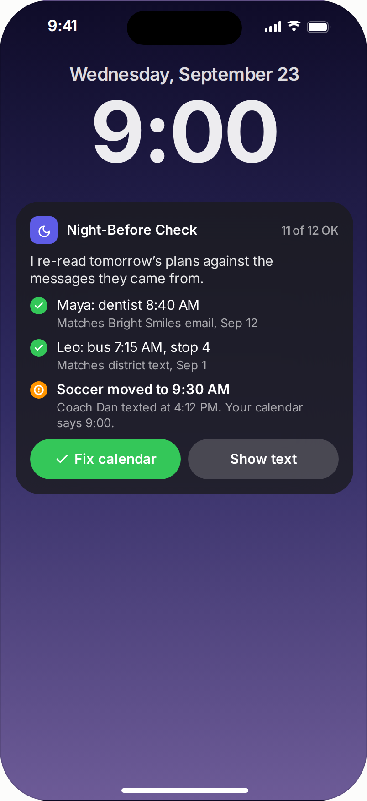
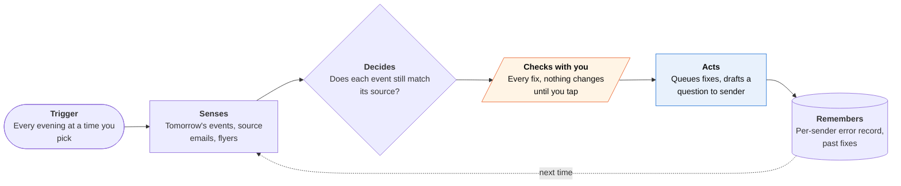
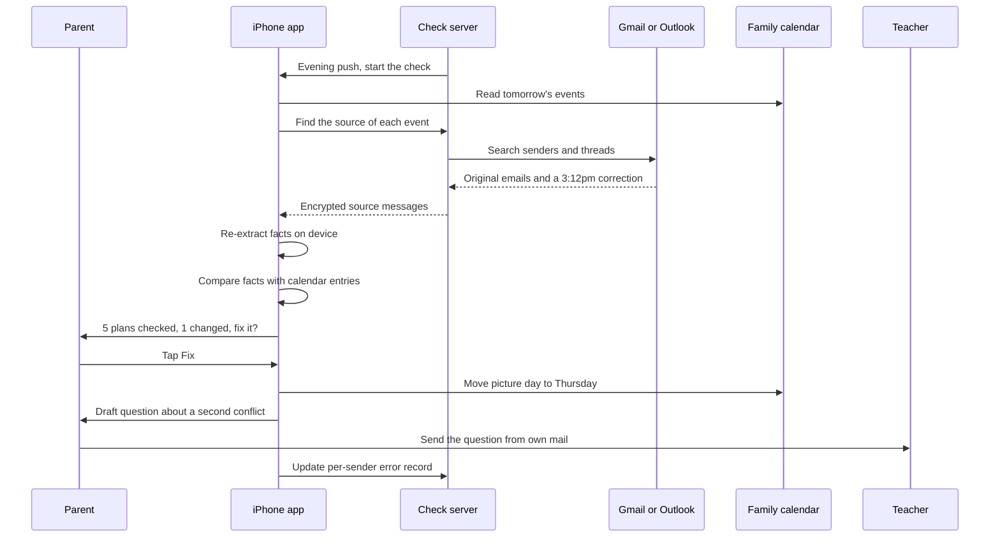

<!-- Generated by scripts/build.py from data/ideas.json. Edit the JSON, then run the script. -->

[← All ideas](../README.md) · **Whitespace** · Family & care

# W-02 · Night-Before Check

> A separate checker agent that re-verifies tomorrow's family plans against the original messages each evening.

| Difficulty | Novelty | Buildable on iOS today | Impact if it works | Horizon | Autonomy |
|---|---|---|---|---|---|
| `●●●○○` 3/5 | `●●●●○` 4/5 | `●●●●○` 4/5 | `●●●●○` 4/5 | Buildable now | L2 · Drafts, you approve |

## The moment

It's 8:40pm. Your family calendar, filled in by an AI organizer, says picture day is Wednesday. At 3:12pm the teacher sent a correction moving it to Thursday, and nobody noticed. Your phone shows one line: 'Tomorrow: 5 plans checked, 1 changed. Picture day moved to Thursday (teacher, 3:12pm). Fix?'

## The problem

AI family organizers now turn school emails and flyers into calendar events automatically, and a misread date is worse than no event because you trust it. Milo shut down in January 2026 after its founder said the technology was too early to be reliable. Every organizer competes on extracting more, faster. None has an independent step that re-checks what it wrote against the source, and against later corrections, before the family acts on it.

## How the agent works

## Deep dive

Night-Before Check is deliberately not an organizer. It doesn't create events. It audits the ones that exist, whoever or whatever made them, the evening before they matter. Keeping it separate is the point: the checker reads each source again with fresh eyes and has no stake in the first extraction being right.

### What the first 90 days look like

Weeks 1 to 4: collect about 1,000 real school and activity emails and flyers from volunteer families (with consent), hand-label the true facts, and measure how often two or three popular organizers get dates, times and items wrong. That base rate decides whether the product is needed and where. Weeks 5 to 8: a beta with 40 families at a few schools, using Google or iCloud calendars plus a forwarding address. Track flags per night, how many were real, and how many real errors slipped through. Weeks 9 to 12: add the people check (the driver's clashing meeting, whose week it is) and per-sender error history, and tune until a normal night shows zero to two items.

### The hardest engineering problem

Linking each calendar event back to its source, then finding anything that changed it. Organizers rarely store where an event came from. The checker has to search mail for the sender, the subject and the days around the event's creation, and match on meaning, because "picture day" and "school photos" are the same event. Then it has to look forward in time for corrections, which often arrive as a short reply in the same thread or as a new email with a different subject.

All of this has to stay cheap and mostly private. The phone re-extracts facts with the on-device model using guided generation. Only long or conflicting threads go to Private Cloud Compute, which has a larger context window and a daily per-user quota.

Calibration matters as much as accuracy. A checker that flags ten things a night gets ignored within a week, and then it fails the same way Milo did. So each flag carries a confidence score and the quoted source sentence. A plain "couldn't check" list covers events with no findable source, such as a plan made by text message, which iOS doesn't let the app read.

### How it makes money

A family subscription sold on one promise: fewer surprises at drop-off. A second channel is licensing the checker to organizer apps that want an independent accuracy check they can show parents, as long as the checker stays separate from the extractor it audits.

## iOS building blocks

- **EventKit (EKEventStore)** — reads tomorrow's events from every calendar on the phone and applies approved fixes
- **Foundation Models (@Generable)** — re-extracts date, time, place and what to bring from each source on-device
- **PrivateCloudComputeLanguageModel** — reconciles long threads and conflicting messages
- **VisionKit (VNDocumentCameraViewController)** — captures paper flyers and notes as sources
- **UserNotifications** — the evening summary with actionable Fix buttons
- **App Intents** — answers 'Is tomorrow checked?' from Siri or Shortcuts
- **BackgroundTasks (BGAppRefreshTask)** — opportunistic prep on the phone; the server push is the reliable trigger

## What makes it hard

- Finding the source of each event. Organizers rarely store a link back, and some keep events only in their own app where EventKit can't see them. The checker has to search mail for the message that produced each event and say plainly when it can't find one.
- Catching corrections. The error that hurts is the 3:12pm 'correction: Thursday' email. The checker must look for newer messages from the same sender and thread, not just re-read the original.
- Keeping the queue short. If it flags ten items a night, parents stop reading by Friday. It needs calibrated confidence and a target of zero to two items on a normal night.
- Mail access. Gmail's read scopes are restricted and need Google's security assessment. A forwarding address is cheaper but misses anything nobody forwarded.

## Risks and failure modes

- False reassurance. '5 plans checked' can make parents stop looking. The summary must also say what it could not check, such as a plan changed by text message, which the app can't read.
- Children's school data and co-parent calendars are sensitive. Keep extraction on-device where possible, get 5.1.2(i) consent before any third-party model sees mail, and never message a teacher or co-parent without a tap.
- Reading another household's calendar needs that person's own consent. The app must not become a way to monitor a co-parent.

## Unsaid assumptions

_What this idea quietly depends on being true. Check these before you build._

- Parents will spend 20 seconds on an evening review if the queue is short and each item quotes the source sentence.
- Organizers write events to calendars the checker can read (iCloud, Google, Outlook), not only into their own app.
- Most costly errors can be seen in email, flyers and documents the family received, not only in texts and conversations.

## Unknown unknowns

_Open questions nobody has good answers to yet._

- What error rate do AI organizers actually have on school email? No one publishes it.
- Is evening the right time, or does a 6am re-check catch more late changes?
- Will organizer makers see an independent checker as a threat or as a partner?

## Prior art and who's building

- [Skylight Sidekick and Magic Import](https://myskylight.com/lp/sidekick-magic-import-for-busy-families/) — Turns forwarded emails, PDFs and photos into calendar events. It extracts once and doesn't re-check events against the source or later corrections.
- [Ohai](https://www.ohai.ai/) — Household manager for schedules, tasks and grocery orders through an app and SMS. No independent verification step.
- [Sense](https://getsense.ai/) — AI family organizer that fills the calendar from school mail. Same single-pass design.
- [Milo (shut down)](https://startups.rip/company/milo) — SMS family assistant that closed in January 2026; its founder said AI was 'too early to be reliable'. The failure this card is built to catch.

## Smallest useful first version

Google or iCloud calendar plus a forwarding address. Each evening at a time you pick, it checks tomorrow's events against the emails and flyers that created them and sends one notification: how many it checked, which changed, and which it couldn't verify. Fixes apply with one tap, and nothing else changes.

Research notes: what we could and couldn't verify

Skylight Sidekick and Magic Import confirmed via search results (URL swapped to the Sidekick page). Milo's shutdown and quote come from the research digest and search snippets (startups.rip, a Sense blog post). I did not open the Sense 2026 roundup cited by the candidate, so it's left out, and the claim that 2026 reviews 'still warn about misread dates' is not repeated. Gmail restricted-scope security assessment is from general knowledge.

## Related ideas

- [B-12 · Family logistics agents](../building-now/B-12-family-logistics-agents.md)
- [W-12 · Agent Janitor](../whitespace/W-12-agent-janitor.md)
- [W-15 · Two-House Handoff](../whitespace/W-15-two-house-handoff.md)
