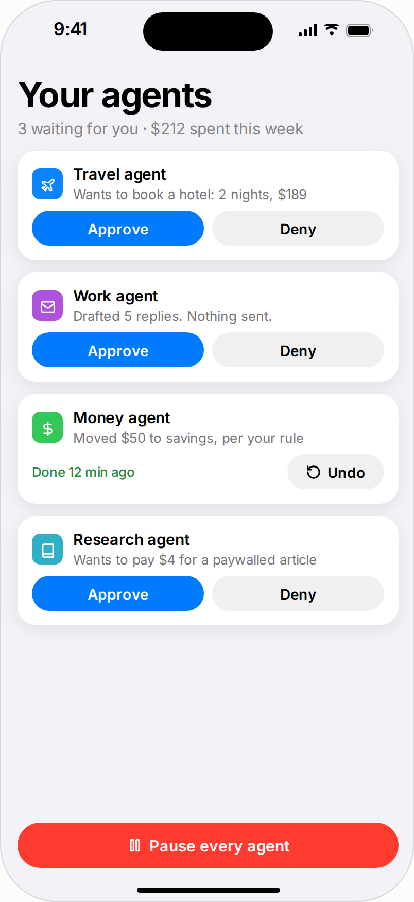
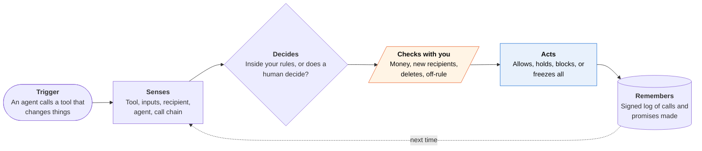
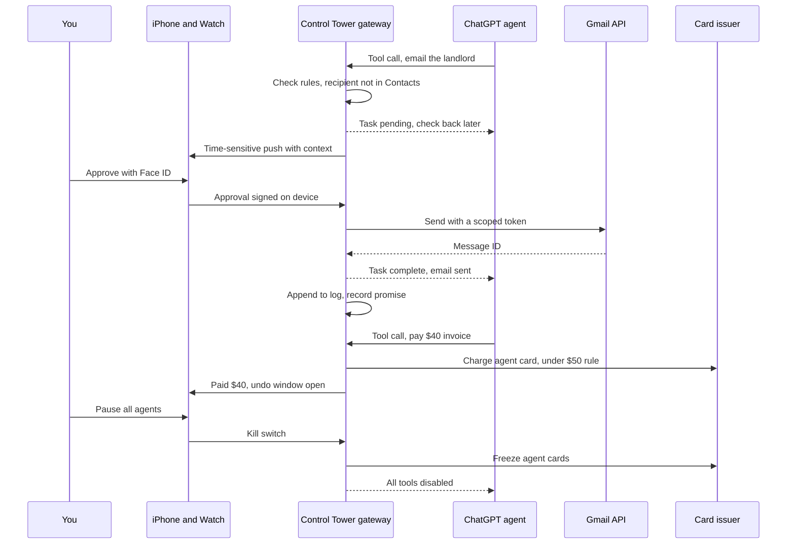

<!-- Generated by scripts/build.py from data/ideas.json. Edit the JSON, then run the script. -->

[← All ideas](../README.md) · **Whitespace** · Work & business

# W-03 · Agent Control Tower

> One iPhone inbox to approve, pause and audit every AI agent that acts for you, whoever made it.

| Difficulty | Novelty | Buildable on iOS today | Impact if it works | Horizon | Autonomy |
|---|---|---|---|---|---|
| `●●●○○` 3/5 | `●●●●○` 4/5 | `●●●○○` 3/5 | `●●●●○` 4/5 | Buildable now | L3 · Acts in guardrails, reports back |

## The moment

It's 7:40am and three agents want something: Claude wants to send a contract redline, OpenClaw wants to pay a $40 invoice, and ChatGPT's agent wants to email your landlord. Instead of three apps with three approval styles, your Watch shows one stack with Approve, Edit or Deny, and what each agent read before it asked. On Friday evening, before the walkthrough, it reminds you that an agent told Priya you'd bring the signed lease.

## The problem

Heavy users now run several agents at once, and each has its own approvals, notifications and log. Nobody can answer 'what did my agents do this week, and what did they promise in my name?' A July 2026 survey of agent permission systems found most commercial agents apply one product-wide policy to every user, so you can't set a rule like 'no agent spends over $50 alone'. And five agents pinging about the same flight change turns delegation into a new interruption problem.

## How the agent works

## Deep dive

Agent Control Tower is a gateway plus a remote control. The gateway is a remote MCP server that sits between your agents and the tools that change things: email, calendar, payments. The iPhone and Watch are where you approve, pause and read the log. Agents keep their own models and memory. The tower only controls what they can do.

### What the first 90 days look like

Weeks 1 to 4: build the gateway with three tools (send email, create event, pay with an agent-scoped virtual card), connect it to Claude, ChatGPT and OpenClaw, and learn exactly how each host behaves when a tool call waits for a human. Weeks 5 to 8: a beta with about 50 people who already run several agents. Measure approvals per day, median time to answer, how many rules people write, and how often they override those rules. Weeks 9 to 12: add receipts for agents that can't be gated (read from their confirmation emails), a list of promises agents made in your name with a briefing before the related meeting, and batching, so a Focus block produces one digest instead of eleven pings.

### The hardest engineering problem

Holding a tool call open while a person decides. Hosts time out long calls, and each handles waiting differently. MCP's 2025-11-25 spec added an experimental Tasks primitive (call now, fetch the result later), and the 2026-07-28 spec made servers stateless with Tasks as an extension, but host support varies. The gateway needs three paths: a Task where the host supports it; a structured "pending your approval, check back in 5 minutes" result that the agent's model can act on; and, after a timeout, a clear denial with a reason, so the agent tells you instead of trying another route. Every approved action must be idempotent, so a host that retries doesn't send the email twice. Each approval is signed with a Secure Enclave key on your phone, so the log can show that a person, not a script, said yes.

A close second is context. The gateway sees tool calls, not the agent's conversation. It rebuilds the "why" from the chain of calls that led to this one, and it flags any request whose wording traces back to an incoming email or web page, which is the pattern behind prompt-injection attacks.

### How it makes money

A subscription for people who already pay for several agents, with a household plan so a family shares one rulebook. Interchange on agent-scoped cards is a second stream. The log is never sold or used for ads, because trust is the whole product.

## iOS building blocks

- **UserNotifications (timeSensitive, authenticationRequired actions)** — approval requests that get through Focus and need an unlocked device
- **ActivityKit (Live Activities)** — a live queue of pending approvals on the Lock Screen and Watch Smart Stack
- **LocalAuthentication** — Face ID for money, new recipients and deletions
- **CryptoKit (SecureEnclave.P256.Signing)** — signs each approval so the gateway can prove a person said yes
- **App Intents (IntentAuthenticationPolicy)** — 'Pause all agents' from Siri or the Action button; resuming needs authentication
- **WidgetKit (Controls)** — a kill-switch control on the Lock Screen and in Control Center
- **EventKit and Core Location (CLMonitor)** — briefs you on agent promises before the meeting or place they concern

## What makes it hard

- Routing. The gateway only sees agents whose connectors go through it. Users must remove each agent's built-in Gmail, Calendar and payment connectors and add the gateway instead. Agents with fixed built-in tools (Muse, Siri AI) can only be logged after the fact, from confirmation emails.
- Waiting for a human. Agent hosts time out long tool calls. The gateway needs MCP Tasks or a 'pending, check back' result, and every host handles these differently.
- Context. To approve well you need to know why the agent asked. The gateway sees tool inputs and results, not the agent's conversation, so it has to show the chain of calls that led here and flag requests that trace back to an incoming email.
- Holding the keys. One service with tokens to email, calendar and cards is a prize target. Tokens need per-agent scopes, approvals backed by hardware keys, and fast revocation.

## Risks and failure modes

- Single point of failure: if the gateway goes down every agent stops, and if it's breached every connected account is exposed.
- Rule drift: auto-approval rules can slide into rubber-stamping. Defaults must be conservative, with a weekly review of what was approved without you.
- Money safety line: agents pay only with agent-scoped virtual cards from a card-issuing partner. Caps and freezes are enforced at the issuer, not just in the app, and every charge is reported with an undo path.

## Unsaid assumptions

_What this idea quietly depends on being true. Check these before you build._

- People will give one more company access to their email and cards in exchange for one place to control every agent.
- Agent vendors will keep supporting remote MCP connectors and won't block third-party gateways.
- Agents treat a denied tool call as final and don't retry through another route.

## Unknown unknowns

_Open questions nobody has good answers to yet._

- Will vendors let outside approvers answer their standard 'input required' states (MCP elicitation, A2A), or keep approvals inside their own apps?
- What rules do ordinary people actually write? 'Under $50' is easy; 'only people I've emailed before' is not.
- How many interruptions a day will people tolerate before they approve everything without reading?

## Prior art and who's building

- [HITL: Human In The Loop (iOS)](https://apps.apple.com/np/app/hitl-human-in-the-loop/id6752878072) — iPhone approvals for team AI workflows built to call it. It doesn't sit in front of consumer agents like ChatGPT, Claude or OpenClaw.
- [Arahi AI human approval](https://arahi.ai/human-approval) — Approval inbox for agents built on Arahi's own platform only.
- [OpenClaw iOS app](https://github.com/openclaw/openclaw) — Approves actions for your own self-hosted OpenClaw agent. One agent, one vendor.
- [Microsoft Copilot Cowork](https://www.microsoft.com/en-us/copilot/blog/2026/05/05/copilot-cowork-from-conversation-to-action-across-skills-integrations-and-devices/) — Approve or reject steps from the Microsoft 365 Copilot iOS app, for Microsoft's agent only.
- [How Agents Ask for Permission (survey)](https://huggingface.co/papers/2607.13718) — Reviews 21 permission-system proposals and five commercial agents and finds no user-level policies. Research that names the gap; not a product.
- [Nylas CLI agent audit](https://cli.nylas.com/guides/audit-ai-agent-activity) — Developer audit log for email-sending agents. Built for the developer, not the person whose name is on the email.

## Smallest useful first version

A remote MCP server with the three tools that matter most (send email, create calendar event, pay with a virtual card) and an iPhone and Watch approval queue. You connect Claude and ChatGPT to it, set two or three rules, and every call that changes something is logged. Anything outside the rules waits for your Face ID, and a Lock Screen control pauses everything.

Research notes: what we could and couldn't verify

Merged 'Delegation Recall' (a log of promises agents made in your name, with briefings before the related meeting or place, and flags for promises traced to incoming email) and 'Agent Attention Firewall' (batching, dedupe, Focus-time holds, a daily interruption count; originally a moonshot). The firewall's full version needs agents to route approvals to outside approvers, so the card keeps only what works through a gateway. HITL, Arahi and Nylas URLs come from the candidates and were not opened. Feasibility lowered to 3 because it depends on users rewiring each agent's connectors. Boundaries with B-25 and W-12 are worth checking.

## Related ideas

- [B-25 · Pocket supervision of work agents](../building-now/B-25-pocket-agent-supervision.md)
- [W-12 · Agent Janitor](../whitespace/W-12-agent-janitor.md)
- [M-02 · Household Spending Constitution](../moonshot/M-02-household-spending-constitution.md)
