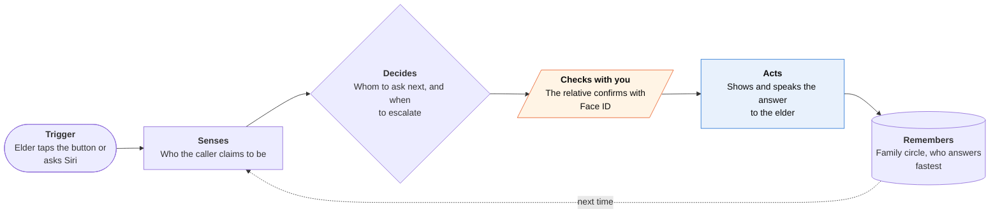

<!-- Generated by scripts/build.py from data/ideas.json. Edit the JSON, then run the script. -->

[← All ideas](../README.md) · **Whitespace** · Safety & civic

# W-04 · Really-You Check

> One tap during a scary call pings the relative's own phone: 'Did you just call Grandma?'

| Difficulty | Novelty | Buildable on iOS today | Impact if it works | Horizon | Autonomy |
|---|---|---|---|---|---|
| `●●○○○` 2/5 | `●●●●○` 4/5 | `●●●●○` 4/5 | `●●●●○` 4/5 | Buildable now | L3 · Acts in guardrails, reports back |

## The moment

Your grandmother gets a call from 'you', crying, saying you're in jail and need $4,000 in gift cards. She taps the big button on her Lock Screen. Within 20 seconds your phone asks 'Did you just call Grandma?', you tap No and confirm with Face ID, and her screen says in large type, and out loud: 'Jake is safe. This call is not Jake. Hang up.'

## The problem

Voice cloning needs only a short clip from a social post, and both the FTC and FCC warn about fake family-emergency calls. The official advice (hang up and call back, or use a family code word) fails exactly when it's needed, because a frightened person forgets both. Scam tools for seniors screen and block numbers on one phone. None asks the person being impersonated.

## How the agent works

## iOS building blocks

- **App Intents (AppShortcutsProvider)** — 'Is this really Jake?' by Siri, the Action button or Back Tap
- **WidgetKit (Controls)** — a big Lock Screen and Control Center button that starts the check
- **UserNotifications (timeSensitive)** — reaches the relative even in Focus
- **LocalAuthentication** — Face ID on the relative's phone, so a stolen SIM can't answer
- **ActivityKit (Live Activities)** — shows the answer in large type on the elder's Lock Screen during the call
- **AVFAudio (AVSpeechSynthesizer)** — speaks the answer, since the phone is at the elder's ear
- **Accessibility (Assistive Access support)** — a full-screen, large-button layout for elders who use Assistive Access

## What makes it hard

- Using it mid-call. The phone is at the elder's ear. The check must start from the Lock Screen, the Action button, Back Tap or Siri, and the answer must be spoken as well as shown.
- Speed. Relatives are in meetings or asleep. The ladder (the named relative, then parents and siblings, then 'nobody confirmed, hang up and call Jake from your contacts') must finish in about two minutes without paging everyone at once.
- Setup is a group job. Every relative must install the app, join the circle and allow time-sensitive alerts. The product lives or dies on a one-link family invite.
- Ambiguity. There may be two grandsons, or the caller may claim to be a lawyer or police officer. The check has to handle 'someone calling about Jake', not only 'Jake'.

## Risks and failure modes

- Safety line: it never tells the elder to send money or keep talking. 'Yes, it was me' only confirms the call; it doesn't approve a payment, and the advice is still to hang up and call back on a known number.
- A stolen, unlocked relative's phone could answer 'yes'. Face ID narrows this but doesn't close it.
- It must not become surveillance. It never listens to calls or reads messages. It only knows the elder asked, and the elder controls who is in the circle.

## Unsaid assumptions

_What this idea quietly depends on being true. Check these before you build._

- Scammers don't also control the relative's phone. A SIM swap alone doesn't beat it, because the answer comes from the app on the relative's device, not their number.
- In a panic, older adults remember one big button better than a code word.
- Families keep the app installed and alerts on for a rare event.

## Unknown unknowns

_Open questions nobody has good answers to yet._

- How often does a relative answer within 90 seconds, and at what hours does it fail?
- When the elder says 'let me check', do scammers hang up or push harder?
- Would banks or gift-card sellers want to trigger the same check at the counter?

## Prior art and who's building

- [FTC alert on AI family-emergency scams](https://consumer.ftc.gov/consumer-alerts/2023/03/scammers-use-ai-enhance-their-family-emergency-schemes) — Advises hanging up and calling the person back. Good advice that depends on memory under stress.
- [FCC grandparent scam alert](https://www.fcc.gov/consumers/scam-alert/grandparent-scams-get-more-sophisticated) — Same advice plus family code words. Nothing automates the check.
- [Carefull](https://getcarefull.com/) — Monitors an older adult's accounts and alerts family to unusual activity. It reacts after money moves, not during the call.
- [Scammer Guardian](https://www.scammerguardian.com/about/) — Screens scam calls before they reach seniors. Detection on one phone; it never asks the real relative.
- [Apple Call Screening (iOS 26)](https://www.macrumors.com/how-to/ios-26-make-your-iphone-wait-on-hold-for-you/) — Asks unknown callers who they are. A scammer just says 'it's Jake', and screening can't verify that claim.

## Smallest useful first version

A family circle of up to ten people, one Lock Screen button and one Siri phrase on the elder's phone. A tap sends a time-sensitive alert to the named relative, then to two backups after 60 seconds. The answer appears in large type and is spoken aloud on the elder's phone.

Research notes: what we could and couldn't verify

Dropped the candidate's callback 'from a known family number through cloud telephony': presenting a relative's number from a cloud line is close to spoofing. If nobody confirms, the app tells the elder to hang up and call the relative from Contacts instead. The FTC, FCC and Carefull URLs are from the candidate and were not opened. I found no product that asks the impersonated relative to confirm, but I searched only the digest and candidate sources.

## Related ideas

- [B-18 · Scam-call guardian agents](../building-now/B-18-scam-call-guardians.md)
- [W-16 · Ulysses Money Pact](../whitespace/W-16-ulysses-money-pact.md)
