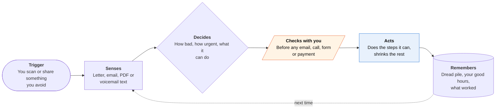

<!-- Generated by scripts/build.py from data/ideas.json. Edit the JSON, then run the script. -->

[← All ideas](../README.md) · **Whitespace** · Mind & focus

# W-05 · Dread Opener

> Reads the letter you've avoided for weeks, tells you how bad it really is, and does all but the last tap.

| Difficulty | Novelty | Buildable on iOS today | Impact if it works | Horizon | Autonomy |
|---|---|---|---|---|---|
| `●●●○○` 3/5 | `●●●●○` 4/5 | `●●●●○` 4/5 | `●●●●○` 4/5 | Buildable now | L2 · Drafts, you approve |

## The moment

The envelope from the county has sat on your counter for three weeks. You scan it without reading it. Ten seconds later: 'Not scary. It's a $38 late fee on the dog license. I've filled in the renewal; you have two minutes left.' A Live Activity counts down while your distracting apps are shielded, and one Face ID finishes it.

## The problem

For many people with ADHD, anxiety or plain overload, the hardest part of admin is opening the thing. Letters sit for weeks while late fees grow. ADHD planners break tasks into steps and send reminders, and admin agents target inbox-heavy professionals, but nobody treats the first step, opening and understanding the thing, as the job. Nobody measures success in minutes of your time left.

## How the agent works

## iOS building blocks

- **VisionKit (VNDocumentCameraViewController)** — scans the letter without you having to read it first
- **Foundation Models** — classifies and summarizes sensitive mail on-device
- **PDFKit (PDFAnnotation)** — fills PDF forms
- **FamilyControls, ManagedSettings, DeviceActivity** — shields the apps you picked while you do the last step
- **ActivityKit and App Intents (LiveActivityIntent)** — the last step as a Lock Screen timer with a Done button
- **LocalAuthentication** — Face ID before anything is sent or paid
- **Share extension (NSExtensionContext)** — takes in PDFs, emails and voicemail transcripts from other apps
- **MessageUI (MFMessageComposeViewController)** — a prefilled 'can you sit with me on FaceTime?' text to a friend you chose

## What makes it hard

- The one-line verdict must be right. Calling a debt lawsuit 'not scary' would be harmful, so court, tax, immigration and debt-collection letters always get a careful summary and a pointer to free help.
- The final step often lives outside the app: a government portal, a bank app, a wet signature. The app can prefill and deep-link but can't press the button.
- Screen Time shields need Apple's Family Controls entitlement, and DeviceActivity schedules have a 15-minute minimum, so the shield lasts until you tap Done or up to 15 minutes.
- Changing tactics after two snoozes needs a record of what works for this person, without turning into nagging.

## Risks and failure modes

- Safety line: it summarizes and drafts; it doesn't give legal, tax or financial advice. Serious letters get a plain 'this matters, here is free help' path, and every deadline shows its source.
- Mail holds account numbers and health details. Read on-device, and ask for 5.1.2(i) consent before any cloud model or call agent sees it.
- Nudges can turn into shame. No streaks, no guilt copy, and snoozing is always allowed.

## Unsaid assumptions

_What this idea quietly depends on being true. Check these before you build._

- Avoidance is mostly about dreading an unclear first step, not the work itself. When the last step is the dreaded part (a hard conversation), shrinking the task doesn't help.
- People will scan a letter they haven't read if the app promises to tell them how bad it is first.
- Most dreaded admin can be reduced to a signature, a Face ID or a yes.

## Unknown unknowns

_Open questions nobody has good answers to yet._

- Does hearing the worst realistic outcome reduce avoidance, or raise anxiety for some people?
- What share of dreaded items can the agent actually finish, and how many does it hand back?
- Who pays: individuals, ADHD coaching services, or employer benefits programs?

## Prior art and who's building

- [Shelpful](https://apps.apple.com/py/app/shelpful-ai-for-adhd-tasks/id6741499362) — AI plus human coaches for ADHD task breakdown and accountability. It helps you plan; it doesn't open the letter or do the task.
- [alfred_](https://get-alfred.ai/blog/ai-agent-for-adhd) — Email and calendar assistant pitched to ADHD users. Inbox-first; no paper mail, calls or last-step design.
- [Saner.AI](https://www.saner.ai/) — Notes, tasks and reminders for ADHD brains. Organizes, doesn't act.
- [Marblism](https://www.marblism.com/blog/best-ai-tools-for-adhd) — AI assistants for work admin, aimed at professionals' inboxes, not a person's dreaded personal mail.

## Smallest useful first version

Scan or share one item and get a one-line verdict: what it is, the worst realistic outcome, the deadline and how many minutes it needs. For the three most common kinds (a bill, a form, an appointment to book) it drafts the reply or fills the form, then leaves you one Live Activity step with a timer.

Research notes: what we could and couldn't verify

The candidate's 3-minute shield is now 'until Done or up to 15 minutes' because DeviceActivity's minimum schedule is 15 minutes (verified in Apple docs); the app can also set and clear ManagedSettings shields itself. The FaceTime body-double invite became a prefilled message, since apps can't create FaceTime links. Goblin Tools was dropped from prior_art (no verified URL). The alfred_, Saner.AI and Marblism URLs come from the candidate and were not opened; Marblism's product description is from general knowledge.

## Related ideas

- [B-23 · ADHD task-breakdown planners](../building-now/B-23-adhd-task-breakdown.md)
- [W-08 · Paper Round-Trip](../whitespace/W-08-paper-round-trip.md)
- [W-26 · Benefits Keeper](../whitespace/W-26-benefits-keeper.md)
