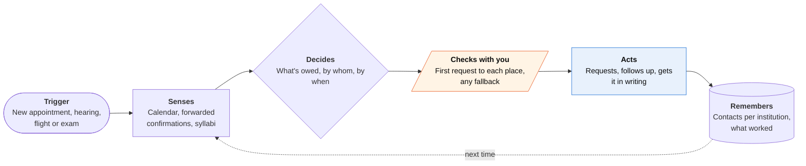

<!-- Generated by scripts/build.py from data/ideas.json. Edit the JSON, then run the script. -->

[← All ideas](../README.md) · **Whitespace** · Accessibility

# W-06 · Accommodations Booked Ahead

> Requests the ASL interpreter, captioner or language interpreter you're owed, then chases it until confirmed.

| Difficulty | Novelty | Buildable on iOS today | Impact if it works | Horizon | Autonomy |
|---|---|---|---|---|---|
| `●●○○○` 2/5 | `●●●●●` 5/5 | `●●●●○` 4/5 | `●●●●○` 4/5 | Buildable now | L3 · Acts in guardrails, reports back |

## The moment

You're Deaf, and your cardiology follow-up is in nine days. Last time the clinic 'forgot' the interpreter and offered to pass notes. This time, the night you book, your phone has already emailed the clinic's patient-access office, and by day three you have a written confirmation naming the interpreter agency.

## The problem

Hospitals, courts, airlines and schools have legal duties to provide interpreters, captioning and other accommodations, but in practice the person who needs them does the chasing. Requests get lost, the interpreter doesn't show, and the fallback is 'we'll write notes' or a relative interpreting. Students with approved extra exam time face the same paperwork race every term. Interpreter platforms sell to institutions, so nobody builds for the person making the request.

## How the agent works

## iOS building blocks

- **EventKit** — spots new appointments, court dates, flights and exams
- **App Intents** — a 'request accommodation for this event' action from Siri or Shortcuts
- **ActivityKit (Live Activities)** — request status in the days before an appointment
- **UserNotifications** — replies, fallback offers that need your answer, and the day-before confirmation
- **Translation** — shows the institution's replies in your own language
- **Foundation Models and PrivateCloudComputeLanguageModel** — drafts short, rule-citing requests while keeping disability details on Apple's models
- **VisionKit and PDFKit** — reads syllabi and accommodation letters to find exam dates

## What makes it hard

- Finding the right contact. The patient-access office, ADA coordinator, court interpreter office or airline accessibility desk is rarely on the appointment confirmation, so the agent needs a contact directory per institution that stays current.
- Getting confirmation in writing. Offices confirm by phone or not at all. The follow-up call has to ask for the agency name, interpreter type and in-person versus video, and then get it in an email.
- Each school's testing center runs its own portal (such as AIM or Accommodate) with no API, so exam booking stays a prefilled one-tap handoff to the student.
- The rules differ: the ADA and Section 504, Section 1557 language access, the Air Carrier Access Act and state court rules each set different duties and notice periods.

## Risks and failure modes

- Safety line: it is not legal advice. It cites rules in plain words, never threatens legal action on its own, and any complaint packet is for the person to read and file.
- Disability status and language needs are sensitive. Share the minimum in each request, draft on Apple's models where possible, and get 5.1.2(i) consent before any third-party model sees them.
- An agent-sent request could be treated as spam or as less legitimate, delaying the accommodation it was meant to secure.

## Unsaid assumptions

_What this idea quietly depends on being true. Check these before you build._

- Institutions act faster on a polite, dated, rule-citing written request than on a patient's phone call.
- They won't treat an agent-sent request as less legitimate than one typed by the person.
- Users will approve the first request to each institution and trust later ones to go out automatically.

## Unknown unknowns

_Open questions nobody has good answers to yet._

- Who pays: users, disability organizations, Medicaid plans, legal-aid groups or universities?
- Does a written paper trail measurably reduce no-show interpreters?
- How should it handle video remote interpreting offers, which some Deaf patients accept and others find unusable?

## Prior art and who's building

- [Boostlingo on-demand ASL interpreting](https://boostlingo.com/solutions/interpreter-services/on-demand/asl-interpretation-services/) — Interpreting sold to hospitals and courts. The provider books it; the patient has no way to make sure it happens.
- [Sorenson healthcare interpreting](https://sorenson.com/enterprise/healthcare/) — Interpreting for health providers. Same institution-side model.
- [Ability Together guide to requesting ASL interpreters](https://abilitytogether.org/scheduling-a-medical-appointment-understanding-the-ada-and-asl-interpreters/) — Explains how to ask for an interpreter under the ADA. A how-to the person still carries out alone, every time.
- [UIC accommodated testing rules](https://drc.uic.edu/drc-testing/accommodatedtesting/) — Typical testing-center rules with fixed booking windows. Students track and book every exam themselves.
- [Purdue DRC booking reminders](https://www.purdue.edu/drc/news/01_28_22.php) — A disability office reminding students about booking deadlines, a sign that missed windows are common.

## Smallest useful first version

Medical appointments only, for Deaf and hard-of-hearing users. When a new appointment lands in your calendar, it drafts a request for an ASL interpreter or CART captioning to the clinic's patient-access office, sends it after your first approval, follows up at 72 hours, and asks for written confirmation two days before.

Research notes: what we could and couldn't verify

Merged 'Accommodations Autopilot' (finding every exam in a student's syllabi and booking extended-time seats before the testing center's deadline). AIM and Accommodate are named without URLs (not verified). The Boostlingo, Sorenson, Ability Together, UIC and Purdue URLs come from the candidates and were not opened. The legal duties are named at a high level from general knowledge.

## Related ideas

- [W-07 · Deaf-First Call Agent](../whitespace/W-07-deaf-first-call-agent.md)
- [W-11 · Paratransit Trip Keeper](../whitespace/W-11-paratransit-trip-keeper.md)
- [W-29 · Step-Free Scout](../whitespace/W-29-step-free-scout.md)
