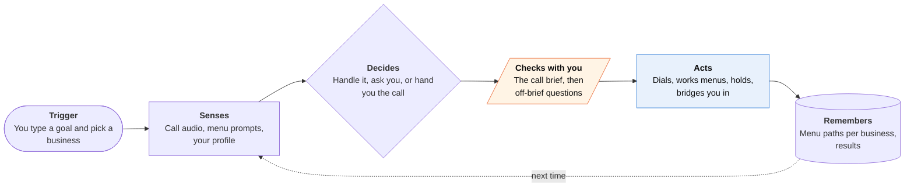

<!-- Generated by scripts/build.py from data/ideas.json. Edit the JSON, then run the script. -->

[← All ideas](../README.md) · **Whitespace** · Social & communication

# W-07 · Deaf-First Call Agent

> Sits through phone trees and hold music, handles routine questions, then hands you the call in captions.

| Difficulty | Novelty | Buildable on iOS today | Impact if it works | Horizon | Autonomy |
|---|---|---|---|---|---|
| `●●●○○` 3/5 | `●●●●○` 4/5 | `●●●●○` 4/5 | `●●●●○` 4/5 | Buildable now | L3 · Acts in guardrails, reports back |

## The moment

You're hard of hearing, and the pharmacy's refill line is a voice-only menu that times out before captions catch up. You type 'refill my lisinopril and ask when it's ready'. The agent calls, gets through the menu, waits 18 minutes on hold and gives your date of birth from your profile. It only taps your Watch when the pharmacist asks something outside its brief, and then you take over with live captions while your typed replies are spoken aloud.

## The problem

Voice-only phone menus, hold queues and 'we only call back' offices are still a wall for Deaf and hard-of-hearing people. Caption apps help once a person is on the line, but you still sit through the menu and the hold. General calling agents handle menus and holds, then report a summary afterwards. None hands the live call back to a Deaf user, in captions, at the moment a person is needed.

## How the agent works

## iOS building blocks

- **CallKit and PushKit** — rings you in like a normal call when you take over the live line
- **Speech (SpeechAnalyzer, SpeechTranscriber)** — on-device live captions of the other person
- **AVFAudio (AVSpeechSynthesizer, Personal Voice)** — speaks your typed replies, in your own voice if you made one and allow it
- **ActivityKit (Live Activities)** — 'on hold, 18 min' and 'pharmacist has a question' on the Lock Screen and Watch
- **WatchKit (WKInterfaceDevice haptics)** — a distinct tap when a person picks up or asks for you
- **App Intents** — 'call the pharmacy about my refill' from Siri or Shortcuts
- **MapKit (MKLocalSearch)** — finds the business and its number

## What makes it hard

- The handoff. Moving a live cloud call into a VoIP session on the phone without dropping it, with captions fast enough for real conversation.
- Staying on the line. Many businesses hang up on anything that sounds like a robocall. The agent has to say up front that it is an assistant calling for a Deaf customer.
- Identity checks. Pharmacies and banks ask for date of birth or more. The brief must say exactly what the agent may disclose, and anything beyond that goes to you.
- Funding. FCC relay services such as IP CTS are paid per minute for conversations between two people, so an agent talking on its own probably falls outside that model and needs another way to pay for minutes.

## Risks and failure modes

- Health safety line: it can ask about a refill or a ready date, but it never agrees to a change in medication, dose or pharmacy. Anything clinical is handed to you live.
- Mishearing. A wrong ready date or confirmation number costs a trip. Key facts are read back on the call and shown to you with the audio clip.
- Consent and disclosure. Some states require every party's consent to record, and the FCC treats AI-generated voices as 'artificial' under the TCPA. The agent identifies itself and keeps recordings only with consent.

## Unsaid assumptions

_What this idea quietly depends on being true. Check these before you build._

- Businesses will stay on the line with an AI that says it is calling for a Deaf customer instead of hanging up on it as a robocall.
- Deaf users will trust a machine to speak for them on routine turns.
- On-device captions are fast and accurate enough on phone-quality audio.

## Unknown unknowns

_Open questions nobody has good answers to yet._

- Can Personal Voice audio be streamed into a VoIP call, and does Apple's authorization allow that use?
- Would the FCC treat an agent-plus-handoff service as relay, so that part of it could be funded that way?
- How often do routine calls hit a point that needs the user, and how long will the other side hold?

## Prior art and who's building

- [Rylo (formerly Nagish)](https://apps.apple.com/us/app/rylo-live-call-captioning/id1514154600) — Live captions and type-to-speak on phone calls. You still sit through menus and hold yourself; it doesn't make the call for you.
- [Rylo's $85M raise (2026)](https://hlth.com/insights/news/rylo-raises-85m-to-scale-ai-communication-tools-for-deaf-and-hard-of-hearing-users) — Funding to grow from call captioning into a wider communication platform. Shows demand; no agent that calls for you yet.
- [Pine AI](https://apps.apple.com/us/app/pine-assistant/id6746403769) — Calls businesses, waits on hold and works phone menus, then reports back. No live, captioned handoff.
- [Genspark Call for Me](https://www.businesswire.com/news/home/20260203556134/en/Genspark-Uses-Twilio-to-Power-Global-AI-Calling-Call-for-Me-Agent) — Places calls and returns structured results, for users who read a summary afterwards.
- [Apple Hold Assist (iOS 26)](https://www.macrumors.com/how-to/ios-26-make-your-iphone-wait-on-hold-for-you/) — Waits on hold on cellular calls, first-party only. It alerts you when a person picks up, which assumes you can then hear them.

## Smallest useful first version

Outbound calls to pharmacies and doctors' offices only. You type the goal and approve a brief; the agent calls, works the menu and holds. When a person answers it handles the routine part, and at anything off-brief it asks them to hold and taps your Watch so you can join with live captions and type-to-speak. An inbound number for offices that 'only call back' comes next.

Research notes: what we could and couldn't verify

Rylo's $85M raise and Nagish rename confirmed via search results (hlth.com, MobiHealthNews, Ctech). The candidate's 'FCC-certified AI captioning' for Rylo was not verified, so the card doesn't claim it. Whether Personal Voice audio can be piped into a VoIP stream is untested (write(_:toBufferCallback:) exists; policy unknown). The FCC's 2024 ruling on AI voices under the TCPA is from general knowledge.

## Related ideas

- [B-02 · Phone-call errand agents](../building-now/B-02-phone-call-errand-agents.md)
- [W-06 · Accommodations Booked Ahead](../whitespace/W-06-accommodations-booked-ahead.md)
- [M-16 · Mid-Call Voice Stand-In](../moonshot/M-16-mid-call-voice-stand-in.md)
