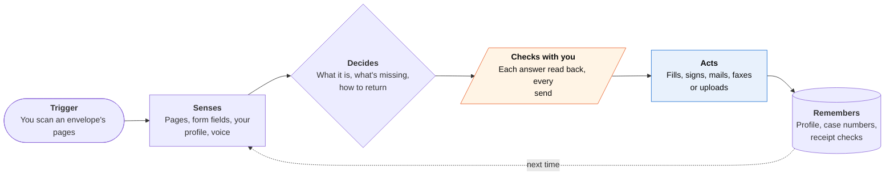

<!-- Generated by scripts/build.py from data/ideas.json. Edit the JSON, then run the script. -->

[← All ideas](../README.md) · **Whitespace** · Life admin

# W-08 · Paper Round-Trip

> Reads the letter aloud, fills the form with you by voice, then mails or faxes it back before the deadline.

| Difficulty | Novelty | Buildable on iOS today | Impact if it works | Horizon | Autonomy |
|---|---|---|---|---|---|
| `●●●○○` 3/5 | `●●●●○` 4/5 | `●●●●○` 4/5 | `●●●●●` 5/5 | Buildable now | L2 · Drafts, you approve |

## The moment

You're blind, or you read Arabic but not English, and a thick envelope arrives: a Medicaid renewal due in 30 days. You hold your phone over it and hear, in plain words and your language, what it is, the deadline and the five things it needs from you. You answer out loud while making tea. The next morning the signed form is in the mail with tracking, and a reminder is set to check that the office logged it.

## The problem

Paper letters from agencies are the last channel that stays inaccessible to blind people, low-literacy readers and people who don't read English. Reading apps stop at reading, and form helpers stop at explaining fields. The return trip (filling, signing, sending by a channel the agency accepts, and confirming receipt) is where deadlines are missed and benefits lapse.

## How the agent works

## iOS building blocks

- **VisionKit (VNDocumentCameraViewController)** — guided page capture that works with VoiceOver
- **Vision (RecognizeDocumentsRequest)** — reads structured pages, including on phones without Apple Intelligence
- **Foundation Models (Attachment) with Vision's OCRTool** — reads and classifies the letter privately on newer phones
- **PDFKit (PDFAnnotation)** — fills the form's fields
- **PencilKit (PKCanvasView)** — captures a finger signature
- **Speech (SpeechTranscriber) and AVSpeechSynthesizer** — asks questions by voice and reads every answer back
- **Translation** — summaries and questions in the user's language
- **PassKit (PKAddPassesViewController)** — saves a cash-payment barcode as a Wallet pass
- **EventKit** — deadline and 'confirm receipt' reminders

## What makes it hard

- Form mapping. A scanned form has no field data. Finding each box, its label and its format (dates, checkboxes, case numbers) from a photo is error-prone, and every value must be read back before it's written.
- Signatures. Some agencies need ink. The app must know which ones and route to a trusted person or in-person help, rather than send something that will be rejected.
- The return channel. Mail and fax need a paid backend (print-and-mail and cloud fax services), and portal uploads need a server-side browser that agency sites may block.
- Older phones. The people who most need this often don't have Apple Intelligence hardware, so reading falls back to Vision OCR and a cloud model, which needs explicit consent.

## Risks and failure modes

- Safety line: it is not legal or benefits advice. It reads and fills what you tell it; eligibility questions and appeals go to legal aid or a caseworker, and you approve every outbound item.
- A missed deadline can mean lost coverage. Tracking numbers, receipt reminders and a 'did the office log it?' follow-up are part of the job, not extras.
- Household, income and immigration details are highly sensitive. The profile stays on the phone, encrypted, and is shared only with the agency the form is for.

## Unsaid assumptions

_What this idea quietly depends on being true. Check these before you build._

- Agencies accept an e-signature or a printed copy of a finger signature for most routine forms.
- Users will trust a voice read-back enough to let the app send a benefits form.
- Mail and fax are still accepted return channels for most agency letters.

## Unknown unknowns

_Open questions nobody has good answers to yet._

- Which agencies reject printed signatures, and how can the app know in advance?
- Who carries the blame for a lost envelope or a late fax?
- Would benefits offices or legal-aid groups sponsor the mailing costs?

## Prior art and who's building

- [ImmiGuide USCIS form helper](https://apps.apple.com/us/app/immiguide-uscis-form-helper/id6761538383) — Explains USCIS form fields in plain language in 8 languages. It doesn't fill, sign, send or track anything.
- [FormBharo (research)](https://arxiv.org/pdf/2608.06027) — Voice-driven form filling for low-literacy users. A research prototype with no return channel.
- [Be My Eyes, Seeing AI and Envision](https://www.bemyeyes.com/business/blog/the-future-of-ai-in-accessible-customer-service-for-blind-and-low%E2%80%91vision-customers/) — Apps for blind and low-vision users read and describe documents well. They stop at reading; nothing fills and returns the form.
- [Immigration AI for law firms (Docketwise)](https://www.docketwise.com/blog/ai-for-immigration-lawyers/) — Most form AI in this space is sold to lawyers, not to the person holding the letter.

## Smallest useful first version

One letter family in one state, such as Medicaid and SNAP renewals, in two languages. Scan, hear a summary, answer by voice, sign with a finger, and the app mails the form with tracking and sets a receipt reminder. Every outbound item needs a double-tap and Face ID.

Research notes: what we could and couldn't verify

Corrected the candidate: OCRTool belongs to the Vision framework (iOS 27) and is passed to a Foundation Models session; it isn't a Foundation Models type. FormBharo (arXiv 2608.06027) is from the candidate and was not opened. The claim that Siri AI is English-only at launch and needs iPhone 15 Pro or later comes from the research digest.

## Related ideas

- [W-05 · Dread Opener](../whitespace/W-05-dread-opener.md)
- [W-26 · Benefits Keeper](../whitespace/W-26-benefits-keeper.md)
- [B-19 · Blind-assist scene agents](../building-now/B-19-blind-assist-scene-agents.md)
