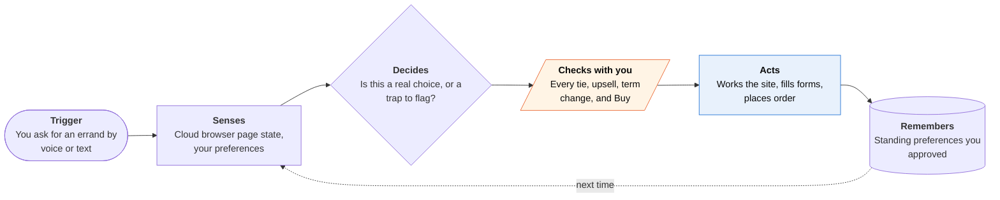

<!-- Generated by scripts/build.py from data/ideas.json. Edit the JSON, then run the script. -->

[← All ideas](../README.md) · **Whitespace** · Accessibility

# W-09 · Pause-and-Ask Errands

> A web-errand agent built for VoiceOver: it does the task and stops at every real choice instead of guessing.

| Difficulty | Novelty | Buildable on iOS today | Impact if it works | Horizon | Autonomy |
|---|---|---|---|---|---|
| `●●●○○` 3/5 | `●●●●○` 4/5 | `●●●○○` 3/5 | `●●●●○` 4/5 | Buildable now | L2 · Drafts, you approve |

## The moment

You're blind, and you ask for the cheapest unscented laundry pods from the store you always use. It finds three at the same price and, instead of silently picking one, reads you a short list (brand, count, rating, one line each), and you choose with a VoiceOver custom action. Before it presses Buy, it reads the total and delivery date and waits for your double-tap and Face ID.

## The problem

Blind users could gain the most from agents that work websites for them, yet today's agents fail them twice. One study found a leading computer-use agent's success falling from 78% to 28% under screen-magnifier conditions, and a field study saw an agent silently pick among equal-price items for a blind shopper. Mainstream agents are tuned to interrupt as little as possible, and their approval screens are built around screenshots.

## How the agent works

## iOS building blocks

- **UIKit accessibility (accessibilityCustomActions, UIAccessibilityCustomRotor)** — choice cards with a fixed reading order, rotor headings and choose, hear-more and cancel actions
- **UIAccessibility announcements** — speaks progress and 'needs you' without moving VoiceOver focus
- **App Intents (SnippetIntent)** — the same choice card from Siri or the Action button
- **ActivityKit (Live Activities)** — progress on long errands
- **Core Haptics (CHHapticEngine)** — a distinct 'needs you' pattern
- **LocalAuthentication** — Face ID before anything is bought
- **AuthenticationServices (ASWebAuthenticationSession)** — an accessible sign-in hand-off to the cloud browser session

## What makes it hard

- Finding real decision points. Price ties, substitutions, pre-ticked boxes, auto-renew and changed terms look different on every site. Too few pauses and it guesses; too many and the errand stalls.
- Accessible sign-in. Logging into a retailer through a cloud browser has to work with VoiceOver, including CAPTCHAs and two-factor codes, without asking the user to look at a screenshot.
- Bot defenses. Retailers may block cloud browsers, so partner APIs are more reliable where they exist.
- Reading order. Every card puts the price first and stays short. Long card text defeats the point.

## Risks and failure modes

- Money safety line: it never buys without reading back the item, total and delivery date and getting an explicit confirmation. Afterwards it keeps return windows and cancel links in a spoken log.
- Retail logins held in a cloud browser are a target. Sessions are scoped per site and can be revoked from the phone.
- Site dark patterns, like a pre-ticked subscription, could slip through if detection misses them. Unknown checkboxes are flagged, never accepted.

## Unsaid assumptions

_What this idea quietly depends on being true. Check these before you build._

- Blind users will accept a cloud browser holding their retail logins.
- Retailers won't block it.
- For this audience, more interruptions at the right moments feel like control, not friction.

## Unknown unknowns

_Open questions nobody has good answers to yet._

- What pause rate do blind users prefer, and does it drop as trust grows?
- Will accessibility law push retailers to offer an agent-friendly API?
- How should it present choices that are hard to describe in words, like colors or styles?

## Prior art and who's building

- [Morae (research)](https://huggingface.co/papers/2508.21456) — Pauses UI agents at decision points so blind users choose. A research prototype, not an iPhone product.
- [CHI 2026 voice computer-use agent for visually impaired shoppers](https://dl.acm.org/doi/10.1145/3772318.3791681) — Studied a voice agent for blind shoppers. Research, not shipping.
- [A11y-CUA dataset](https://huggingface.co/papers/2602.09310) — Shows agent success falling from 78.3% to 41.67% keyboard-only and 28.3% under magnifier. Measures the gap; doesn't fix it.
- [Be My Eyes](https://www.bemyeyes.com/business/blog/the-future-of-ai-in-accessible-customer-service-for-blind-and-low%E2%80%91vision-customers/) — Describes scenes and screens and supplies accessible support to businesses. It doesn't complete purchases for the user.
- [ChatGPT agent on iOS](https://techcrunch.com/2026/09/23/chatgpt-mobile-app-gets-voice-based-agentic-features/) — A cloud browser that runs errands, tuned for sighted users: few interruptions and screenshot-based progress.

## Smallest useful first version

One retailer the user already shops at, reorders and simple searches only. Every choice arrives as a VoiceOver-first card with the price first, and every order ends with a spoken read-back and Face ID.

Research notes: what we could and couldn't verify

The candidate's 'Foundation Models onToolCall confirmations' was dropped because the agent runs in a cloud browser; confirmations are enforced on the server and on the phone with Face ID. The CHI 2026 URL is from the candidate and was not opened. Feasibility is 3 because retailer bot defenses can block the cloud browser.

## Related ideas

- [B-01 · Cloud-computer errand agents](../building-now/B-01-cloud-errand-agents.md)
- [M-04 · Agent That Reads VoiceOver's Map](../moonshot/M-04-voiceover-map-agent.md)
- [M-05 · Assistive Agent Pass](../moonshot/M-05-assistive-agent-pass.md)
