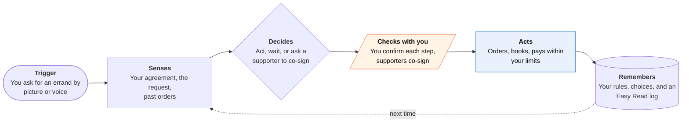

<!-- Generated by scripts/build.py from data/ideas.json. Edit the JSON, then run the script. -->

[← All ideas](../README.md) · **Whitespace** · Family & care

# W-10 · Co-Sign, Not Guardian

> Runs errands for people with cognitive disabilities under their own rules for when a supporter co-signs.

| Difficulty | Novelty | Buildable on iOS today | Impact if it works | Horizon | Autonomy |
|---|---|---|---|---|---|
| `●●●○○` 3/5 | `●●●●●` 5/5 | `●●●●○` 4/5 | `●●●●○` 4/5 | Buildable now | L3 · Acts in guardrails, reports back |

## The moment

You have Down syndrome and live in your own flat. You tap the big 'I want to buy' picture, say 'new headphones', and see three pairs with photos and prices in Easy Read. Your own agreement says 'over $50, ask Sam', so Sam gets a co-sign request: Sam can say yes or 'let's talk', but can't buy anything for you or see your other purchases.

## The problem

Many adults with intellectual and cognitive disabilities want to run their own errands, and some have a supported decision-making agreement that says who helps with which choices. Apps give them two bad options. Caregiver tools (restricted cards, account monitoring) put the family in charge, and general agents assume a fully independent user with no safety net. Nothing turns the person's own agreement into rules an agent follows.

## How the agent works

## iOS building blocks

- **SwiftUI AssistiveAccess scene** — a picture-first version of the app that runs properly inside Assistive Access (iOS 26)
- **Speech (SpeechAnalyzer) and AVSpeechSynthesizer** — spoken requests in, every screen and choice read aloud
- **Foundation Models (Tool call(arguments:), DynamicProfile onToolCall)** — each errand is a tool that checks the agreement in plain Swift before it runs; onToolCall logs or halts every call
- **CloudKit sharing (CKShare)** — links each supporter to only the records the agreement grants
- **UserNotifications (UNNotificationAction)** — 'Yes' and 'Let's talk' buttons on co-sign requests
- **App Intents** — 'I want to buy' and 'What did I order?' from Siri or a Home Screen button
- **LocalAuthentication** — Face ID before anyone changes the agreement on the person's phone

## What makes it hard

- Writing the agreement with the person, not about them. Setup has to be Easy Read, picture-based and slow, and it should import the paper SDM agreements that disability groups already use.
- Enforcement must be deterministic. The model proposes an action; plain code checks amount, category, cooling-off period and co-signer before any tool runs. The rules can't live in a 4,096-token on-device prompt.
- Paying. Apple Pay has no agent API, so the server-side agent needs a payment method the person owns, such as a virtual card whose limits match the agreement.
- Supporter delays. If a co-sign waits all day, the person gives up or buys elsewhere. The agreement needs fallbacks the person picked ('if Sam doesn't answer in 2 hours, ask Priya').

## Risks and failure modes

- The supporter becomes the controller. Safety line: supporters can never start a purchase, edit the agreement or see anything it doesn't grant, and the person can drop a supporter after a waiting period they chose.
- Exploitation can come from inside the circle. Pattern warnings go to the person first and to a supporter only if the agreement says so, so abuse by a named supporter can go unflagged.
- A misheard request ('headphones' vs 'headphone case') leads to wrong orders. Every purchase needs a picture confirmation screen and an easy return path.

## Unsaid assumptions

_What this idea quietly depends on being true. Check these before you build._

- Supporters answer co-sign requests fast enough that waiting doesn't push the person to route around the app.
- The stores and billers the person uses can be reached by a server-side agent through normal checkout or APIs.
- A disability services agency, Medicaid waiver program or family will pay, because the person often can't.

## Unknown unknowns

_Open questions nobody has good answers to yet._

- Does a machine-readable SDM agreement carry any legal weight, or is it only a personal tool? State SDM laws differ.
- What should happen when two supporters disagree, or when one says 'let's talk' every time?
- Can model-written Easy Read summaries be accurate enough without a human editor?

## Prior art and who's building

- [W3C COGA, 'Supported Decision-Making Online' (Group Note Draft, Feb 2026)](https://www.w3.org/TR/coga-sdm) — Design patterns such as self-set spending limits, cooling-off periods and helper confirmation. It is guidance for web authors, not a product that runs errands.
- [SupportedDecisionMaking.org resource library](https://supporteddecisionmaking.org/resource-library/) — Templates and guides for SDM agreements. They live on paper; nothing reads them and acts on them.
- [Apple Assistive Access](https://developer.apple.com/documentation/swiftui/assistiveaccess) — Simplifies the iPhone for people with cognitive disabilities. It changes the interface, not who decides, and it runs no errands.
- Caregiver-controlled prepaid cards (for example True Link) and elder account monitoring — Spending limits exist, but the family or a trustee sets them. The person being protected doesn't write the rules.

## Smallest useful first version

An Assistive Access app for one errand type, ordering from one grocery or online store, with the agreement set up in a guided session with one supporter. Spend limits, cooling-off timers and co-sign requests work from day one. Pilot it with a self-advocacy group rather than with families.

Research notes: what we could and couldn't verify

Verified via search results: the W3C COGA 'Supported Decision-Making Online' document is a Group Note Draft dated Feb 5, 2026 (w3.org itself was blocked, so the page body wasn't read). onToolCall(perform:) on DynamicProfile takes no arguments, so the per-action check belongs in each Tool's call(arguments:); the card says so. True Link is named without a URL (not opened this session).

## Related ideas

- [W-16 · Ulysses Money Pact](../whitespace/W-16-ulysses-money-pact.md)
- [M-02 · Household Spending Constitution](../moonshot/M-02-household-spending-constitution.md)
- [M-05 · Assistive Agent Pass](../moonshot/M-05-assistive-agent-pass.md)
