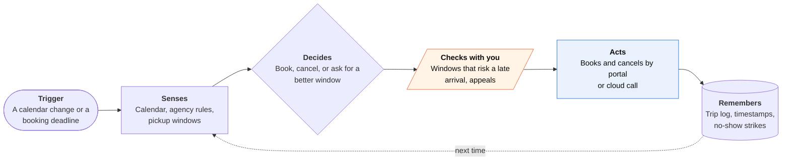

<!-- Generated by scripts/build.py from data/ideas.json. Edit the JSON, then run the script. -->

[← All ideas](../README.md) · **Whitespace** · Physical world

# W-11 · Paratransit Trip Keeper

> Books next-day paratransit rides from your calendar, cancels in time, and fights wrongful no-show strikes.

| Difficulty | Novelty | Buildable on iOS today | Impact if it works | Horizon | Autonomy |
|---|---|---|---|---|---|
| `●●●○○` 3/5 | `●●●●●` 5/5 | `●●●○○` 3/5 | `●●●●○` 4/5 | Buildable now | L3 · Acts in guardrails, reports back |

## The moment

You use a power wheelchair, and your dialysis just moved from Tuesday to Wednesday. Normally that means a long hold on the reservation line before 5 pm and a pickup window you have to remember. Tonight the agent has already cancelled Tuesday's ride before the late-cancel cutoff and booked Wednesday's, and tomorrow the pickup window sits on your Lock Screen.

## The problem

ADA paratransit is booked a day or more ahead, often by phone in office hours, and every agency has its own cutoffs and penalties. A missed cancellation counts as a no-show, and a pattern of no-shows can suspend service: Green Bay's 2026 policy suspends riders for 7 days on the third no-show. Agency apps, where they exist, serve one agency and don't watch your calendar, cancel for you or help you appeal a no-show you didn't cause.

## How the agent works

## iOS building blocks

- **EventKit** — reads appointments and notices when they move or get cancelled
- **ActivityKit (Live Activities, push updates)** — pickup window and vehicle status on the Lock Screen and in the Watch Smart Stack
- **App Intents (LongRunningIntent)** — 'Book my ride to dialysis' from Siri, with progress shown while the booking runs
- **Core Location (CLMonitor)** — with your permission, notes that you were at the pickup spot during the window, as no-show evidence
- **WeatherKit** — flags severe weather that may call for a cancel or rebook
- **UserNotifications (time-sensitive)** — ten-minute heads-up and approval requests

## What makes it hard

- No common API. Agencies use different scheduling vendors and portals, and many take bookings only by phone. Each agency is its own integration, so growth is city by city.
- Voice booking must be exact: rider ID, both addresses, mobility device, attendant, return trip. The cloud voice agent reads every field back and hands over to the rider if the reservationist pushes back.
- Cutoffs are local and strict (SacRT takes bookings until 5 pm the day before). A server has to time each booking and cancellation, because iOS won't run an app's loop all night.
- Location evidence helps appeals but is sensitive. It stays on the phone and goes into an appeal only when the rider approves.

## Risks and failure modes

- A booking error can strand someone who has no other way home. Safety line: the agent never cancels a return trip on its own and always confirms both legs.
- Agencies may treat an AI caller as unauthorized and hang up. Riders may need to name the service as an authorized representative where the agency allows it.
- Stored portal passwords and rider IDs are a target. Keep them in the Keychain, or encrypted per rider on the server.

## Unsaid assumptions

_What this idea quietly depends on being true. Check these before you build._

- Agencies will accept bookings from an AI voice or a portal session acting for a registered rider.
- Riders' calendars reflect their real appointments, including ones a clinic booked.
- A disability organization, dialysis provider or transit agency pays, since many riders have low incomes.

## Unknown unknowns

_Open questions nobody has good answers to yet._

- Will agencies see this as help (fewer no-shows) or as extra load (more changes, more automated calls)?
- Does on-phone location evidence change the outcome of no-show appeals?
- How should standing trips (subscription rides) interact with one-off changes across different vendors?

## Prior art and who's building

- [SacRT GO paratransit app](https://www.sacrt.com/sacrt-go-paratransit-service/) — Sacramento's app, relaunched May 19, 2026, lets riders book up to two days ahead and cancel. It serves one agency and doesn't watch your calendar, cancel for you or handle appeals.
- [DREDF topic guide: no-shows in ADA paratransit](https://dredf.org/ADAtg/noshow.shtml) — Explains when no-show suspensions are lawful and how riders can contest them. Guidance, not a tool.
- [SolTrans ADA paratransit no-show policy](https://www.soltrans.org/about/policies/ada-paratransit-passenger-no-show-policy) — An example of the local rules the agent must model: penalties start at three no-shows that are also 10% of a month's trips.
- [Pine AI](https://apps.apple.com/us/app/pine-assistant/id6746403769) — General calling agent for bills and customer service. It doesn't know paratransit cutoffs, pickup windows or no-show strikes.

## Smallest useful first version

One agency with a web booking portal, one rider group (dialysis patients), and three jobs: book from the calendar, cancel before the cutoff, and show the pickup window as a Live Activity. Phone booking and no-show appeals come second.

Research notes: what we could and couldn't verify

Verified via search results: SacRT GO relaunch on May 19, 2026, with bookings up to two days ahead until 5 pm the day before; Green Bay ADA paratransit policy (Feb 18, 2026) with a 7-day suspension on the third no-show; SolTrans threshold (3 no-shows and 10% of monthly trips); Kitsap policy dated Feb 26, 2026. Not verified: whether any agency accepts AI-voice bookings today.

## Related ideas

- [W-29 · Step-Free Scout](../whitespace/W-29-step-free-scout.md)
- [W-06 · Accommodations Booked Ahead](../whitespace/W-06-accommodations-booked-ahead.md)
- [B-02 · Phone-call errand agents](../building-now/B-02-phone-call-errand-agents.md)
