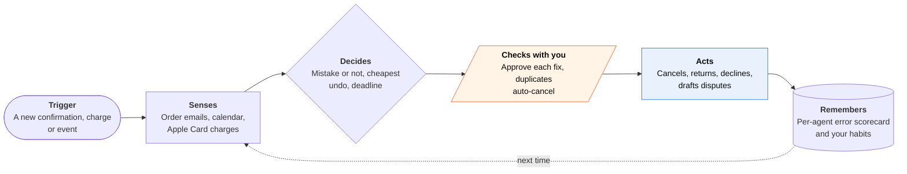

<!-- Generated by scripts/build.py from data/ideas.json. Edit the JSON, then run the script. -->

[← All ideas](../README.md) · **Whitespace** · Life admin

# W-12 · Agent Janitor

> Checks what your agents actually did and fixes their mistakes while the undo window is still open.

| Difficulty | Novelty | Buildable on iOS today | Impact if it works | Horizon | Autonomy |
|---|---|---|---|---|---|
| `●●●○○` 3/5 | `●●●●●` 5/5 | `●●●○○` 3/5 | `●●●○○` 3/5 | Buildable now | L2 · Drafts, you approve |

## The moment

Your shopping agent ordered the same air filter twice, your scheduling agent accepted a 6 a.m. call in the wrong time zone, and your travel agent booked a hotel for the wrong Saturday, with free cancellation until 6 p.m. At lunch one notification sums it up: 'Duplicate order cancelled. Two fixes need you, one before 6 p.m.'

## The problem

People now let agents buy, book and email for them, and those agents make small mistakes: duplicates, wrong dates, wrong time zones, wrong sizes. Each vendor reports its own work as done, and nobody checks across agents. The cheap fixes (free cancellation, easy returns, a quick correction email) expire in hours or days, and the evidence is scattered across email, cards and calendars.

## How the agent works

## iOS building blocks

- **FinanceKit (with a background delivery extension)** — reads Apple Card, Apple Cash and Apple Savings transactions and wakes on new charges
- **EventKit** — reads new events to catch wrong dates and time zones
- **ActivityKit (Live Activities)** — countdown until the free-cancel or return window closes
- **Foundation Models (@Generable)** — pulls order, booking and price fields out of confirmations on device
- **AuthenticationServices (ASWebAuthenticationSession)** — OAuth sign-in to Gmail or Outlook for the server-side watcher
- **UserNotifications (UNNotificationAction)** — 'Approve fix' and 'It's fine' on each flagged action

## What makes it hard

- Seeing the trail. iOS apps can't read the Mail app, so confirmations come through Gmail or Microsoft Graph on a server, and Google requires a security assessment for apps that read Gmail server-side. EventKit can't answer invitations, so declines also go through those APIs.
- Knowing intent. A 'duplicate' may be deliberate (two filters for two units). The Janitor needs your original instruction; when an agent doesn't expose it, it asks you once and learns.
- Every undo path is different: merchant cancel links, return portals, airline and hotel rules. Many fixes need a cloud browser or an email to support, which is an agent job in itself.
- FinanceKit is a managed entitlement and mostly covers Apple's own cards; other cards need an aggregator such as Plaid, with consent.

## Risks and failure modes

- It holds read access to your email, cards and calendar, which makes it a prime target. Emails are untrusted input: a crafted message saying 'cancel this order' must never trigger a fix without your approval.
- Money safety line: it never buys anything or moves money. It only cancels, returns and disputes, and it acts alone only on exact duplicates inside a free-cancel window, under a cap you set.
- False alarms wear out trust fast. If it flags too much, people mute it and miss the one real mistake.

## Unsaid assumptions

_What this idea quietly depends on being true. Check these before you build._

- Agent mistakes show up in email, calendar or card data soon enough to catch them inside the undo window.
- Agent vendors keep sending ordinary confirmation emails instead of hiding actions inside their own apps.
- People will pay for recovered money, as a share of refunds or a small subscription.

## Unknown unknowns

_Open questions nobody has good answers to yet._

- Who is liable when an agent buys the wrong thing: the user, the agent vendor, the merchant or the card network?
- Will agent vendors expose action logs, for example over MCP, so a third party can audit them?
- What error rate do consumer agents actually have in everyday use?

## Prior art and who's building

- [Consumer Reports Innovation Lab, 'My Agent Messed Up!'](https://innovation.consumerreports.org/my-agent-messed-up-understanding-errors-and-recourse-in-ai-transactions/) — Maps agent transaction errors and the missing recourse. Research, not a tool that catches mistakes.
- [Pine AI](https://apps.apple.com/us/app/pine-assistant/id6746403769) — Gets refunds and cancels subscriptions when you ask. It doesn't watch other agents or catch their mistakes on its own.
- [Chargeflow on AI-agent chargeback liability](https://www.chargeflow.io/blog/ai-agent-chargeback-liability) — The merchant-side view of disputes over agent purchases. It works for the store.
- [Merchant refund agents such as Fini and Gorgias](https://www.usefini.com/blog/top-10-ai-agents-for-handling-refunds-returns-cancellations-automatically) — Automate returns and cancellations for merchants, not for the buyer.

## Smallest useful first version

Watch one trail well: Gmail order and booking confirmations plus Apple Card charges. Flag duplicates, wrong dates and over-limit prices, show each free-cancel deadline as a Live Activity, and draft the fix for one tap. Agent scorecards come later.

Research notes: what we could and couldn't verify

The candidate cited a UK CMA statement (March 2026) that consumer law applies the same to agent purchases; not verified, so it's left out. EventKit's EKParticipant docs confirm it can't change participant information, hence server-side declines. Lowered feasibility to 3 (server-side Gmail/Graph access, FinanceKit entitlement) and impact to 3 (agent buyers are still a minority).

## Related ideas

- [W-03 · Agent Control Tower](../whitespace/W-03-agent-control-tower.md)
- [M-10 · Agent Mistake Warranty](../moonshot/M-10-agent-mistake-warranty.md)
- [M-21 · Bot-to-Bot Dispute Desk](../moonshot/M-21-bot-to-bot-dispute-desk.md)
