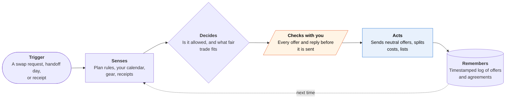

<!-- Generated by scripts/build.py from data/ideas.json. Edit the JSON, then run the script. -->

[← All ideas](../README.md) · **Whitespace** · Family & care

# W-15 · Two-House Handoff

> Each co-parent has an agent; the two agents settle swaps, kid gear and cost splits within the parenting plan.

| Difficulty | Novelty | Buildable on iOS today | Impact if it works | Horizon | Autonomy |
|---|---|---|---|---|---|
| `●●●○○` 3/5 | `●●●●○` 4/5 | `●●●●○` 4/5 | `●●●●○` 4/5 | Buildable now | L2 · Drafts, you approve |

## The moment

Your ex asks to swap weekends to take the kids to a wedding. Instead of a tense text thread, your agent checks the parenting plan, your calendar and the holiday rotation and shows you: 'Swap is allowed, but you'd lose Halloween unless you trade the 14th. Offer the 14th?' You tap yes, and your ex's agent shows the same neutral offer.

## The problem

Separated parents coordinate for years under a court order most of them can't quote from memory. Every swap, forgotten inhaler and shared bill becomes a message that can start a fight, and co-parenting apps only log those messages or soften their tone. No tool checks a request against the plan, proposes a fair trade, or keeps the kids' gear and shared costs straight so the parents rarely have to write to each other.

## How the agent works

## iOS building blocks

- **EventKit** — reads your calendar and writes the agreed schedule
- **CloudKit sharing (CKShare)** — one shared record of rules, offers, gear and costs that both parents' apps sync
- **Foundation Models (PrivateCloudComputeLanguageModel)** — turns a long parenting-plan PDF into draft rules with a 32K-token context
- **VisionKit (VNDocumentCameraViewController)** — scans the signed plan and paper receipts
- **ActivityKit (Live Activities)** — handoff-day checklist of what travels with the kids
- **UserNotifications (UNNotificationAction)** — Accept, Counter or Decline on offers
- **CryptoKit** — hash-chains the log so either parent can show it wasn't edited

## What makes it hard

- Reading the plan into rules. Plans are long, local and full of exceptions ('alternating years', 'reasonable notice'). Both parents confirm every extracted rule, and anything ambiguous stays as text, not logic. Milo, a family-logistics agent, shut down in January 2026 after small extraction errors made more work for families.
- Neutral by design. Both agents run the same confirmed rules and the same code, and neither sees the other parent's calendar, notes or reasons.
- One-parent adoption. If only one parent installs it, the app can only send neutral offers by email or text that the other parent answers through a link.
- Protective orders and high-conflict cases need a mode that uses only the permitted channel, strips location data and never suggests direct contact.

## Risks and failure modes

- Safety line: it never shares a parent's location, new address or reasons for a request unless that parent chooses to, and it defers to any protective order. It isn't legal advice and can't change the court order; lasting changes go to a lawyer or mediator.
- If the agent seems to favor one side, the other parent will use that against it. Offers must be symmetric and shown the same way to both parents.
- Kids' privacy: older kids can see the handoff calendar and add their own gear, but the app never tracks a child's location or reads their messages.

## Unsaid assumptions

_What this idea quietly depends on being true. Check these before you build._

- Both parents will install it; with one parent, it's only a drafting tool.
- Mediators and courts will accept an exported, tamper-evident log the way they accept co-parenting app records.
- Most day-to-day conflict is logistics, not the deeper disputes no scheduling tool can fix.

## Unknown unknowns

_Open questions nobody has good answers to yet._

- Should the two agents ever settle small trades without either parent watching?
- Who pays: each parent, a court that orders its use, or a family-law practice?
- How do step-parents, grandparents and teenagers fit into a two-agent design?

## Prior art and who's building

- [OurFamilyWizard](https://www.ourfamilywizard.com/) — Court-friendly messaging, calendar and expense log, with ToneMeter to flag hostile wording. It records what parents write; it doesn't check requests against the plan or propose trades.
- [BestInterest](https://bestinterest.app/) — Filters hostile messages from a co-parent. It changes tone, not logistics.
- AppClose, TalkingParents, Custody X Change — Shared calendars, messaging, custody schedules and expense tracking. No agent reasons about the plan for either parent.

## Smallest useful first version

One parent's app that reads the plan into confirmed rules and checks swap requests against it, with neutral offers sent by link to the other parent. Add the shared gear list and cost splits once both parents are on it.

Research notes: what we could and couldn't verify

The candidate's why-now leans on A2A v1.0; with both parents on the same app, CloudKit sharing does the job, so A2A is left out of ios_blocks. OurFamilyWizard's ToneMeter and BestInterest's filtering are from the candidate and weren't re-checked. AppClose, TalkingParents and Custody X Change are named without URLs. Milo shutdown is from the research digest.

## Related ideas

- [B-12 · Family logistics agents](../building-now/B-12-family-logistics-agents.md)
- [M-12 · Household Agent Treaty](../moonshot/M-12-household-agent-treaty.md)
