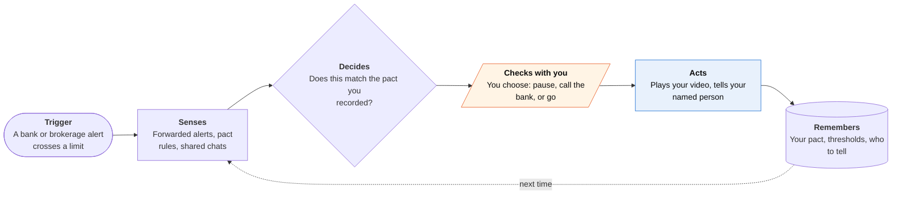

<!-- Generated by scripts/build.py from data/ideas.json. Edit the JSON, then run the script. -->

[← All ideas](../README.md) · **Whitespace** · Money & commerce

# W-16 · Ulysses Money Pact

> Set money rules for your future self now; the agent holds you to them when a charming stranger asks.

| Difficulty | Novelty | Buildable on iOS today | Impact if it works | Horizon | Autonomy |
|---|---|---|---|---|---|
| `●●●○○` 3/5 | `●●●●○` 4/5 | `●●●○○` 3/5 | `●●●●○` 4/5 | Buildable now | L3 · Acts in guardrails, reports back |

## The moment

Eight months ago you recorded a short video: 'If I ever want to send more than $5,000 to someone I haven't met in person, make me wait two days and tell Ana.' Today, after weeks of chats with a friendly 'crypto mentor', your bank emails that a $12,000 wire is pending. Your phone plays your own video, offers to call the bank to hold the wire for 48 hours as you agreed, and tells Ana, as you asked.

## The problem

Romance and investment scams run for weeks, and by the time family hears about it the money is gone. Watching the chats doesn't work: iOS apps can't read WhatsApp or iMessage, and research shows language models track scam escalation only moderately well. Monitoring services watch accounts on the family's behalf. Nobody helps a person set rules for their own future self and holds them to those rules at the moment money moves.

## How the agent works

## iOS building blocks

- **AVFoundation (AVCaptureSession)** — records the pact video in your own words
- **Share extension (NSExtensionContext)** — 'second look' at a chat screenshot, link or profile photo you choose to share
- **Foundation Models (PrivateCloudComputeLanguageModel)** — explains what the second look found in plain words
- **FinanceKit (with a background delivery extension)** — watches Apple Card, Apple Cash and Apple Savings for pact-sized transfers
- **UserNotifications (time-sensitive)** — the pact alert breaks through Focus when a limit is crossed
- **Contacts** — picks the trusted person to notify
- **LocalAuthentication** — Face ID before cancelling or loosening the pact

## What makes it hard

- Seeing money move in time. Wires and brokerage withdrawals don't appear in FinanceKit, so the agent relies on alert emails you route to it (a forwarding address or Gmail OAuth). Cash taken out for a crypto ATM or gift cards may raise no alert at all.
- Setup is paperwork: trusted-contact forms at each brokerage (FINRA Rule 4512), alerts for large transfers and new payees at each bank, and credit freezes at the three bureaus. The agent pre-fills; the account holder signs.
- The agent can't stop a transfer. Holds come from the institution (FINRA Rule 2165 lets brokerages place temporary holds when they suspect exploitation), so its job is to get you on the phone with the bank in time.
- Tone. Setup has to feel like writing your own will, not like being treated as incompetent.

## Risks and failure modes

- Safety line: it cannot block money and never pretends to. It isn't a financial adviser, never holds bank passwords and never moves funds.
- The named person could be the one exploiting you. Notices carry only what you authorized, and you can change who is told after a waiting period you picked.
- The pact video is a voice and face sample a scammer could clone. It stays encrypted on the phone and is never uploaded.

## Unsaid assumptions

_What this idea quietly depends on being true. Check these before you build._

- An older adult will write rules against their own future judgment before any scam starts.
- Banks send alerts fast enough that a pending wire can still be stopped when the customer calls.
- Hearing your own voice persuades more than a warning from family.

## Unknown unknowns

_Open questions nobody has good answers to yet._

- Does a recorded pre-commitment actually change behavior in the middle of a scam? Nobody has tested it.
- If memory declines, what happens when the person cancels the pact during a scam?
- Will banks ever honor a customer's own pre-set cooling-off rule directly?

## Prior art and who's building

- [EverSafe](https://www.eversafe.com/) — Monitors accounts and alerts trusted advocates about unusual activity. Read-only and usually set up by family; it doesn't encode the person's own rules or speak to them in the moment.
- [Carefull](https://getcarefull.com/) — Account monitoring with alerts to a trusted circle. Same gap: the family watches; the person's own voice is absent.
- [SeniorShield.ai](https://apps.apple.com/us/app/seniorshield-ai-scam-blocker/id6738144273) — Screens scam calls for older adults. It works at the phone call, not at the moment money moves.
- [PreScam benchmark](https://huggingface.co/papers/2605.12243) — 11,573 real scam conversations; LLMs track escalation only moderately well. That argues for checkpoints where money moves rather than chat monitoring.

## Smallest useful first version

The pact recorder plus alert forwarding for one bank and one brokerage, with the trusted-contact form pre-filled. When a forwarded alert crosses a threshold, it plays the video, offers to call the bank and notifies the named person.

Research notes: what we could and couldn't verify

FINRA Rules 4512 (trusted contact) and 2165 (temporary holds) are cited from general knowledge and the candidate; not re-checked this session. Moment rewritten from the elder's point of view so the pact reads as theirs, not the family's.

## Related ideas

- [W-10 · Co-Sign, Not Guardian](../whitespace/W-10-co-sign-not-guardian.md)
- [B-18 · Scam-call guardian agents](../building-now/B-18-scam-call-guardians.md)
- [M-02 · Household Spending Constitution](../moonshot/M-02-household-spending-constitution.md)
