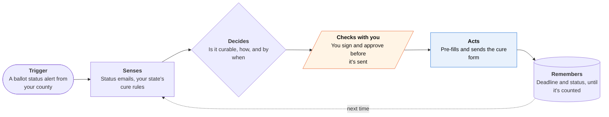

<!-- Generated by scripts/build.py from data/ideas.json. Edit the JSON, then run the script. -->

[← All ideas](../README.md) · **Whitespace** · Safety & civic

# W-17 · Ballot Cure Watch

> Watches your mail ballot's status and, if it's flagged, gets the cure form signed and in before the deadline.

| Difficulty | Novelty | Buildable on iOS today | Impact if it works | Horizon | Autonomy |
|---|---|---|---|---|---|
| `●●●○○` 3/5 | `●●●●●` 5/5 | `●●●○○` 3/5 | `●●●○○` 3/5 | Buildable now | L2 · Drafts, you approve |

## The moment

You mailed your ballot for the November 3 election from college, two states away. Four days later your county flags a signature mismatch in a status email you'd never have opened. The agent has already pre-filled your state's cure form: you sign on screen, photograph your ID, and see the deadline counting down on your Lock Screen.

## The problem

Mail ballots get rejected for missing or mismatched signatures, and many states let voters fix, or 'cure', them, but only for a few days. States already send status alerts (California's Where's My Ballot, BallotTrax in many states), yet voters must notice the alert, find the right form and meet the deadline alone. Voting apps stop at registration and reminders, and campaigns chase cures only for their own likely voters.

## How the agent works

## iOS building blocks

- **PDFKit** — fills the state's official cure form
- **PencilKit** — you sign the form on screen
- **VisionKit (VNDocumentCameraViewController)** — scans your ID where the state requires a copy
- **MessageUI (MFMailComposeViewController)** — sends the form from your own email where the county accepts email; you tap Send
- **ActivityKit (Live Activities)** — deadline countdown on the final day (a Live Activity lasts hours, not days)
- **UserNotifications (time-sensitive)** — status changes and deadline reminders
- **EventKit** — adds the cure deadline and drop-off hours to your calendar

## What makes it hard

- Fifty states, thousands of counties. Cure rules differ in form, ID, return method and deadline (Nevada's closes November 9 for this election; Florida's at 5 p.m. on the second day after). The rules table needs legal review and constant updates.
- Seeing the alert. The app can't read SMS or the Mail app, so voters choose email alerts and forward them or connect Gmail. Polling county lookup sites from a server may break their terms.
- Some counties accept cures only in person or by mail. Then the agent's job is a map, office hours and a reminder, not a submission.
- Timing: the general election is 40 days away, so anything shipped for 2026 is a narrow pilot, not 50 states.

## Risks and failure modes

- Safety line: strictly nonpartisan. It never suggests how to vote, never handles anyone else's ballot or form, never returns a ballot, and deletes voter data after certification.
- A wrong deadline or form could cost someone their vote. Every rule links to the official source, and when unsure the app says 'call your county' with the number.
- Registration details and ID images are sensitive. ID scans stay on the phone except when the voter sends them to the election office.

## Unsaid assumptions

_What this idea quietly depends on being true. Check these before you build._

- Election offices accept cure forms sent through channels the voter uses, as long as the voter signed personally.
- A nonprofit or civic-tech group will fund it; there's no obvious business model.
- Voters opt in to email status alerts before a problem shows up.

## Unknown unknowns

_Open questions nobody has good answers to yet._

- Will election officials welcome an assistant, or see it as outside interference?
- How many rejected ballots could be cured in time with faster notice?
- Could the rules table be published as open data for states and nonprofits?

## Prior art and who's building

- [NCSL table of states with signature cure processes](https://www.ncsl.org/elections-and-campaigns/table-15-states-with-signature-cure-processes) — Lists which states allow cures and how. A reference, not a tool that acts on your ballot.
- [Nevada Secretary of State signature cure page](https://www.nvsos.gov/elections/election-information/2026-election-information/signature-cure) — Official instructions for one state. Every state has its own page and process.
- [Vote411](https://www.vote411.org/california) — League of Women Voters guide to registration and ballots. It stops before the cure step.
- California Where's My Ballot and BallotTrax — Send ballot status alerts by text or email. The voter still has to find and file the cure form alone.

## Smallest useful first version

One state that accepts cures by email or upload, with alert forwarding and a pre-filled cure form the voter signs on screen. Add states only after legal review of each.

Research notes: what we could and couldn't verify

Cure deadlines (Nevada: November 9 for a November 3 election; Florida: 5 p.m. on the second day after) come from the candidate and match state law as I understand it; not re-verified this session. BallotTrax and Where's My Ballot are named without URLs.

## Related ideas

- [W-08 · Paper Round-Trip](../whitespace/W-08-paper-round-trip.md)
- [W-26 · Benefits Keeper](../whitespace/W-26-benefits-keeper.md)
