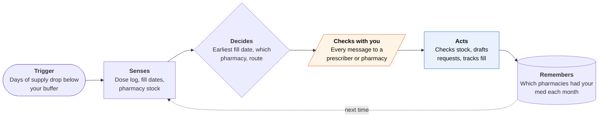

<!-- Generated by scripts/build.py from data/ideas.json. Edit the JSON, then run the script. -->

[← All ideas](../README.md) · **Whitespace** · Health & body

# W-18 · Refill Runway

> Runs the monthly relay between you, your prescriber and pharmacies so a controlled med never runs out.

| Difficulty | Novelty | Buildable on iOS today | Impact if it works | Horizon | Autonomy |
|---|---|---|---|---|---|
| `●●●○○` 3/5 | `●●●●○` 4/5 | `●●●○○` 3/5 | `●●●●○` 4/5 | Buildable now | L2 · Drafts, you approve |

## The moment

It's the 26th and you have four days of your ADHD medication left. Your pharmacy says your strength is back-ordered, and your prescriber's office won't send a new prescription until they know which pharmacy has it. You tap 'Start refill' on your Watch and go back to work; by evening a drafted portal message names a pharmacy two miles away that has your exact strength.

## The problem

Controlled medications like ADHD stimulants need a new prescription for every fill, and it can't be filled too early. When a pharmacy runs out, the patient becomes the go-between: call pharmacies, tell the prescriber where to send it, check that it arrived. Since 2023, DEA rules allow a one-time pharmacy-to-pharmacy transfer of an unfilled electronic prescription, but someone has to ask. Stock finders like Medfinder handle one step and stop, and pharmacy apps see only their own chain.

## How the agent works

## iOS building blocks

- **HealthKit (HKUserAnnotatedMedicationQueryDescriptor, HKMedicationDoseEvent)** — reads the medications you choose to share and your logged doses to count days left
- **App Intents** — 'How many days of meds do I have?' and 'Start refill' from Siri or the Watch
- **WidgetKit** — days-left complication on the Watch face and a Home Screen widget
- **ActivityKit (Live Activities)** — refill progress and pickup details on the Lock Screen
- **UserNotifications (UNNotificationAction)** — approve or edit each drafted message
- **Foundation Models (on-device)** — reads pharmacy emails and pasted messages so health details stay on the phone

## What makes it hard

- Fill-date rules vary by state and insurer. The agent can estimate the earliest fill date, but it shows it as an estimate and leaves the call to the pharmacist.
- Stock checks: some pharmacies won't discuss controlled-substance stock by phone, and automated callers may be refused. It needs a mix of cloud calls, stock-finder partners and scripts for your own calls.
- No send button to reach into. Patient portals rarely let third-party apps send messages, and iOS apps can't read pharmacy texts, so the agent drafts, copies and opens the portal; you paste and send.
- Apple's HealthKit rules bar sending health data to a general-purpose cloud model. Only drug name, strength and form leave the phone, with your consent, to a service that is itself a health service.

## Risks and failure modes

- Safety line: it never changes doses, never asks for early fills, never pressures a prescriber or pharmacist, and never shops across prescribers. It isn't medical advice.
- Controlled-substance records are sensitive (jobs, custody, law enforcement). The dose log stays on the phone, and the server keeps only what the relay needs, encrypted.
- A stale stock report can send someone across town for nothing, days before they run out. The app shows how fresh each stock check is.

## Unsaid assumptions

_What this idea quietly depends on being true. Check these before you build._

- Pharmacies will keep answering stock questions from an automated caller.
- Prescribers accept pharmacy changes that patients request by portal message.
- Users log doses in the Health app, or the app can estimate from fill dates and dose instructions.

## Unknown unknowns

_Open questions nobody has good answers to yet._

- Will pharmacies use the one-time electronic transfer often enough to skip the prescriber during shortages?
- Would pharmacies share live stock through an API if patients asked for it?
- How will insurers react to automatic copay versus cash-price comparisons at fill time?

## Prior art and who's building

- [Medfinder](https://www.medfinder.com/) — Calls pharmacies and reports who has your medication in stock. It stops there: no prescriber handoff, fill-date tracking or monthly repeat.
- [Quartz on Medfinder's pharmacy callers](https://qz.com/ozempic-adderall-medfinder-1851532606) — Shows the stock hunt is often done by people on phones, which is costly to scale.
- Medisafe and Apple Health medication reminders — Remind you to take doses and log them. They know nothing about stock, fill rules or the prescriber relay.
- GoodRx — Shows cash prices and coupons. It doesn't manage the refill.

## Smallest useful first version

Count days left from Health app medications and fill dates, alert five days out, and draft the prescriber and pharmacy messages for copy-and-send. Add cloud stock calls in one metro area after that.

Research notes: what we could and couldn't verify

Raised novelty from 3 to 4: Medfinder covers stock finding, but nobody runs the prescriber-pharmacy relay. Lowered feasibility from 4 to 3 because stock checks run from a server and portal messages need a manual paste. The 2023 DEA one-time transfer rule is from the candidate and general knowledge; not re-verified. Dropped the claim that stimulant shortages were still being tracked in September 2026 (not verified). 'Some pharmacies won't discuss controlled-substance stock by phone' is widely reported but not verified this session.

## Related ideas

- [B-02 · Phone-call errand agents](../building-now/B-02-phone-call-errand-agents.md)
- [W-01 · Denial Clock](../whitespace/W-01-denial-clock.md)
- [B-09 · Health-record reading assistants](../building-now/B-09-health-record-readers.md)
