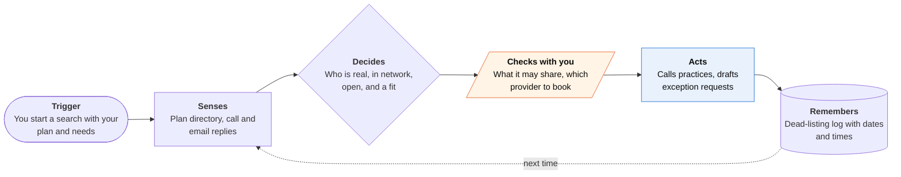

<!-- Generated by scripts/build.py from data/ideas.json. Edit the JSON, then run the script. -->

[← All ideas](../README.md) · **Whitespace** · Health & body

# W-19 · Ghost Network Buster

> Calls down your plan's therapist list to find who is really taking patients, and files the gap if nobody is.

| Difficulty | Novelty | Buildable on iOS today | Impact if it works | Horizon | Autonomy |
|---|---|---|---|---|---|
| `●●●○○` 3/5 | `●●●●○` 4/5 | `●●●●○` 4/5 | `●●●●○` 4/5 | Buildable now | L3 · Acts in guardrails, reports back |

## The moment

You finally decide to find a therapist. Your plan's directory lists 180 in-network names, and the first eight you call are voicemail, full, or no longer take your plan. You hand the list to the agent with three needs: evenings, telehealth, someone who treats OCD. Two days later you have four real openings and a dated log of every listing that was dead.

## The problem

Insurer directories are full of 'ghost' listings. In a 2023 Senate Finance Committee secret-shopper study, more than 80% of the Medicare Advantage mental-health listings staff tried were unreachable, not taking new patients, or not in network. Therapy marketplaces show only clinicians who joined them, and nothing on the patient's side turns all those failed calls into pressure on the plan.

## How the agent works

## iOS building blocks

- **VisionKit (VNDocumentCameraViewController)** — scans the insurance card for plan name and member ID
- **HealthKit (HKClinicalTypeIdentifier.coverageRecord)** — reads plan details from connected health records if you opt in
- **ActivityKit (Live Activities)** — shows search progress while a calling batch runs
- **Foundation Models (SystemLanguageModel)** — turns call outcomes into a structured short list on the phone
- **EventKit** — adds the intake call you approve to your calendar
- **UserNotifications** — tells you when a practice with an opening calls back

## What makes it hard

- Getting the list. Medicare Advantage and Medicaid plans must publish a FHIR Provider Directory API under CMS's 2020 interoperability rule, but many employer and marketplace plans offer only a website, so the fallback is a supervised cloud browser or a photo of the list.
- The calls run from cloud telephony on a server, not the phone. Many practices use voicemail or AI receptionists, so the agent needs its own callback number and has to match each callback to the right listing.
- Data minimization on every call: plan, availability and the focus area you chose. It says nothing about your history unless you approve the exact wording.
- The complaint path depends on plan type: the state insurance department for fully insured plans, the Department of Labor for self-funded employer plans, CMS for Medicare Advantage. The agent has to route each draft to the right place.

## Risks and failure modes

- Safety line: this is a search tool, not care and not a crisis service. A crisis option (988 in the US) stays on every screen, and any sign of crisis stops the search and shows emergency help instead of a waitlist.
- Not legal advice. Exception requests and regulator complaints are drafts you send yourself. When a plan refuses, the app points you to a patient advocate or your state's consumer assistance program.
- Practices may treat a wave of AI calls as spam. It needs one call per listing per search, a clear 'I am an AI assistant calling for a patient' opening, and per-practice rate limits.

## Unsaid assumptions

_What this idea quietly depends on being true. Check these before you build._

- Practices will answer three short questions from an AI caller that says what it is.
- A dated log of dead listings will move a plan to grant an out-of-network exception or a single-case agreement.
- People will trust an app with the fact that they are looking for mental-health care.

## Unknown unknowns

_Open questions nobody has good answers to yet._

- How often plans grant network-gap exceptions when shown a call log, and how fast.
- Whether state call-recording and AI-disclosure laws allow recorded agent calls to practices in every state.
- Whether a call log counts as proof under the No Surprises Act rule that limits your costs when you relied on a wrong directory listing.

## Prior art and who's building

- [Senate Finance Committee secret-shopper study (2023)](https://www.finance.senate.gov/chairmans-news/wyden-calls-for-action-to-get-rid-of-ghost-networks-releases-secret-shopper-study) — The evidence: staff could book appointments only 18% of the time. A report, not a tool patients can use.
- [NBC News on therapy ghost networks](https://www.nbcnews.com/health/health-care/ghost-networks-health-insurance-companies-therapy-rcna210591) — Reporting on the problem. Patients still call down the list by hand.
- [Headway](https://headway.co/) — Filters to in-network therapists and checks benefits, but only for clinicians on Headway, not your plan's full directory. Alma, Rula and Grow Therapy work the same way. None builds an exception case.
- [Zocdoc on ghost networks](https://www.zocdoc.com/resources/blog/article/ghost-networks-doctor-hard-to-find) — Avoids ghosts by showing only bookable listings, which leaves most of the directory out.
- [Lyra Health](https://www.lyrahealth.com/blog/ghost-network/) — An employer-paid network that bypasses the insurer directory. Only for covered employees.

## Smallest useful first version

Start where the data is open: Medicare Advantage directories through the Provider Directory API. The agent calls up to 40 practices over two days, returns a short list with first-available dates, and exports the dead-listing log as a PDF to attach to a plan complaint. No auto-booking at first.

Research notes: what we could and couldn't verify

The 80% and 18% figures are from the May 2023 Senate Finance Committee study (120 calls, 12 MA plans, six states; small sample), confirmed via search results. The CMS 2020 interoperability rule (Provider Directory API for MA and Medicaid) and the No Surprises Act directory protections are from memory, not re-verified. Headway's scope is from its site as shown in search results. I found no product that calls down a patient's own directory.

## Related ideas

- [W-01 · Denial Clock](../whitespace/W-01-denial-clock.md)
- [B-02 · Phone-call errand agents](../building-now/B-02-phone-call-errand-agents.md)
- [B-24 · Medical-bill dispute tools](../building-now/B-24-medical-bill-dispute.md)
