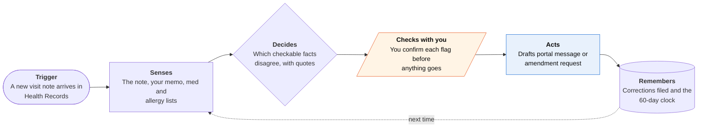

<!-- Generated by scripts/build.py from data/ideas.json. Edit the JSON, then run the script. -->

[← All ideas](../README.md) · **Whitespace** · Health & body

# W-20 · Chart Check

> Reads the note your doctor's AI scribe wrote about you, flags what's wrong, and drafts the correction.

| Difficulty | Novelty | Buildable on iOS today | Impact if it works | Horizon | Autonomy |
|---|---|---|---|---|---|
| `●●●○○` 3/5 | `●●●●●` 5/5 | `●●●●○` 4/5 | `●●●○○` 3/5 | Buildable now | L2 · Drafts, you approve |

## The moment

Two days after your visit, the note shows up in your patient portal. It says you 'deny chest pain', lists a medication you stopped last year, and puts your knee surgery on the wrong side. You would never have read it. The agent did, and it shows you three flagged quotes with a short correction ready for you to send.

## The problem

Many clinics now use ambient AI scribes that listen to the visit and draft the note, which the clinician then signs. Mistakes, mostly things left out, end up in a record that insurers, specialists and future doctors will rely on. Patients can read their notes, but few read dense notes closely, and almost nobody works through the HIPAA amendment process.

## How the agent works

## iOS building blocks

- **HealthKit (HKClinicalTypeIdentifier.clinicalNoteRecord, HKAttachment)** — reads new clinical notes and their attached files from participating providers
- **HealthKit (medicationRecord, allergyRecord)** — checks the note against your recorded medications and allergies
- **Speech (SpeechAnalyzer, SpeechTranscriber)** — transcribes your own after-visit voice memo on the device
- **Foundation Models (SystemLanguageModel)** — compares note and memo on the device so the text stays local
- **PDFKit** — reads note PDFs you download from the portal and share to the app
- **UserNotifications** — tells you when a new note has something worth checking

## What makes it hard

- Coverage. Health Records only carries clinical notes from institutions that share them through Apple's connection, and many do not. The fallback is a PDF you download from the portal. Sending the correction also stays manual, because patient portals have no public messaging API.
- Precision beats recall. The agent must flag only facts a patient can judge (side, drug, dose, dates, what you did or didn't say) and stay quiet on clinical reasoning, or clinics will learn to ignore it.
- Long notes don't fit the on-device model in one pass, so it checks section by section. Sending HealthKit data to a general cloud model runs against HealthKit's sharing rules, so the default is on-device only.
- Copy-forward. An error fixed in one note can live on in later notes and in records already sent to other providers. The agent has to re-read later notes and list who received the record.

## Risks and failure modes

- Safety line: not medical advice. It never says a diagnosis or treatment is wrong; it only shows where the note disagrees with your own account. Questions about symptoms or care go to your clinician.
- A wrong flag could make you distrust a correct note. Every flag shows the exact quote, the source it conflicts with, and a 'the note may be right' option.
- Your memory can be wrong too. The provider decides on any amendment. If it is denied, HIPAA lets you add a statement of disagreement, and the app drafts that rather than escalating.

## Unsaid assumptions

_What this idea quietly depends on being true. Check these before you build._

- For the facts it flags, your memo or memory is more reliable than the scribe's draft.
- Clinicians will fix precise, polite, patient-confirmed corrections rather than resent them.
- Enough providers share notes into Health Records, or patients will download PDFs.

## Unknown unknowns

_Open questions nobody has good answers to yet._

- How common patient-checkable errors are in signed AI-scribe notes; published error rates vary widely.
- Whether health systems will build a fast lane for patient corrections once volume grows.
- Whether insurers and later doctors see the corrected note or an older copy.

## Prior art and who's building

- [OpenNotes](https://en.wikipedia.org/wiki/OpenNotes) — The movement that got visit notes shared with patients. It gives access; nothing reads the notes for you or files corrections.
- [Ambient AI scribe safety research](https://pmc.ncbi.nlm.nih.gov/articles/PMC13456971/) — Studies errors in scribe-drafted notes. The quality checks it looks at serve clinics, not patients.
- [Omission blindness in AI clinical notes](https://arxiv.org/pdf/2608.31016) — Research on why omissions are the hardest scribe errors to catch. No patient-side tool.
- [HealthKit clinical record types](https://developer.apple.com/documentation/healthkit/hkclinicaltypeidentifier) — The API that makes a patient-side reader possible, including clinical notes since iOS 16.4. No app uses it for this.

## Smallest useful first version

A note checker for Health Records notes and portal PDFs. You record a 60-second memo after the visit, the app compares it with the note on the device, shows up to three flags with quotes, and drafts a short portal message you copy and send. Formal amendment requests and the 60-day tracking come next.

Research notes: what we could and couldn't verify

The candidate's error-rate range (4.8% to 71% of signed notes) is left out because I could not verify it. The PMC and arXiv URLs come from the candidate; I did not open them, so their titles are as the candidate described them. The HIPAA amendment timeline (act within 60 days, one 30-day extension, statement of disagreement on denial; 45 CFR 164.526) is from memory. clinicalNoteRecord (iOS 16.4) verified in Apple docs.

## Related ideas

- [B-09 · Health-record reading assistants](../building-now/B-09-health-record-readers.md)
- [M-20 · Exam Room Advocate](../moonshot/M-20-exam-room-advocate.md)
- [W-01 · Denial Clock](../whitespace/W-01-denial-clock.md)
