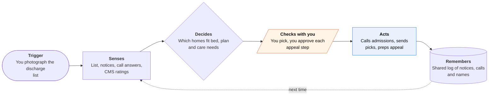

<!-- Generated by scripts/build.py from data/ideas.json. Edit the JSON, then run the script. -->

[← All ideas](../README.md) · **Whitespace** · Family & care

# W-21 · Discharge Scramble

> Told to pick a nursing home by tomorrow? It calls every one for a bed and watches Medicare appeal deadlines.

| Difficulty | Novelty | Buildable on iOS today | Impact if it works | Horizon | Autonomy |
|---|---|---|---|---|---|
| `●●●○○` 3/5 | `●●●●●` 5/5 | `●●●○○` 3/5 | `●●●●○` 4/5 | Buildable now | L3 · Acts in guardrails, reports back |

## The moment

Your dad has been in the hospital for four days after a fall. At 4 pm the case manager hands you a printed list of 31 nursing homes and says he leaves tomorrow, so pick three. You photograph the list at his bedside. By 7 pm your phone shows five homes with a bed this week that take his plan and can give IV antibiotics, next to their inspection records.

## The problem

Hospital discharge gives families hours to choose post-acute care from a list with no bed, insurance or care-capability data on it. Hospitals, nursing homes and insurers all run software on their side, while the family works from a printout. Later, a notice that Medicare coverage is ending starts a fast-appeal deadline that many families miss.

## How the agent works

## iOS building blocks

- **VisionKit (VNDocumentCameraViewController)** — scans the facility list and every notice you are handed
- **Foundation Models (SystemLanguageModel, Attachment)** — recognizes a notice type and pulls out its dates on the device
- **ActivityKit (Live Activities)** — counts down to the fast-appeal deadline on the Lock Screen and Watch
- **App Intents (LiveActivityIntent)** — lets you approve a step from a Live Activity button
- **UserNotifications (time-sensitive)** — alerts you when a facility calls back or a deadline nears
- **MessageUI (MFMessageComposeViewController)** — prefills updates to siblings that you send yourself

## What makes it hard

- Speed: 30 admissions lines in two hours. A server-side agent runs the calls in parallel from cloud telephony, and many admissions offices want a referral packet or a fax rather than a call, so it needs e-fax too.
- Inpatient or observation status decides whether Original Medicare covers the nursing-home stay (it needs three inpatient midnights). The app cannot see hospital status; it can only prompt you to ask the case manager.
- Consent and proxy authority. Sharing a parent's details with facilities needs their consent or a health-care proxy, captured before the first call.
- Deadlines depend on notice dates the app only knows if someone scans the notice. For the fast appeal, the agent can dial the QIO from the cloud and then call your own number to join you in.

## Risks and failure modes

- Safety line: not medical or legal advice. Whether a home can handle dementia care or IV antibiotics is what the facility says on the call; the hospital care team confirms fit. For appeals the app points to the Medicare QIO, your state's SHIP counselors and elder-law attorneys, and you or your parent approve every step.
- Sharing a parent's diagnoses with 30 facilities is a privacy risk. Each call shares only what that question needs.
- Star ratings can mislead. Staffing and quality measures are partly self-reported, so the app shows inspection findings next to the stars.

## Unsaid assumptions

_What this idea quietly depends on being true. Check these before you build._

- Admissions staff will give bed and insurance answers to a disclosed AI caller.
- The family can get the parent's consent or proxy authority in time.
- Case managers will accept choices a family sends from an app.

## Unknown unknowns

_Open questions nobody has good answers to yet._

- Whether hospitals will let families add their own facility picks, or insist on their referral platform.
- How often a fast appeal succeeds when the family files on time with a clean record.
- How to reach families before the crisis, since this happens rarely to any one person; caregiver groups, employers and hospital social workers are the likely channels.

## Prior art and who's building

- [ExaCare (nursing homes approving admissions with AI)](https://www.mcknights.com/news/nursing-homes-greenlighting-admissions-with-ai/) — Facility-side AI that approves referrals within hours. It speeds up the facility, not the family.
- [NYU Langone discharge-need prediction](https://nyulangone.org/news/ai-tool-helps-predict-which-patients-need-continued-care-after-leaving-hospital) — Hospital-side model that predicts who needs continued care. Helps planners, not families choosing a home.
- [CMS Five-Star Quality Rating System](https://www.cms.gov/medicare/health-safety-standards/certification-compliance/five-star-quality-rating-system) — Ratings for inspections, staffing and quality. No bed or plan availability, so you still call every home.
- [Medicare fast appeals](https://www.medicare.gov/providers-services/claims-appeals-complaints/appeals/fast-appeals) — Explains the fast-appeal process and deadline. Nobody tracks it for you.
- [Brevy Care fast-appeal guide](https://brevy.com/medicare/fast-appeal) — A 2026 consumer guide to fast appeals. Seen only in search results; I could not open it to check whether it does more than explain.

## Smallest useful first version

A bedside app for one metro area. You scan the list, a server agent calls each admissions line with three questions (bed this week, plan accepted, named care needs), merges CMS data, and returns a ranked short list within two hours. Notice scanning and the fast-appeal countdown come second.

Research notes: what we could and couldn't verify

Fast-appeal deadline (contact the BFCC-QIO by noon the day before services end) confirmed via search results (Medicare.gov, Medicare Interactive). The three-inpatient-midnight rule is from memory. Hospital-side platforms named in the candidate (naviHealth, WellSky CarePort, Olio) and the nH Predict lawsuit against UnitedHealth are left out of prior_art because I had no verified URLs. Brevy Care could be a consumer product in this space; worth a look before final tiering.

## Related ideas

- [W-01 · Denial Clock](../whitespace/W-01-denial-clock.md)
- [M-20 · Exam Room Advocate](../moonshot/M-20-exam-room-advocate.md)
- [B-12 · Family logistics agents](../building-now/B-12-family-logistics-agents.md)
