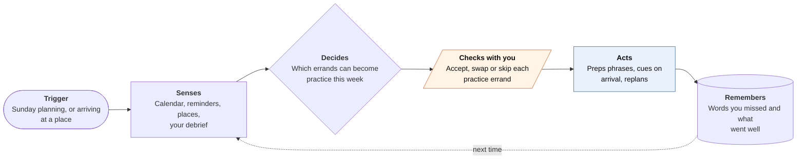

<!-- Generated by scripts/build.py from data/ideas.json. Edit the JSON, then run the script. -->

[← All ideas](../README.md) · **Whitespace** · Learning & memory

# W-22 · Errand Immersion

> Turns errands you already have into target-language practice: preps the phrases, cues you, then debriefs.

| Difficulty | Novelty | Buildable on iOS today | Impact if it works | Horizon | Autonomy |
|---|---|---|---|---|---|
| `●●○○○` 2/5 | `●●●●○` 4/5 | `●●●●○` 4/5 | `●●●○○` 3/5 | Buildable now | L2 · Drafts, you approve |

## The moment

You have a 140-day streak in Portuguese, but you still freeze with real people. On Sunday the agent sees you need a haircut and a birthday cake this week and suggests a Brazilian bakery on your commute. On Thursday, as you walk up to the bakery, your Watch shows the six phrases you rehearsed that morning. Afterwards you say a 30-second debrief into your phone.

## The problem

Conversation apps drill you inside the app and count minutes and streaks. The hard step is speaking with real people, and no app plans that part: where to go, what to say, and what to practice next based on how it went.

## How the agent works

## iOS building blocks

- **EventKit** — reads the week's events and reminders and schedules 5-minute prep slots
- **MapKit (MKLocalSearch)** — finds candidate bakeries, barbers and shops near your routes
- **Core Location (CLMonitor)** — geofences the chosen place to bring up the phrase card
- **ActivityKit (Live Activities)** — shows the phrase card on the Lock Screen and Watch Smart Stack
- **Speech (SpeechAnalyzer, SpeechTranscriber)** — transcribes your own debrief on the device
- **Foundation Models (SystemLanguageModel)** — writes the pre-brief and pulls missed words from the debrief
- **App Intents** — lets you say 'brief me for the bakery' to Siri or Shortcuts

## What makes it hard

- Knowing which places really serve in your target language. Map data rarely says so. The agent can guess from names and reviews, but you have to confirm each place.
- Geofences at small radii fire late or not at all on dense city blocks, so the card also needs a manual 'I'm here' button.
- Language coverage. SpeechTranscriber supports a limited set of locales and the on-device model is stronger in some languages than others, so each target language needs testing.
- Small towns may have no fitting places. The fallback is real calls abroad (a hotel, a museum ticket office) and online exchange partners.

## Risks and failure modes

- Recording people without consent. The debrief records only your own voice after the errand; the app never records the conversation.
- Treating people as practice props. The plan sticks to errands where you are an ordinary customer and doesn't ask staff for extra time.
- Meeting strangers from exchange apps carries safety risk. The agent suggests public places and never shares your location.

## Unsaid assumptions

_What this idea quietly depends on being true. Check these before you build._

- Target-language speakers or businesses fit into a normal week, which holds in big cities and fails in many towns.
- Learners will record an honest debrief right after an awkward moment.
- Short, just-in-time phrase cards help more than longer in-app drills.

## Unknown unknowns

_Open questions nobody has good answers to yet._

- Whether real-world errands improve speaking faster than more AI role-play.
- How to measure progress without recording the other person.
- Whether big tutor apps will partner with or copy an app that sends learners outside.

## Prior art and who's building

- [Duolingo Video Call](https://blog.duolingo.com/video-call/) — Real-time AI conversation that moved into the Super tier in February 2026. Practice stays inside the app; it never plans a real conversation.
- [Speak](https://www.speak.com/) — AI speaking tutor aimed at replacing human tutors. Also stays inside the app.
- [Gliglish](https://gliglish.com/) — AI role-play of everyday scenes like ordering or shopping, not tied to your actual errands or places.

## Smallest useful first version

One language, one city. Every Sunday it proposes three practice errands from your reminders, you confirm the places, and it builds a phrase card that appears as a Live Activity when you arrive or tap 'I'm here'. A 30-second debrief shapes next week's plan.

Research notes: what we could and couldn't verify

Tandem and HelloTalk (language-exchange apps) are relevant but left out of prior_art because I had no verified URLs. SpeechTranscriber locale support for Portuguese was not checked; the card treats locale coverage as a hard part.

## Related ideas

- [B-17 · AI conversation tutors](../building-now/B-17-ai-conversation-tutors.md)
- [B-11 · Meeting and memory capture](../building-now/B-11-meeting-memory-capture.md)
