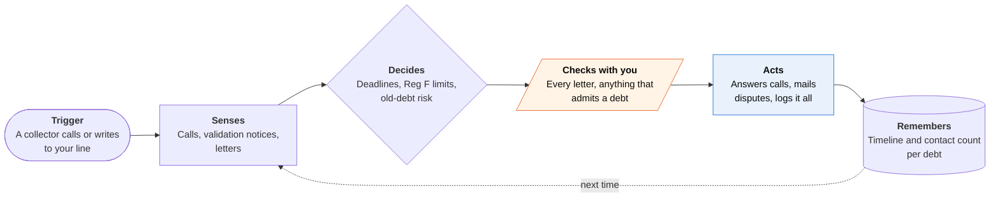

<!-- Generated by scripts/build.py from data/ideas.json. Edit the JSON, then run the script. -->

[← All ideas](../README.md) · **Whitespace** · Money & commerce

# W-23 · Collector Line

> A separate number your AI answers when debt collectors, and their voice bots, call about a debt.

| Difficulty | Novelty | Buildable on iOS today | Impact if it works | Horizon | Autonomy |
|---|---|---|---|---|---|
| `●●●○○` 3/5 | `●●●●●` 5/5 | `●●●●○` 4/5 | `●●●●○` 4/5 | Buildable now | L3 · Acts in guardrails, reports back |

## The moment

A collection agency's voice bot has called five times this week about a gym debt you don't recognize. You gave it your Collector Line number, so your agent picks up. It says the call is recorded and that it is an AI, asks for the validation notice, and says to contact you by mail only. By Friday a dispute letter is waiting for your approval, and the app shows how many days are left to dispute.

## The problem

Debt collectors now run cheap AI voice and text agents, so contact is constant. The CFPB's Regulation F gives consumers real rights: a validation notice, a window to dispute, limits on how often and when collectors call, and the right to restrict how they get in touch. Using those rights takes records, dates and letters that stressed people rarely keep.

## How the agent works

## iOS building blocks

- **CallKit (Call Directory extension, CXCallDirectoryProvider)** — labels known collector numbers when they call your real phone
- **VisionKit (VNDocumentCameraViewController)** — scans validation notices and letters
- **Foundation Models (SystemLanguageModel, Attachment)** — reads notice fields on the device and flags missing ones
- **EventKit** — puts the dispute and response deadlines on your calendar
- **UserNotifications** — server push after the agent takes a call
- **App Intents** — lets you ask Siri what collectors said today

## What makes it hard

- Getting collectors onto the new number. The agent asks in writing that they use it or the mail, but they may keep calling your old number. The Call Directory extension can label those calls; it cannot answer them.
- Recording and disclosure. Some states require every party's consent to record. The agent announces recording, and if the collector objects it stops recording and keeps written notes.
- Statute-of-limitations estimates differ by state and debt type, and in some states a small payment restarts the clock. The app must say when an estimate is uncertain and send the user to a lawyer.
- Certified mail needs a print-and-mail service with proof of delivery linked to each deadline.

## Risks and failure modes

- Safety line: not legal advice. It never agrees to pay, sets up a payment plan, admits a debt or shares bank details. A lawsuit, court papers or a garnishment notice sends you straight to legal aid or a consumer attorney.
- Drafts that cross into legal advice invite unauthorized-practice-of-law claims. Letters stick to the forms the law describes and cite their sources.
- Treating a court summons like a collection letter is the worst failure. Any court paper is flagged as urgent and is never handled by the agent alone.

## Unsaid assumptions

_What this idea quietly depends on being true. Check these before you build._

- Collectors will use the number you give them and respect a request to contact you by mail.
- State recording laws allow a disclosed AI to take the call for you.
- People in collections will trust an app with their debts.

## Unknown unknowns

_Open questions nobody has good answers to yet._

- Who pays: people in collections rarely buy subscriptions, so legal-aid partners, nonprofits or partner attorneys paid through FDCPA fee-shifting are the likely models.
- Whether regulators with shrinking enforcement staff act on AI-built complaint files.
- How collector bots behave when a consumer bot answers (loops, hang-ups, escalation to humans).

## Prior art and who's building

- [Pine AI](https://apps.apple.com/us/app/pine-ai-assistant-agent/id6746403769) — Consumer calling agent for bills, cancellations and refunds. It places calls for you; it does not answer collectors or track Reg F rights.
- [Skit.ai](https://skit.ai/) — Collector-side AI voice agents: the other side this app counters.
- [SoloSuit debt validation letter](https://www.solosuit.com/debt_validation_letter) — Attorney-prepared validation letters and lawsuit answers. One-off documents; nothing answers calls, counts contacts or tracks deadlines.
- [Debt Discipline on AI debt collectors](https://www.debtdiscipline.com/ai-debt-collectors-rights-2026) — Explains consumer rights against AI collectors. Information only, no tool.

## Smallest useful first version

A number plus a scanner. The agent answers collector calls with a fixed script (disclose, take details, request the notice, ask for mail only), logs each call, and counts contacts per debt against Reg F's seven-calls-in-seven-days limit. You scan the validation notice, and it drafts a dispute letter you approve before it is mailed.

Research notes: what we could and couldn't verify

Reg F details are from memory, not re-verified: in force since November 30, 2021; model validation notice; presumed limit of 7 calls in 7 days per debt; calls before 8 am or after 9 pm presumed inconvenient; the consumer can restrict contact media. The SoloSuit URL was seen in search results. The Debt Discipline URL comes from the candidate and was not opened.

## Related ideas

- [B-18 · Scam-call guardian agents](../building-now/B-18-scam-call-guardians.md)
- [B-08 · Bill-fighting and cancel agents](../building-now/B-08-bill-fighting-agents.md)
- [M-21 · Bot-to-Bot Dispute Desk](../moonshot/M-21-bot-to-bot-dispute-desk.md)
