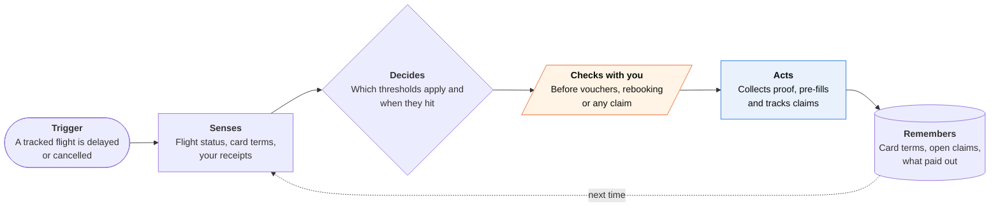

<!-- Generated by scripts/build.py from data/ideas.json. Edit the JSON, then run the script. -->

[← All ideas](../README.md) · **Whitespace** · Money & commerce

# W-24 · Coverage Clock

> When your flight slips, a Live Activity shows which card and airline protections apply, then files the claims.

| Difficulty | Novelty | Buildable on iOS today | Impact if it works | Horizon | Autonomy |
|---|---|---|---|---|---|
| `●●○○○` 2/5 | `●●●●○` 4/5 | `●●●●○` 4/5 | `●●●○○` 3/5 | Buildable now | L2 · Drafts, you approve |

## The moment

Your 6:10 pm flight now leaves at 11:40 pm. Your Lock Screen reads: 'Hour 5 of delay. Your card's trip-delay cover starts at hour 6. Keep meal and hotel receipts.' At midnight the flight is cancelled. The agent reminds you that the airline owes a cash refund if you choose not to fly, and asks whether to request it or rebook.

## The problem

Travelers have several overlapping protections: credit-card trip-delay cover, US DOT refund rules, and EU261 or UK261 compensation. Each has its own thresholds and proof rules. Claims are won or lost in the terminal, when you keep or toss receipts and accept or refuse a voucher, and no app tells you what to do at that moment.

## How the agent works

## iOS building blocks

- **ActivityKit (Live Activities, push updates)** — runs the delay clock on the Lock Screen, Watch Smart Stack and CarPlay
- **Foundation Models (Attachment)** — reads receipt photos offline in a terminal with bad Wi-Fi
- **VisionKit (VNDocumentCameraViewController)** — captures receipts and the airline's delay letter
- **FinanceKit** — helps match the fare to the card that paid, where Wallet has that card (managed entitlement)
- **App Intents** — lets you say 'add this receipt to my delay claim'
- **UserNotifications** — alerts you when a threshold passes

## What makes it hard

- Card benefit terms live in guide-to-benefits PDFs that differ by card and year. Someone has to keep a current table, and you must confirm which card paid, since FinanceKit sees only some Wallet cards.
- Claims go through benefit-administrator web portals with no API. The first version builds a packet you upload; automating the portals would need a supervised cloud browser.
- A Live Activity stays active for at most 8 hours. A long airport night needs a fresh one started by push, without tipping into spam.
- Timing needs good flight data, and the rules measure different things: EU261 uses arrival delay, card cover usually counts from scheduled departure.

## Risks and failure modes

- Not legal or insurance advice. The card's benefit administrator and the airline decide coverage. The app shows its source for every threshold and says when it is unsure.
- Bad advice about vouchers or rebooking can cost you a cash refund. Any step that might waive a right needs your explicit approval and shows the rule it relies on.
- Receipts and travel history are personal. They stay on the device until you submit a claim.

## Unsaid assumptions

_What this idea quietly depends on being true. Check these before you build._

- Benefit administrators accept claims an app assembles and the cardholder submits.
- Public flight-status data is accurate enough to time the thresholds.
- People will photograph receipts at 11 pm if the phone prompts them at the right moment.

## Unknown unknowns

_Open questions nobody has good answers to yet._

- How often card delay claims pay when documented this way, and how fast.
- Whether US refund rules stay as written; they are agency rules a later DOT can revise.
- Whether card issuers would share their terms, or pay for cleaner claims.

## Prior art and who's building

- [AirHelp](https://www.airhelp.com/en/flight-delay-compensation/) — Files airline compensation claims for a 35% fee (50% if it goes to court). Ignores card trip-delay cover and gives no guidance during the delay.
- [Flighty](https://flighty.com/) — Tracks flights and predicts delays early. It never claims anything.
- [RecoverKit](https://www.tryrecoverkit.com/blog/credit-card-travel-delay-insurance/) — Publishes guides to card delay claims; unclear whether it files them.
- [Chase trip delay guide](https://www.chase.com/personal/credit-cards/education/basics/the-comprehensive-guide-to-trip-delay-reimbursement) — An issuer's explainer. You still assemble and file the claim yourself.

## Smallest useful first version

US domestic flights and the most common premium travel cards. The app tracks your flight, runs a delay clock with your card's threshold and the DOT refund rule, prompts for receipts, and exports a filled claim packet after the trip.

Research notes: what we could and couldn't verify

AirHelp's fee (35%, plus 15% legal action fee) and Flighty's scope come from search results. The 2024 DOT automatic-refund rule (cancellations and significant changes: 3+ hours domestic, 6+ hours international) is from memory. FinanceKit coverage (Apple Card, Apple Cash, some Wallet accounts) is from Apple's docs; which non-Apple cards it sees varies by region.

## Related ideas

- [B-05 · Trip booking and rebooking agents](../building-now/B-05-trip-rebooking-agents.md)
- [W-28 · Should This Be Free?](../whitespace/W-28-should-this-be-free.md)
- [M-21 · Bot-to-Bot Dispute Desk](../moonshot/M-21-bot-to-bot-dispute-desk.md)
