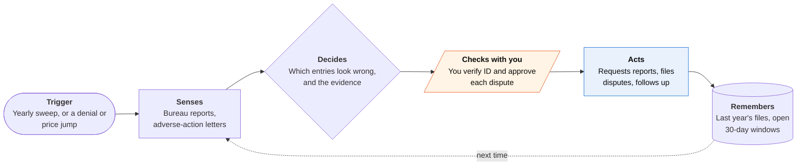

<!-- Generated by scripts/build.py from data/ideas.json. Edit the JSON, then run the script. -->

[← All ideas](../README.md) · **Whitespace** · Money & commerce

# W-25 · Shadow File Auditor

> Pulls the little-known reports that set your rent, insurance and bank access, and disputes the errors.

| Difficulty | Novelty | Buildable on iOS today | Impact if it works | Horizon | Autonomy |
|---|---|---|---|---|---|
| `●●●○○` 3/5 | `●●●●●` 5/5 | `●●●●○` 4/5 | `●●●○○` 3/5 | Buildable now | L2 · Drafts, you approve |

## The moment

Your car insurance renewal jumps, and the letter cites 'claims history'. You have never filed a claim. The agent already requested your LexisNexis C.L.U.E. auto report and found a claim that belongs to someone with a similar name. A dispute is drafted with your policy records attached, and the 30-day investigation clock starts when you tap Send.

## The problem

Specialty consumer reporting agencies keep files on your insurance claims, bank account history, rental history, and employment and income. These files quietly set premiums, rental approvals and whether a bank will open an account for you. The FCRA lets you get most of them free, but each bureau has its own request process, and almost nobody checks.

## How the agent works

## iOS building blocks

- **VisionKit (VNDocumentCameraViewController)** — scans mailed reports and adverse-action letters
- **PDFKit** — reads reports you download from bureau sites
- **Foundation Models (SystemLanguageModel)** — explains entries and compares years on the device, so reports stay local
- **Keychain Services and Data Protection (FileProtectionType.complete)** — keeps reports and account details encrypted at rest
- **EventKit** — puts reinvestigation deadlines on your calendar
- **UserNotifications** — reminds you when a report arrives or a window closes

## What makes it hard

- Each bureau has its own request channel (web form, phone or mail) and identity checks. You pass the identity checks yourself; the agent fills in everything else.
- Reports arrive by mail weeks later in layouts that change. The app has to match each letter to its request and parse it reliably.
- Evidence lives in your old emails, past addresses and bank letters. The agent needs those documents, and should keep them on the device.
- There are many tenant-screening bureaus. Knowing which one a landlord used depends on the adverse-action notice, which people often throw away.

## Risks and failure modes

- Safety line: not legal advice and not credit repair. It takes no fee for a dispute before the work is done (the Credit Repair Organizations Act bans advance fees), never disputes accurate entries, and sends lawsuits to consumer attorneys.
- Bulk or vague disputes get rejected as frivolous. Each dispute names one specific error with evidence.
- These files are sensitive. Reports stay on the device, and nothing goes to a third-party model without explicit consent.

## Unsaid assumptions

_What this idea quietly depends on being true. Check these before you build._

- Specialty bureaus will process requests and disputes an app prepares for the consumer.
- Errors are common enough to make a yearly sweep worth the effort.
- People will do a few identity checks a year for a benefit they can't see yet.

## Unknown unknowns

_Open questions nobody has good answers to yet._

- How often specialty files contain errors that change a price or a decision.
- Whether bureaus start blocking or slowing requests that come in through an app.
- Who pays: consumers, insurers who want clean data, or consumer attorneys who take the cases.

## Prior art and who's building

- [Consumer Action guide to specialty reports](https://www.consumer-action.org/downloads/english/specialty_report_guide.pdf) — Lists the specialty bureaus and how to request each file. A guide; you do every request and dispute by hand.
- [LexisNexis Consumer Center](https://supportcenter.lexisnexis.com/app/answers/answer_view/a_id/1127747/~/ensuring-accuracy-in-credit,-insurance,-and-identity-with-the-consumer-center) — Where you request and dispute your LexisNexis file. One bureau among many, with no tracking across bureaus.
- [Consumer attorneys for C.L.U.E. disputes](https://consumerattorneys.com/lp/clue-report-dispute) — Lawyers who litigate C.L.U.E. errors after the harm. Not self-service or preventive.

## Smallest useful first version

A yearly sweep of five files: C.L.U.E. auto and home, ChexSystems, one large tenant screener, and The Work Number. The app walks you through each request, reads each report when it arrives, and drafts a dispute for any entry you mark wrong.

Research notes: what we could and couldn't verify

FCRA points are from memory, not re-verified: free annual disclosure from nationwide specialty consumer reporting agencies, a free report within 60 days of an adverse-action notice, and a 30-day reinvestigation window. Credit Karma and Dovly (big-three credit only) and the 2024 SafeRent settlement are left out for lack of verified URLs. The Menlo 2026 survey (only 20% of agent users have given an agent financial-account access) in the research digest supports keeping reports on the device.

## Related ideas

- [W-23 · Collector Line](../whitespace/W-23-collector-line.md)
- [B-08 · Bill-fighting and cancel agents](../building-now/B-08-bill-fighting-agents.md)
