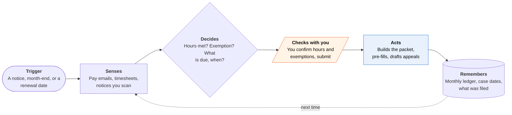

<!-- Generated by scripts/build.py from data/ideas.json. Edit the JSON, then run the script. -->

[← All ideas](../README.md) · **Whitespace** · Life admin

# W-26 · Benefits Keeper

> Keeps Medicaid and SNAP from lapsing over paperwork: logs hours, reads notices and files proof on time.

| Difficulty | Novelty | Buildable on iOS today | Impact if it works | Horizon | Autonomy |
|---|---|---|---|---|---|
| `●●●●○` 4/5 | `●●●●○` 4/5 | `●●●○○` 3/5 | `●●●●●` 5/5 | Buildable now | L2 · Drafts, you approve |

## The moment

It is March 2027 and your state now checks Medicaid work hours. You drive for two gig apps and care part-time for your disabled mother. The agent has pulled February's gig earnings from your forwarded email, logged 86 hours, noted that your caregiving may qualify you for an exemption, and shows a pre-filled report with one question left for you.

## The problem

The July 2025 federal budget law requires many Medicaid expansion adults to show 80 hours a month of work, school or service, with states checking by January 2027, and moves them to renewals every six months. SNAP work rules widened too. In the 2023-24 Medicaid unwinding, most people who lost coverage lost it over paperwork, not eligibility. Consumer help so far is explainers; the automation being built is on the state's side.

## How the agent works

## iOS building blocks

- **VisionKit (VNDocumentCameraViewController)** — scans notices, timesheets and volunteer sign-off sheets
- **Foundation Models with Vision OCRTool** — pulls hours, dates and notice types out of documents on the device where supported
- **Translation (TranslationSession)** — shows notices and to-dos in your language
- **EventKit** — puts reporting months and renewal dates on your calendar
- **App Intents** — lets you say 'log 4 hours at the food bank'
- **HealthKit (clinical records, opt-in)** — finds records that may support a medical-frailty exemption
- **UserNotifications** — sends repeated reminders before each deadline

## What makes it hard

- Many users have older iPhones without Apple Intelligence. Every on-device model step needs a server fallback, with explicit consent under guideline 5.1.2(i), and the app must work in several languages.
- Every state has its own portal with identity proofing and no API. Filing stays in your hands: the app pre-fills and walks you through the upload, or you approve and it mails a paper packet and keeps a dated copy.
- Fifty state rollouts of one federal rule, each with its own exemptions, data matches and timelines. Keeping the rules current is a staff job, not a model job.
- Gig income is messy: weekly statements from several apps, tips and expenses. Turning it into hours, or the income alternative ($580 a month, which is 80 hours at the federal minimum wage), has to be shown line by line.

## Risks and failure modes

- Safety line: not legal advice, and it never invents or rounds up hours. False statements to a benefits agency are serious, so every number links to a document. For denials and fair hearings it connects you to legal aid.
- A missed deadline costs health coverage. The app sends repeated reminders and says plainly when it cannot help.
- Very sensitive data about low-income people. No ads, no data sales, on-device by default.

## Unsaid assumptions

_What this idea quietly depends on being true. Check these before you build._

- States will accept proof from members for hours their data matches miss.
- Users will forward pay emails and scan paper each month.
- A nonprofit, state or Medicaid health plan will pay, because users cannot.

## Unknown unknowns

_Open questions nobody has good answers to yet._

- How many states will verify hours through data matches alone, which would make member proof matter less.
- Whether Medicaid managed-care plans will fund this to keep members enrolled.
- How fast Propel and state tools close the gap.

## Prior art and who's building

- [CMS interim final rule on community engagement](https://www.cms.gov/newsroom/fact-sheets/medicaid-community-engagement-requirement-certain-individuals-interim-final-rule-comment-period-cms) — The federal rule. It sets what states must check, not how members keep their proof.
- [Minnesota Renewal Lookup](https://mn.gov/dhs/about-us/legislative-media/media/news/?id=1053-762638) — A state tool for renewal dates ahead of the 2027 requirements. One state, and it does not build your proof.
- [Propel](https://www.propel.app/insights/ai-to-help-simplified-reporting-reduce-error-rate/) — Popular SNAP app that says it is building AI reporting tools, so this window may close. Today it offers guides such as its work-requirements explainer.
- [OpenMedicaid work-requirements tracker](https://www.openmedicaid.org/insights/work-requirements-2026) — Tracks what each state is doing. Information, not action.
- [CHCS summary of the requirements](https://www.chcs.org/resource/a-summary-of-national-medicaid-work-requirements/) — Policy summary written for states and plans.

## Smallest useful first version

One state, Medicaid only. A monthly hours ledger fed by forwarded pay emails and scanned sign-off sheets, an exemption checklist, and a notice scanner that turns each letter into a dated to-do. Free, in English and Spanish, and it works without Apple Intelligence.

Research notes: what we could and couldn't verify

Merged 'Medicaid Hours Keeper' (hours ledger, exemption check, never rounding up hours, fair-hearing drafts). H.R. 1 details (80 hours, start by January 1, 2027, six-month renewals, SNAP changes) come from the two candidates and memory. The CMS rule number (CMS-2454-IFC) from the merge source was not verified, so it is not in the card. The candidate listed HeyMedicaid at heymedicaid.med; I could not verify that URL and left it out. The procedural-disenrollment share in the unwinding is from memory (KFF put it near 70%). Novelty set to 4 (candidate had 3) because Propel's tools are announced, not shipped.

## Related ideas

- [W-08 · Paper Round-Trip](../whitespace/W-08-paper-round-trip.md)
- [W-01 · Denial Clock](../whitespace/W-01-denial-clock.md)
- [W-32 · Between-Clients Wage Check](../whitespace/W-32-between-clients-wage-check.md)
