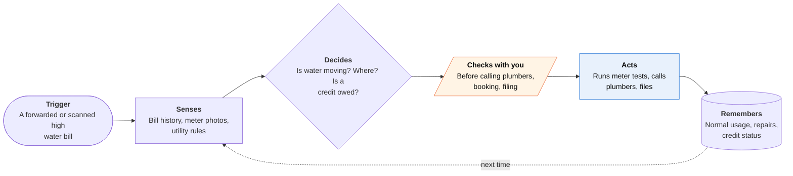

<!-- Generated by scripts/build.py from data/ideas.json. Edit the JSON, then run the script. -->

[← All ideas](../README.md) · **Whitespace** · Physical world

# W-27 · Leak Bill Detective

> Turns a shocking water bill into a found leak, a fixed pipe, and the utility's leak credit.

| Difficulty | Novelty | Buildable on iOS today | Impact if it works | Horizon | Autonomy |
|---|---|---|---|---|---|
| `●●○○○` 2/5 | `●●●●●` 5/5 | `●●●●○` 4/5 | `●●●○○` 3/5 | Buildable now | L2 · Drafts, you approve |

## The moment

Your water bill is $412 when it's usually $70, and you can't see water anywhere. You forward the bill. The agent tells you your utility's leak-credit deadline, then asks you to photograph the meter at 11 pm and again at 6 am, before anyone showers. The meter moved overnight, so it walks you through a toilet dye test next.

## The problem

Leak gadgets stop at the alert, and plumbers stop at the fix. Many water utilities offer a leak adjustment on the bill, but each has its own rules, proof and deadline, often on a paper form. Nothing takes you from 'this bill is wrong' to a found leak to the credit.

## How the agent works

## iOS building blocks

- **Foundation Models (Attachment) with Vision OCRTool** — reads bills and meter photos on the device
- **VisionKit (DataScannerViewController)** — reads a digital meter display live through the camera
- **Visual Intelligence (IntentValueQuery)** — lets you point the Camera at the meter and hand the image to the app
- **UserNotifications (UNCalendarNotificationTrigger)** — prompts the late-night and early-morning meter photos
- **EventKit** — books the plumber visit you pick
- **PDFKit** — fills the utility's PDF leak-adjustment form
- **App Intents** — lets you say 'log a meter reading'

## What makes it hard

- Meters vary: sweep dials, digital displays, meters in a street box. Reading a low-flow indicator from a photo is error-prone, so you confirm every reading. If the utility offers hourly smart-meter data online, that beats photos.
- Leak-adjustment rules differ by utility, and there are thousands of water utilities. The agent has to find and read each program's page and form, and say so when there is no program.
- Plumber calls run from cloud telephony with clear AI disclosure, and prices quoted by phone are soft.
- Proof rules differ: some utilities want a plumber's invoice, some accept parts receipts for a DIY fix. The packet has to match each program.

## Risks and failure modes

- Not a plumber. Water near wiring, a sagging ceiling or anything involving gas goes to a licensed professional right away.
- A false 'no leak' lets damage continue. Results read 'no flow seen overnight', never 'your home is fine'.
- Some meters sit in street boxes or shared basements. The app never pushes you to open a vault or enter a space that is unsafe.

## Unsaid assumptions

_What this idea quietly depends on being true. Check these before you build._

- Your utility has a leak-adjustment program and accepts a plumber's invoice plus meter photos as proof.
- You can reach and read your meter.
- The credit is large enough to be worth the paperwork.

## Unknown unknowns

_Open questions nobody has good answers to yet._

- What share of US water utilities offer leak adjustments, and how generous they are.
- Whether utilities would take filings from an app, or partner with one.
- Whether home insurers would pay for leak finding to prevent water-damage claims.

## Prior art and who's building

- [Flume](https://flumewater.com/) — A sensor on the meter that alerts on leaks. It stops at the alert: no bill relief, no plumber, no utility claim. Phyn and Moen Flo stop at the alert too.
- [SFPUC Leak Allowance](https://www.sfpuc.gov/accounts-services/bill-relief/leak-allowance) — A real credit program with its own rules and form. You find it and file it yourself.
- [Seattle Public Utilities Leak Adjustments](https://seattle.gov/utilities/your-services/accounts-and-payments/bills-and-payments/my-bill-seems-too-high/leak-adjustments) — Another program with its own proof rules and deadlines. Nothing connects it to finding and fixing the leak.
- [Google AI Mode agentic calling](https://9to5google.com/2026/04/10/google-ai-mode-redesign/) — Calls local businesses for prices and availability. Not tied to a leak test, a bill or a credit.

## Smallest useful first version

Forward a bill and get your utility's leak-credit rules and deadline, a guided two-photo overnight meter test, and a filled leak-adjustment form after the repair. Start with the largest US water utilities and leave plumber calling for later.

Research notes: what we could and couldn't verify

Flume's URL and scope come from search results. The Google calling URL is the research digest's source for Google's agentic calling. Phyn and Moen Flo are named in a note without their own URLs. Visual Intelligence hands the app a single captured image, not a live feed, which is enough for a meter photo.

## Related ideas

- [B-08 · Bill-fighting and cancel agents](../building-now/B-08-bill-fighting-agents.md)
- [W-28 · Should This Be Free?](../whitespace/W-28-should-this-be-free.md)
- [B-02 · Phone-call errand agents](../building-now/B-02-phone-call-errand-agents.md)
