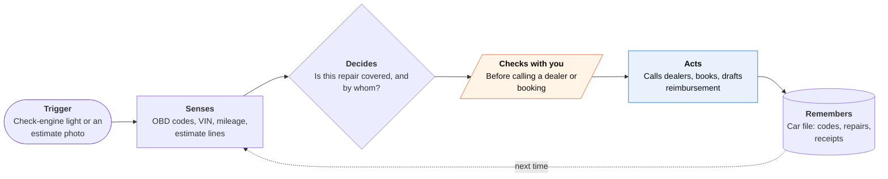

<!-- Generated by scripts/build.py from data/ideas.json. Edit the JSON, then run the script. -->

[← All ideas](../README.md) · **Whitespace** · Physical world

# W-28 · Should This Be Free?

> Before you pay for a car repair, it checks recalls, the emissions warranty and quiet coverage extensions.

| Difficulty | Novelty | Buildable on iOS today | Impact if it works | Horizon | Autonomy |
|---|---|---|---|---|---|
| `●●●○○` 3/5 | `●●●●○` 4/5 | `●●●●○` 4/5 | `●●●●○` 4/5 | Buildable now | L2 · Drafts, you approve |

## The moment

Your check-engine light comes on during the commute, and you say 'check this' in CarPlay. The app reads the code from a Bluetooth dongle and tells you it's a catalyst code: not an emergency, but worth fixing this week. That afternoon a shop quotes $1,900 for a catalytic converter, and when you photograph the estimate at the counter, the app points out that at 71,000 miles the converter is still under the federal 8-year, 80,000-mile emissions warranty. It offers to call the nearest dealer to confirm and book.

## The problem

Carmakers often owe you repairs you never hear about: open recalls, the federal emissions warranty on major parts like the catalytic converter and engine computer, and quiet warranty extensions sent to dealers as bulletins. Independent shops have no reason to mention them, and owners don't know where to look. Code-reader apps explain the fault and estimate the cost, and estimate-reader apps say whether the price is fair, but none asks whether someone else should be paying.

## How the agent works

## iOS building blocks

- **Core Bluetooth** — reads trouble codes and live data from a Bluetooth LE OBD-II dongle
- **CarPlay (CPVoiceControlTemplate)** — talks you through a warning light while you drive
- **VisionKit (DataScannerViewController)** — scans the VIN barcode or text on the door jamb or windshield
- **Vision (RecognizeDocumentsRequest)** — turns the estimate photo into line items with parts, labor and prices
- **Foundation Models (PrivateCloudComputeLanguageModel)** — matches estimate lines to the codes and to long coverage documents
- **Visual Intelligence (IntentValueQuery)** — lets you point the Camera at an estimate and hand it straight to the app
- **ActivityKit (Live Activities)** — shows the dealer call in progress and its answer on the Lock Screen
- **EventKit** — adds the booked service slot to your calendar

## What makes it hard

- Coverage documents are messy. NHTSA publishes recalls in structured form, but warranty extensions reach the public as PDFs of dealer bulletins with VIN ranges, mileage caps and part numbers. Deciding which ones apply to this VIN and this line item is the core engineering job.
- The emissions warranty depends on mileage, and not every car reports the odometer over OBD-II. The app needs a dashboard photo or a service record, and it must know which parts count as major emission parts for this model.
- Hardware and entitlements: only Bluetooth LE OBD-II adapters work through Core Bluetooth; classic-Bluetooth dongles need Apple's MFi program. CarPlay needs an entitlement Apple grants per category, and a repair helper (most likely a driving-task app) is not guaranteed one.
- Dealer calls go out through cloud telephony, not the phone. Service advisers often won't confirm coverage without the car in the bay, so the call should aim for a diagnosis appointment with the document on file, not a yes on the phone.

## Risks and failure modes

- Safety line: the app never tells you a flashing check-engine light, a brake fault or overheating is fine to ignore to save money. When in doubt it says stop driving and get help.
- A wrong 'this should be free' costs a tow to the dealer and a diagnosis fee. Show the document and the reasoning, and say 'likely covered', never 'covered'.
- Flagging line items can sour you with a shop you depend on. Stick to evidence (this part doesn't match this code), not accusations of fraud.

## Unsaid assumptions

_What this idea quietly depends on being true. Check these before you build._

- Public coverage documents are complete and current enough to act on.
- Dealers honor coverage when a customer arrives with the document in hand.
- Owners will pair a dongle once and leave it plugged in.

## Unknown unknowns

_Open questions nobody has good answers to yet._

- What share of repairs people pay for were actually covered by a recall, the emissions warranty or an extension?
- How often do carmakers reimburse owners who already paid an independent shop for a repair an extension covers?
- Will dealer service desks talk to a disclosed AI caller, or hang up?

## Prior art and who's building

- [FIXD](https://www.fixdapp.com/) — Bluetooth OBD-II sensor and app that explains codes, estimates repair costs and surfaces recalls. It stops there: it doesn't read the shop's estimate, check warranty coverage for the part, or call a dealer.
- [Car AI](https://www.car-ai.app/) — Upload a photo or PDF of a repair estimate and it explains each line and whether the price looks fair. It answers 'is this price fair?', not 'should someone else pay?', and it takes no action.
- [NHTSA recall lookup (and SaferCar app)](https://www.nhtsa.gov/recalls) — Free VIN lookup and alerts for open safety recalls. Recalls only: it doesn't cover the emissions warranty or warranty extensions, and it doesn't connect a recall to the repair on the counter in front of you.

## Smallest useful first version

No dongle and no CarPlay at first. You photograph the estimate and the VIN and enter the mileage; the app returns open recalls, any line that falls under the federal emissions warranty, and any NHTSA-posted extension that names the part, each with the document to show the service adviser. Dealer calls come in version two, once the matching is proven.

Research notes: what we could and couldn't verify

Estimate reading alone is not whitespace: Car AI (car-ai.app) and several App Store apps already explain repair estimates. The untaken part is matching the estimate to coverage (recalls, the 8-year/80,000-mile federal emissions warranty on major emission parts, warranty extensions) and calling dealers. Car AI's site was blocked by the egress proxy; its description comes from a search snippet. FIXD's recall feature is from the candidate and was not re-checked. The claim that iOS 27 opens CPVoiceControlTemplate to every CarPlay category comes from the research digest; Apple's class page still describes it as a navigation-app template. Candidate listed RepairPal without a URL; left out.

## Related ideas

- [B-16 · CarPlay voice agents](../building-now/B-16-carplay-voice-agents.md)
- [B-02 · Phone-call errand agents](../building-now/B-02-phone-call-errand-agents.md)
- [B-08 · Bill-fighting and cancel agents](../building-now/B-08-bill-fighting-agents.md)
