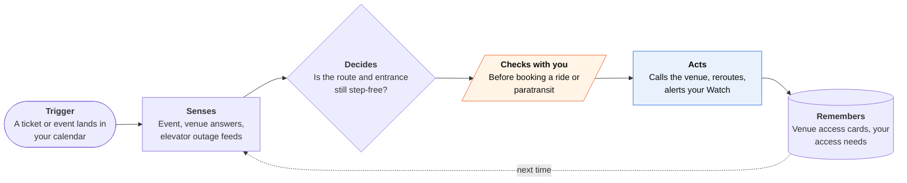

<!-- Generated by scripts/build.py from data/ideas.json. Edit the JSON, then run the script. -->

[← All ideas](../README.md) · **Whitespace** · Accessibility

# W-29 · Step-Free Scout

> For wheelchair users: it calls venues about access, then reroutes you live when a station elevator breaks.

| Difficulty | Novelty | Buildable on iOS today | Impact if it works | Horizon | Autonomy |
|---|---|---|---|---|---|
| `●●●○○` 3/5 | `●●●○○` 3/5 | `●●●●○` 4/5 | `●●●●○` 4/5 | Buildable now | L3 · Acts in guardrails, reports back |

## The moment

You have concert tickets across town tonight. On Monday the agent called the venue and learned that the step-free entrance is on 5th Street, around the corner from the box office, and that companion seats must be booked by phone. At 6:40 your wrist taps: the elevator at your transfer station just went out, so take the bus two stops and use the ramp on 5th. You still get in before the doors open.

## The problem

For a wheelchair user, one broken elevator or one stepped entrance can end a night out. Routing apps treat access as a fixed tag on a station, and venue websites say 'accessible' without saying where the ramp is or whether the lift works. Checking both means phone calls and watching outage pages all day, and that work falls on the person with the least slack.

## How the agent works

## iOS building blocks

- **EventKit** — finds the event, venue and start time to plan around
- **MapKit** — shows the venue, the entrance pin and walking legs; MapKit gives transit ETAs only, so routes are planned on a server
- **Core Location (CLMonitor)** — notices when you reach the transfer station or the venue block
- **ActivityKit (Live Activities)** — push-updated trip status on the Lock Screen and the Apple Watch Smart Stack
- **UserNotifications (time-sensitive interruption level)** — breaks through Focus when an elevator on your route fails
- **App Intents** — lets you ask Siri whether tonight's route is still step-free

## What makes it hard

- Outage data is uneven. New York publishes a live elevator and escalator feed for developers; many cities publish nothing, or update late. The app must show how fresh each status is and fall back to 'call ahead' when it can't know.
- Routing with live outages has to run on a server (for example OpenTripPlanner over GTFS schedules plus the outage feed), because MapKit's transit mode only estimates arrival times. Watching the feed for hours before an event also needs a server and push, not background refresh.
- Venue calls go through cloud telephony. Front-desk staff often don't know where the ramp is, so the agent must ask concrete questions, note who answered and when, and mark answers unconfirmed until a user checks them in person.
- Access needs are personal: a power chair, a manual chair and a walker user need different answers about door widths, lifts and seating. The profile has to be precise without becoming a medical form.

## Risks and failure modes

- A wrong 'step-free' answer can strand someone at night. Every venue card and route shows its source and time, and the app never hides uncertainty.
- Disability status is sensitive. Keep the access profile on the device, and share venue corrections to a community map only with consent and without identity.
- Rides and paratransit cost money and paratransit has booking windows; the app shows the fare and asks before booking anything.

## Unsaid assumptions

_What this idea quietly depends on being true. Check these before you build._

- Transit outage feeds outside New York are timely enough to act on.
- Venue staff answer access questions accurately on the phone.
- Users will trust an agent's call notes enough to rely on them at the door.

## Unknown unknowns

_Open questions nobody has good answers to yet._

- How many transit agencies publish machine-readable elevator status, and how quickly does it update?
- Do venues answer a disclosed AI caller as well as they answer a person?
- Can crowd corrections to venue cards stay accurate without a moderation team?

## Prior art and who's building

- [StepFree NYC](https://apps.apple.com/us/app/stepfree-nyc/id6758830177) — iPhone app with live elevator and escalator status for every NYC subway station, alerts for saved stations, and accessible routes with bus alternatives. It covers New York transit only; it doesn't know your plans for the evening, check the venue, or arrange a fallback ride.
- [MTA accessible subway travel and elevator status](https://www.mta.info/accessibility/subway) — Official outage information with per-station email and text alerts, plus a public developer feed. Station by station, not tied to your trip or your deadline.
- [MTA elevator-outage settlement (coverage)](https://www.disabled-world.com/disability/legal/mta-settlement.php) — A July 2026 class-action settlement requires real-time outage details, alerts and a rerouting phone line. It improves the information; it doesn't give riders an agent that watches their route for them.

## Smallest useful first version

New York only: subway, bus and one venue per trip. From a calendar event, the agent calls the venue with your questions and saves a venue card; a server plans a step-free route from the MTA elevator feed and pushes a reroute to your Watch if an elevator on that route fails in the three hours before the event. No booking yet; it shows the paratransit and accessible-taxi numbers.

Research notes: what we could and couldn't verify

Partial overlap found: StepFree NYC (App Store) already offers live NYC elevator status, saved-station outage alerts and accessible routing with bus alternatives, so the transit-watch half is taken in New York. The whitespace is the venue calls, tying the watch to a specific event and deadline, other cities, and fallback booking. Novelty scored 3 for that reason; consider narrowing the card to 'venue access calls plus event-anchored rerouting'. StepFree NYC's features come from search snippets (App Store pages were blocked by the egress proxy). The MTA settlement details are from the candidate's source and were not re-verified. The candidate's claim that Google Maps and Citymapper lag during sudden outages was dropped as unverified. MapKit's transit transport type is documented as ETA-only (checked on developer.apple.com).

## Related ideas

- [W-11 · Paratransit Trip Keeper](../whitespace/W-11-paratransit-trip-keeper.md)
- [W-06 · Accommodations Booked Ahead](../whitespace/W-06-accommodations-booked-ahead.md)
- [B-02 · Phone-call errand agents](../building-now/B-02-phone-call-errand-agents.md)
