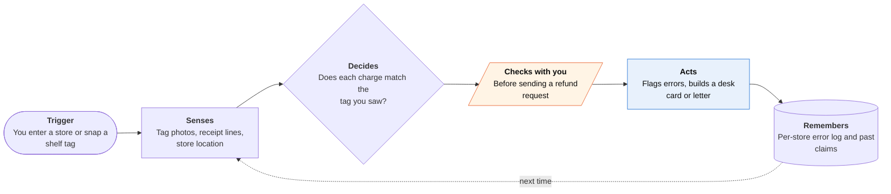

<!-- Generated by scripts/build.py from data/ideas.json. Edit the JSON, then run the script. -->

[← All ideas](../README.md) · **Whitespace** · Money & commerce

# W-30 · Shelf Price Witness

> Catches checkout overcharges by matching shelf tags you photographed to your receipt, then claims the refund.

| Difficulty | Novelty | Buildable on iOS today | Impact if it works | Horizon | Autonomy |
|---|---|---|---|---|---|
| `●●○○○` 2/5 | `●●●●●` 5/5 | `●●●●○` 4/5 | `●●●○○` 3/5 | Buildable now | L2 · Drafts, you approve |

## The moment

You grab a coffee tagged $8.99 on sale, and it rings up at $12.49. You don't notice, but the app does: it matches your tag photo to the receipt and buzzes before you reach the car. It shows a service-desk card with the tag photo, the time and the receipt line, and because you shop in Michigan, it adds the bonus the state's scanner law allows.

## The problem

Checkout overcharges are small, frequent and hard to prove. With electronic shelf labels, the tag you saw can change before you get home, and a receipt alone proves nothing about the price offered. Receipt apps store receipts for expenses and cashback, and price-audit tools are sold to stores, so nothing sits on the shopper's side of the scanner.

## How the agent works

## iOS building blocks

- **VisionKit (DataScannerViewController)** — reads shelf-tag prices and product names live in the camera
- **Vision (RecognizeDocumentsRequest)** — reads receipt lines while keeping the table layout
- **Foundation Models (Attachment)** — matches a tag photo to an abbreviated receipt line on device
- **Core Location (CLMonitor)** — notices when you enter a saved store and starts a shopping session
- **CryptoKit (SHA256)** — hashes each photo with its time and store so the evidence can't be quietly edited
- **App Intents** — an Action button press snaps a tag without opening the app
- **Meta Wearables Device Access Toolkit** — Meta's iOS SDK (not Apple's) that pulls photo frames from Ray-Ban Meta glasses for hands-free capture

## What makes it hard

- Matching is the hard part. Receipts abbreviate names, sale tags carry conditions (member card, buy two), and produce is priced by weight. The app must say 'can't tell' often rather than cry wolf.
- Capture has to cost almost nothing. Phone snaps work for a few items; passive capture needs glasses, and Meta's toolkit has been a developer preview, so check that apps built on it can ship to everyone.
- Digital receipts arrive by email or inside a store's own app, and an iOS app can read neither. It needs a forwarding address, a share-sheet import or a photo of the paper receipt.
- Rules differ by place and chain. Michigan's scanner law pays a bonus of ten times the difference ($1 to $5) if you notify the seller with evidence within 30 days; many states give only the refund; some chains have their own policies. The rules table must be kept current.

## Risks and failure modes

- Filming in aisles, especially with glasses, can bother staff and other shoppers. Capture tags only, never keep faces, and respect a store's no-photo policy.
- A false accusation at the service desk is embarrassing. Show confidence and evidence, and let the shopper decide whether to raise it.
- A per-store history of what you buy is personal data. Keep it on the device and never sell or share it.

## Unsaid assumptions

_What this idea quietly depends on being true. Check these before you build._

- Stores honor photo evidence at the service desk.
- Shoppers will snap tags, or wear glasses, while they shop.
- Overcharges happen often enough that a shopper sees a payoff within a few trips.

## Unknown unknowns

_Open questions nobody has good answers to yet._

- How often does a typical grocery trip include an overcharge once electronic shelf labels are common?
- Will stores accept a claim sent after the shopper has left, or only at the desk?
- Is Meta's glasses toolkit open for general App Store release, and what does continuous capture cost in battery?

## Prior art and who's building

- [Using receipt apps to catch store overcharges](https://www.theappnote.com/blog/catch-store-overcharges-with-receipt-apps) — Explains how to spot overcharges with receipt-scanning apps. Fully manual: you compare prices yourself, nothing records the tag price, and nothing files the claim.
- [Michigan Scanner Law](https://www.michigan.gov/consumerprotection/protect-yourself/consumer-alerts/shopping/michigans-scanner-law) — Gives shoppers the difference plus a bonus of ten times the difference ($1 minimum, $5 maximum) when they notify the seller with evidence within 30 days. The right exists; no tool gathers the evidence for it.
- [Scanner Price Accuracy Code (Canada)](https://en.wikipedia.org/wiki/Scanner_Price_Accuracy_Code) — Voluntary Canadian retail code that gives the item free, up to a cap, when it scans above the shelf price. Shoppers still have to catch and prove the error themselves.
- [ShopRite ScanRite policy](https://www.shoprite.com/scanrite-policy) — A chain's own promise for scanning errors. It only pays if the shopper notices the error and can show the tag price.
- [Consumer Reports Kroger price-tag findings](https://www.yahoo.com/news/consumer-reports-visited-26-krogers-104700792.html) — Found more than 150 expired or misleading price tags across 26 Kroger stores in 14 states. Documents the problem; gives shoppers no tool.

## Smallest useful first version

Phone only. An Action button press snaps a tag; after checkout you photograph the receipt, and the app lists any line priced above a tag you captured, with a desk card showing the photo, time and store. Start with Michigan's rules and one grocery chain; add glasses capture and mailed claims later.

Research notes: what we could and couldn't verify

Dropped the candidate's claim that New York City requires a bonus on top of the refund: could not verify it. Michigan's rule (30-day notice with evidence, bonus of 10x the difference, $1 to $5) comes from search snippets of the state's page and a Michigan State University Extension article; the state page itself was blocked by the egress proxy. ShopRite and Consumer Reports URLs are from the candidate and could not be opened here. Meta toolkit status is from the research digest. Canada's Scanner Price Accuracy Code URL came from search results; the exact cap was not checked, so the card says 'up to a cap'.

## Related ideas

- [B-06 · Price-watch auto-buy agents](../building-now/B-06-price-watch-auto-buy.md)
- [B-08 · Bill-fighting and cancel agents](../building-now/B-08-bill-fighting-agents.md)
