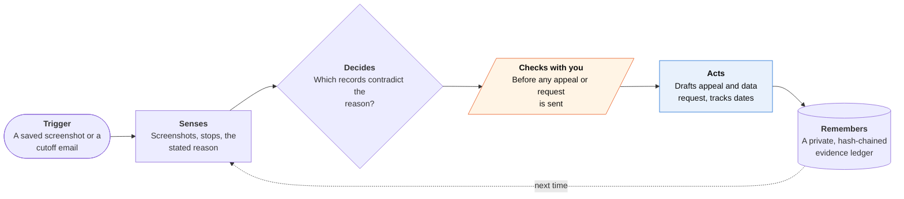

<!-- Generated by scripts/build.py from data/ideas.json. Edit the JSON, then run the script. -->

[← All ideas](../README.md) · **Whitespace** · Work & business

# W-31 · Deactivation Defense File

> Keeps a gig worker's own evidence ledger and drafts the appeal when a platform's algorithm cuts them off.

| Difficulty | Novelty | Buildable on iOS today | Impact if it works | Horizon | Autonomy |
|---|---|---|---|---|---|
| `●●●○○` 3/5 | `●●●●○` 4/5 | `●●●●○` 4/5 | `●●●●○` 4/5 | Buildable now | L2 · Drafts, you approve |

## The moment

Your delivery account is deactivated at 6 p.m. on a Friday for 'multiple customer reports' you never saw, and rent is due. You forward the email to the app, which already holds 14 months of your own records: drop-off photos, times, ratings and support chats. Before you finish reading, it has matched the three disputed orders to your photos and drafted an appeal and a data-access request for you to review.

## The problem

Gig platforms cut workers off through automated systems, often with a one-line reason and a short appeal window. Workers rarely hold their own records, because the evidence lives inside the platform's app. Earnings trackers log pay and miles, and guides explain how to appeal, but nothing keeps evidence ready and turns it into an appeal on the day it's needed.

## How the agent works

## iOS building blocks

- **App Intents** — an Action button or Back Tap shortcut files a screenshot into the ledger in one press
- **Visual Intelligence (IntentValueQuery)** — receives a screenshot from Visual Intelligence and returns the matching order entry
- **Foundation Models (on-device, PrivateCloudComputeLanguageModel)** — pulls order, time and address on device; drafts long appeals on Private Cloud Compute
- **Core Location (CLVisit)** — records where you stopped and for how long, as a second witness
- **CryptoKit (SHA256)** — hash-chains entries so the ledger shows nothing was edited later
- **Foundation Data Protection (FileProtectionType.complete)** — keeps the ledger encrypted while the phone is locked
- **UserNotifications** — reminds you of appeal and review deadlines

## What makes it hard

- iOS can't read the driver apps, so capture depends on the worker saving screenshots. The ledger has to pay off every day (mileage, weekly pay checks) or nobody builds it up before the crisis.
- Each platform wants a different appeal format and length, and many route appeals through in-app forms the app can't fill. The output must be text the worker can paste, plus a packet for human helpers.
- Rights differ by place. Seattle's App-Based Worker Deactivation Rights Ordinance (in force since January 2025) gives app-based workers notice and a way to challenge; the EU Platform Work Directive must be in national law by 2 December 2026 and requires a human to decide account suspensions and terminations. Most US workers have neither, and the app must say so plainly.
- Screenshots and location history contain customers' addresses. Redact them from anything that leaves the phone.

## Risks and failure modes

- Unauthorized practice of law: the app drafts in the worker's own voice, hands off to driver guilds, worker centers and legal aid, and never promises an outcome.
- Evidence that looks altered can sink a case. Keep originals untouched, show the hash chain, and never help create or edit evidence.
- Never contact customers, and never scrape or automate the platform's app.

## Unsaid assumptions

_What this idea quietly depends on being true. Check these before you build._

- Workers will capture evidence before they need it.
- Platforms read appeals, and specific evidence changes outcomes.
- Guilds, worker centers and legal aid will accept a packet assembled by an app.

## Unknown unknowns

_Open questions nobody has good answers to yet._

- How much more often do appeals with specific evidence succeed than generic ones?
- Will platforms treat an app-drafted appeal differently, or flag it?
- How will EU member states put the human-review right into practice, and will US cities copy it?

## Prior art and who's building

- [Gridwise deactivation appeal guide](https://gridwise.io/blog/gig-driver-deactivation-appeal) — Gridwise tracks gig earnings and mileage and publishes appeal guides. Advice only: no evidence ledger and no drafted appeal.
- [Independent Drivers Guild deactivation representation](https://driversguild.org/deactivation/) — Represents deactivated drivers in New York City. Human help that works best when the worker has records; this app should feed it, not replace it.
- [Worker Info Exchange](https://www.workerinfoexchange.org/request-data) — London nonprofit that files data-access requests for gig workers and backs challenges to automated dismissals. Strong on data rights, but no day-to-day evidence capture on the worker's phone.
- [Fini: AI agents for marketplace driver deactivations](https://www.usefini.com/guides/ai-agents-marketplace-driver-deactivations-fee-refunds) — The other side of the table: AI agents sold to marketplaces to score and process deactivation appeals. Workers have no equivalent.
- [terms.law deactivation appeals FAQ](https://terms.law/FAQ/gig-economy/deactivation-appeals-faq.html) — Legal FAQ on appeals at Uber, Lyft and DoorDash; notes there is no dedicated appeal product for workers.

## Smallest useful first version

A one-press screenshot ledger with automatic mileage and weekly pay totals, so it earns its keep every day. When you forward a deactivation email, it drafts an appeal that cites matching entries and, where the law gives one, a data-access request, and lists local help. US rideshare and delivery first; Seattle and EU rules as they apply.

Research notes: what we could and couldn't verify

Seattle ordinance effective date (January 1, 2025) is from seattle.gov and Seyfarth search results. The EU Platform Work Directive transposition date and human-decision rule are from general knowledge of Directive (EU) 2024/2831, not re-fetched. Fini's role comes from a search result title and snippet. Left out the candidate's claim that Uber added an in-app review center that accepts driver evidence: not verified. Possible extra prior art: Fair Work Center's Seattle deactivation resources (https://www.fairworkcenter.org/legal-clinic/deactivation-resources/), seen in search.

## Related ideas

- [M-25 · Worker-Side Dispatch Agent](../moonshot/M-25-worker-side-dispatch-agent.md)
- [W-25 · Shadow File Auditor](../whitespace/W-25-shadow-file-auditor.md)
- [W-32 · Between-Clients Wage Check](../whitespace/W-32-between-clients-wage-check.md)
