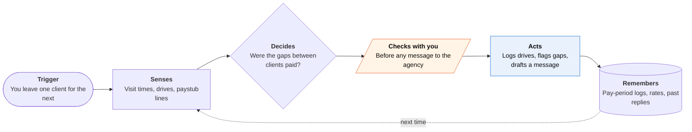

<!-- Generated by scripts/build.py from data/ideas.json. Edit the JSON, then run the script. -->

[← All ideas](../README.md) · **Whitespace** · Work & business

# W-32 · Between-Clients Wage Check

> For home-care aides: logs the drive between clients and checks each paycheck for unpaid travel time.

| Difficulty | Novelty | Buildable on iOS today | Impact if it works | Horizon | Autonomy |
|---|---|---|---|---|---|
| `●●○○○` 2/5 | `●●●●●` 5/5 | `●●●●●` 5/5 | `●●●●○` 4/5 | Buildable now | L2 · Drafts, you approve |

## The moment

You see four clients a day across town, and the agency's visit-verification app clocks you in and out at every door. The 25-minute drives in between never show up on your paystub. At the end of the pay period your phone shows $118 of travel time that looks unpaid, with the log behind it, and asks whether you want to raise it with your coordinator.

## The problem

When an agency employs a home-care aide, federal law counts travel between clients during the workday as paid work time. Agencies record every visit through electronic visit verification, but that record stays on the agency's side and stops at the client's door. Aides have no easy way to see what's missing from a paystub, and every mileage, scheduling and payroll tool is sold to the agency.

## How the agent works

## iOS building blocks

- **Core Location (CLVisit)** — records arrivals and departures at client homes with little battery
- **VisionKit (VNDocumentCameraViewController)** — captures a clean scan of each paystub
- **Vision (RecognizeDocumentsRequest)** — reads hours, rates and mileage from the paystub table
- **Foundation Models (on-device)** — compares the log with the paystub without sending pay data off the phone
- **Translation** — shows results and drafts messages in the aide's own language
- **WidgetKit** — a Home Screen widget with this period's unpaid-looking minutes
- **Foundation Data Protection (FileProtectionType.complete)** — keeps logs encrypted while the phone is locked

## What makes it hard

- Telling client stops from personal ones. CLVisit logs a pharmacy run the same as a client visit, so the app needs the schedule plus a quick end-of-day review.
- Paystubs vary by payroll provider, and many don't list travel time at all. The app compares totals (hours worked vs hours paid) and says clearly when a stub can't answer the question.
- Rules vary. Federal law makes travel between clients paid time for agency employees; mileage repayment depends on the state (California requires employers to reimburse work expenses; federal law only steps in if costs push pay below minimum wage). Live-in and privately hired aides fall under different rules.
- Aides fear retaliation, so nothing leaves the phone by default and the app works without an account.

## Risks and failure modes

- Retaliation can cost an aide shifts. The app explains that retaliation for wage complaints is illegal, points to worker centers and unions, and never sends anything on its own.
- False alarms damage trust with the agency. Show the log, the rule and any doubt, in calm wording.
- A location log of client homes is sensitive for clients too. Keep the minimum, store it on the device, and let the aide delete it.

## Unsaid assumptions

_What this idea quietly depends on being true. Check these before you build._

- The aide is an agency employee covered by federal wage law, not a privately hired or live-in worker.
- Aides will spend a minute a day confirming the log.
- Agencies correct errors when shown a clear record.

## Unknown unknowns

_Open questions nobody has good answers to yet._

- How much unpaid travel time does a typical multi-client aide lose per week?
- Will agencies accept a worker-side log when it disagrees with their visit-verification data?
- Could a union or worker center distribute the app, and who pays for it?

## Prior art and who's building

- [US DOL Fact Sheet #79D (hours worked in domestic service)](https://www.dol.gov/agencies/whd/fact-sheets/79d-flsa-domestic-service-hours-worked) — States the rule with an example: 30 minutes driving between two clients is hours worked the agency must pay. A rule, not a tool that checks your pay against it.
- [Goldberg Segalla on the Third Circuit travel-time ruling](https://www.goldbergsegalla.com/news-and-knowledge/knowledge/third-circuit-affirms-home-health-care-aides-must-be-paid-for-travel-between-clients/) — Law-firm summary of an appeals ruling that home-care aides must be paid for travel between clients. Shows the rule is enforced; aides still need their own records to use it.
- [Phillips & Garcia travel-time cases](https://www.phillipsgarcialaw.com/practice_areas/travel-time-compensation-for-home-health-aides.cfm) — A firm that takes aide travel-time cases. Lawyers need a day-by-day log the aide rarely has.
- [Carevoyant on caregiver travel-time payroll](https://www.carevoyant.com/home-health-blog/caregiver-travel-time-payroll-bottom-line) — A home-care software vendor writing to agencies about paying travel time. The tooling is built for the employer, not the aide.

## Smallest useful first version

An automatic drive log between scheduled clients, a paystub scan, and a pay-period view of hours worked versus hours paid, in English and Spanish, all on the device. No claims in version one: just a calm draft message the aide can copy if they choose.

Research notes: what we could and couldn't verify

Third Circuit ruling details (case name, date) come from the candidate's source and were not re-verified. DOL Fact Sheet #79D and its between-clients example were confirmed via search results. Agency-side EVV and mileage vendors named in the candidate (HHAeXchange, Sandata, Timeero) had no verified URLs, so Carevoyant stands in as the agency-side example. The California expense-reimbursement point is general knowledge (Labor Code 2802), not re-checked.

## Related ideas

- [W-31 · Deactivation Defense File](../whitespace/W-31-deactivation-defense-file.md)
- [M-25 · Worker-Side Dispatch Agent](../moonshot/M-25-worker-side-dispatch-agent.md)
